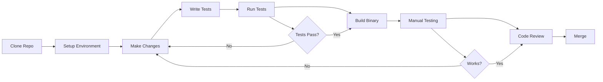
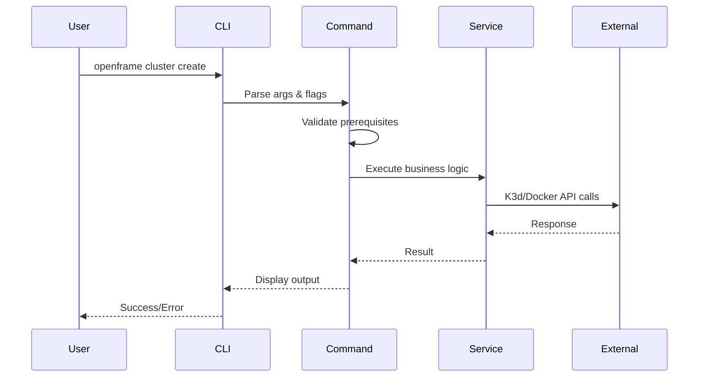

# OpenFrame CLI Developer Getting Started Guide

Welcome to OpenFrame CLI development! This guide will help you set up your development environment and understand the project structure so you can start contributing to the OpenFrame CLI project.

## Development Environment Setup

### Prerequisites

| Tool | Version | Purpose | Installation |
|------|---------|---------|-------------|
| **Go** | 1.19+ | Primary language | [Go Installation](https://golang.org/doc/install) |
| **Docker** | Latest | Container runtime | [Docker Installation](https://docs.docker.com/get-docker/) |
| **K3d** | v5.0+ | Local Kubernetes clusters | `curl -s https://raw.githubusercontent.com/k3d-io/k3d/main/install.sh \| bash` |
| **Helm** | v3.0+ | Package manager | [Helm Installation](https://helm.sh/docs/intro/install/) |
| **kubectl** | Latest | Kubernetes CLI | [kubectl Installation](https://kubernetes.io/docs/tasks/tools/) |
| **Make** | Latest | Build automation | Usually pre-installed |

### Clone and Setup Repository

```bash
# Clone the repository
git clone https://github.com/flamingo-stack/openframe-cli.git
cd openframe-cli

# Install Go dependencies
go mod download

# Verify setup
make test
```

### Development Dependencies

```bash
# Install additional development tools
go install github.com/golangci/golangci-lint/cmd/golangci-lint@latest
go install github.com/spf13/cobra-cli@latest

# Install testing tools
go install github.com/onsi/ginkgo/v2/ginkgo@latest
go install github.com/onsi/gomega/...@latest
```

## Repository Structure

```
openframe-cli/
├── cmd/                          # CLI command definitions
│   ├── bootstrap/               # Complete environment setup
│   │   └── bootstrap.go        # Bootstrap command entry point
│   ├── chart/                  # Chart management commands
│   │   ├── chart.go           # Chart command group
│   │   └── install.go         # ArgoCD and chart installation
│   ├── cluster/               # Cluster lifecycle commands
│   │   ├── cluster.go        # Cluster command group
│   │   ├── create.go         # Cluster creation
│   │   ├── delete.go         # Cluster deletion
│   │   ├── list.go           # List clusters
│   │   ├── status.go         # Cluster status
│   │   └── cleanup.go        # Resource cleanup
│   └── dev/                   # Development workflow commands
│       └── dev.go            # Development tools integration
├── internal/                  # Internal packages (not for external use)
│   ├── bootstrap/            # Bootstrap service implementation
│   ├── cluster/             # Cluster management business logic
│   │   ├── models/          # Data structures and validation
│   │   ├── services/        # Core business logic
│   │   ├── ui/              # User interface components
│   │   └── utils/           # Cluster-specific utilities
│   ├── chart/               # Chart installation services
│   │   ├── services/        # ArgoCD and Helm integration
│   │   └── prerequisites/   # Chart dependency validation
│   ├── dev/                 # Development workflow services
│   │   ├── services/        # Telepresence and Skaffold integration
│   │   └── prerequisites/   # Development tool validation
│   └── shared/              # Shared utilities across modules
│       ├── ui/              # Reusable UI components
│       ├── errors/          # Error handling and display
│       └── system/          # System utilities
├── docs/                     # Documentation
│   ├── dev/                 # Developer documentation
│   └── tutorials/           # User and developer tutorials
├── go.mod                   # Go module definition
├── go.sum                   # Go module checksums
├── Makefile                 # Build automation
└── README.md               # Project overview
```

## Development Workflow



### Build and Test Commands

```bash
# Build the CLI binary
make build

# Run all tests
make test

# Run tests with coverage
make test-coverage

# Run linting
make lint

# Format code
make fmt

# Run full CI pipeline locally
make ci

# Build for all platforms
make build-all
```

### Local Development Commands

```bash
# Build and install locally
go build -o openframe main.go

# Run directly with go run
go run main.go cluster list

# Install to GOPATH/bin
go install

# Test specific package
go test ./internal/cluster/...

# Run with race detection
go test -race ./...
```

## Code Style and Conventions

### Go Code Standards

```go
// Package naming: lowercase, single word
package cluster

// Interface naming: Use -er suffix
type ClusterManager interface {
    CreateCluster(config ClusterConfig) error
    DeleteCluster(name string) error
}

// Error handling: Always check errors
func createCluster(name string) error {
    if err := validateName(name); err != nil {
        return fmt.Errorf("invalid cluster name: %w", err)
    }
    // ... rest of function
}

// Use structured logging
log.WithFields(log.Fields{
    "cluster": clusterName,
    "operation": "create",
}).Info("Creating cluster")
```

### Command Structure Pattern

```go
// cmd/<command>/<command>.go pattern
func GetCommandCmd() *cobra.Command {
    cmd := &cobra.Command{
        Use:   "command [args]",
        Short: "Brief description",
        Long:  `Detailed description with examples`,
        PreRunE: validatePrerequisites,
        RunE:    runCommand,
    }
    
    // Add flags
    cmd.Flags().String("flag", "", "Flag description")
    
    return cmd
}
```

### Service Layer Pattern

```go
// internal/<module>/services/<service>.go pattern
type Service struct {
    config Config
    client ClientInterface
}

func NewService(config Config) *Service {
    return &Service{
        config: config,
        client: NewClient(),
    }
}

func (s *Service) Execute(cmd *cobra.Command, args []string) error {
    // Implementation
}
```

## Testing Guidelines

### Unit Tests

```go
// _test.go suffix for test files
func TestCreateCluster(t *testing.T) {
    // Arrange
    service := NewService(testConfig)
    
    // Act
    err := service.CreateCluster("test-cluster")
    
    // Assert
    assert.NoError(t, err)
    assert.True(t, clusterExists("test-cluster"))
}
```

### Integration Tests

```go
// Use build tags for integration tests
//go:build integration
// +build integration

func TestClusterLifecycle(t *testing.T) {
    // Test full cluster create/delete cycle
    // Requires Docker and K3d
}
```

### Test Structure

```
pkg/
├── cluster/
│   ├── service.go
│   ├── service_test.go          # Unit tests
│   └── service_integration_test.go  # Integration tests
```

## Contributing Guidelines

### Git Workflow

1. **Create Feature Branch**
   ```bash
   git checkout -b feature/add-new-command
   ```

2. **Make Changes and Test**
   ```bash
   # Make your changes
   make test
   make lint
   ```

3. **Commit Changes**
   ```bash
   git add .
   git commit -m "feat: add new cluster validation command"
   ```

4. **Push and Create PR**
   ```bash
   git push origin feature/add-new-command
   # Create pull request on GitHub
   ```

### Commit Message Format

```
type(scope): description

[optional body]

[optional footer]
```

**Types:**
- `feat`: New feature
- `fix`: Bug fix  
- `docs`: Documentation changes
- `style`: Code style changes
- `refactor`: Code refactoring
- `test`: Adding tests
- `chore`: Build/tool changes

**Examples:**
```
feat(cluster): add cluster validation command
fix(bootstrap): handle missing Docker daemon error
docs(readme): update installation instructions
```

## Debugging Tips

### Debug CLI Commands

```bash
# Enable debug logging
export DEBUG=true
go run main.go cluster create test-cluster

# Use delve debugger
dlv debug -- cluster create test-cluster

# Add debug prints
import "log"
log.Printf("DEBUG: cluster config: %+v", config)
```

### Common Development Errors

<details>
<summary>❌ "Module not found" errors</summary>

**Problem**: Go module issues after dependency changes.

**Solution**:
```bash
go mod tidy
go mod download
go clean -modcache  # If problems persist
```
</details>

<details>
<summary>❌ "Command not found" during testing</summary>

**Problem**: Local binary not built or not in PATH.

**Solution**:
```bash
make build
export PATH=$PATH:$(pwd)
# Or use go run directly
go run main.go <command>
```
</details>

<details>
<summary>❌ "Docker daemon not running" in tests</summary>

**Problem**: Integration tests require Docker.

**Solution**:
```bash
# Start Docker
sudo systemctl start docker

# Run only unit tests
go test -short ./...

# Skip integration tests
go test -v ./... -tags="!integration"
```
</details>

### Performance Debugging

```bash
# CPU profiling
go run main.go cluster create test --cpuprofile=cpu.prof

# Memory profiling  
go run main.go cluster create test --memprofile=mem.prof

# Analyze profiles
go tool pprof cpu.prof
```

## Architecture Deep Dive

### Command Flow



### Dependency Injection Pattern

```go
// Services take interfaces, not concrete types
type ClusterService struct {
    k3dClient    K3dClientInterface
    uiHandler    UIHandlerInterface
    configStore  ConfigStoreInterface
}

// Easy to mock for testing
type MockK3dClient struct{}
func (m *MockK3dClient) CreateCluster(name string) error {
    return nil  // Mock implementation
}
```

## Advanced Development Topics

### Adding New Commands

1. **Create command file**: `cmd/<group>/<command>.go`
2. **Implement service**: `internal/<group>/services/<service>.go`
3. **Add UI handling**: `internal/<group>/ui/<handler>.go`
4. **Write tests**: Include unit and integration tests
5. **Update documentation**: Add help text and examples

### Custom UI Components

```go
// Use shared UI components for consistency
import "github.com/flamingo-stack/openframe-cli/internal/shared/ui"

// Display progress
ui.ShowProgress("Creating cluster...", func() error {
    return service.CreateCluster(name)
})

// Interactive prompts
mode := ui.SelectFromOptions("Choose mode:", []string{"dev", "prod"})
```

### Error Handling Patterns

```go
// Use wrapped errors for context
if err := validateCluster(name); err != nil {
    return fmt.Errorf("cluster validation failed: %w", err)
}

// Custom error types for specific handling
type ClusterNotFoundError struct {
    Name string
}

func (e ClusterNotFoundError) Error() string {
    return fmt.Sprintf("cluster '%s' not found", e.Name)
}
```

## Next Steps

Now that you have your development environment set up:

1. **Explore the Codebase**: Start with `cmd/` to understand command structure
2. **Read Architecture Documentation**: Check [architecture-overview-dev.md](architecture-overview-dev.md)
3. **Pick an Issue**: Look for "good first issue" labels on GitHub
4. **Join Development Discussions**: Participate in code reviews and planning
5. **Write Documentation**: Help improve docs as you learn

## Getting Help

### Development Resources

- 🔧 **Make Commands**: Run `make help` to see all available build targets
- 📊 **Code Coverage**: Check `make test-coverage` output for coverage gaps
- 🐛 **Debugging**: Use `go run -race` to catch concurrency issues
- 📖 **Go Docs**: Use `go doc` to explore package documentation

### Community

- 💬 **Developer Discussions**: Join development-focused channels
- 🔍 **Code Reviews**: Participate in PR reviews to learn patterns
- 📝 **Architecture Decisions**: Contribute to design discussions
- 🎯 **Feature Planning**: Help prioritize and design new features

---

**🚀 Ready to contribute?** Pick your first issue and start coding!