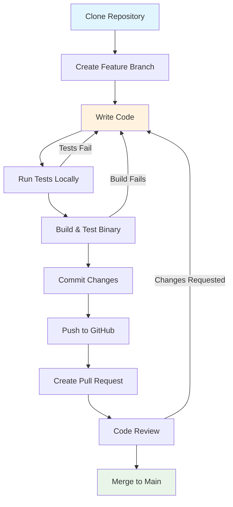

# Developer Getting Started Guide - OpenFrame CLI

Welcome to the OpenFrame CLI development team! This guide will help you set up your development environment, understand the project structure, and start contributing to the codebase.

## Prerequisites for Development

| Tool | Version | Purpose | Installation |
|------|---------|---------|--------------|
| **Go** | 1.23+ | Primary language | [Install Go](https://golang.org/doc/install) |
| **Git** | Latest | Version control | [Install Git](https://git-scm.com/downloads) |
| **Docker** | Latest | For testing clusters | [Get Docker](https://docs.docker.com/get-docker/) |
| **kubectl** | v1.24+ | Kubernetes CLI | [Install kubectl](https://kubernetes.io/docs/tasks/tools/) |
| **k3d** | v5.0+ | Local K8s clusters | [Install k3d](https://k3d.io/#installation) |
| **Make** | Latest | Build automation | Usually pre-installed on Unix systems |

## Development Environment Setup

### 1. Clone the Repository

```bash
git clone https://github.com/flamingo-stack/openframe-cli.git
cd openframe-cli
```

### 2. Install Dependencies

```bash
# Download Go modules
go mod download

# Verify dependencies
go mod verify
```

### 3. Build the Project

```bash
# Build for current platform
go build -o openframe

# Or use Make (if Makefile exists)
make build

# Verify build
./openframe --version
```

### 4. Run Tests

```bash
# Run all tests
go test ./...

# Run tests with coverage
go test -cover ./...

# Run tests in verbose mode
go test -v ./...
```

## Project Structure

```
openframe-cli/
├── cmd/                          # CLI command definitions
│   ├── bootstrap/               # Bootstrap command implementation
│   ├── chart/                   # Chart management commands
│   ├── cluster/                 # Cluster management commands
│   ├── dev/                     # Development tools commands
│   └── root.go                  # Root command and CLI entry point
├── internal/                    # Private application code
│   ├── bootstrap/               # Bootstrap service logic
│   ├── chart/                   # Chart management services
│   │   ├── providers/          # Chart provider implementations
│   │   └── services/           # Chart business logic
│   ├── cluster/                 # Cluster management services
│   │   ├── providers/          # Cluster provider implementations (k3d)
│   │   └── utils/              # Cluster utilities
│   ├── dev/                     # Development services
│   │   ├── models/             # Development-related models
│   │   ├── prerequisites/      # Prerequisite checking and installation
│   │   ├── services/           # Dev tool services (intercept, scaffold)
│   │   └── ui/                 # Development UI components
│   └── shared/                  # Shared utilities and components
│       ├── adapters/           # External tool adapters
│       ├── config/             # Configuration management
│       ├── errors/             # Error handling utilities
│       ├── executor/           # Command execution abstraction
│       ├── files/              # File system utilities
│       ├── flags/              # Common CLI flags
│       └── ui/                 # UI components (progress, prompts, tables)
├── docs/                        # Documentation
│   ├── codewiki/               # Generated architecture docs
│   └── tutorials/              # User and developer tutorials
├── go.mod                       # Go module definition
├── go.sum                       # Go module checksums
├── main.go                      # Application entry point
└── README.md                    # Project overview
```

## Development Workflow



### Branch Strategy

- **main**: Production-ready code
- **feature/***: New feature development
- **bugfix/***: Bug fixes
- **release/***: Release preparation

### Example Development Session

```bash
# 1. Create feature branch
git checkout -b feature/add-cluster-metrics

# 2. Make changes to code
vim internal/cluster/service.go

# 3. Run tests frequently
go test ./internal/cluster/...

# 4. Build and test manually
go build -o openframe
./openframe cluster list

# 5. Run full test suite
go test ./...

# 6. Commit and push
git add .
git commit -m "feat: add cluster metrics collection"
git push origin feature/add-cluster-metrics
```

## Build and Test Commands

### Building

```bash
# Development build
go build -o openframe

# Build with version info
go build -ldflags "-X main.version=dev -X main.commit=$(git rev-parse HEAD)" -o openframe

# Build for multiple platforms
GOOS=linux GOARCH=amd64 go build -o openframe-linux-amd64
GOOS=darwin GOARCH=amd64 go build -o openframe-darwin-amd64
GOOS=windows GOARCH=amd64 go build -o openframe-windows-amd64.exe
```

### Testing

```bash
# Unit tests only
go test -short ./...

# Integration tests (requires Docker)
go test ./... -tags=integration

# Test specific package
go test ./internal/cluster/

# Test with race detection
go test -race ./...

# Benchmark tests
go test -bench=. ./...
```

### Code Quality

```bash
# Format code
go fmt ./...

# Lint code (requires golangci-lint)
golangci-lint run

# Vet code
go vet ./...

# Check modules
go mod tidy
go mod verify
```

## Code Style and Conventions

### Go Conventions

1. **Follow standard Go conventions**: Use `gofmt`, `golint`, and `go vet`
2. **Package naming**: Use lowercase, single words when possible
3. **Interface naming**: End interfaces with `-er` (e.g., `ClusterManager`, `CommandExecutor`)
4. **Error handling**: Always handle errors explicitly

### Project-Specific Patterns

#### Service Pattern
```go
// Service interfaces define contracts
type ClusterService interface {
    CreateCluster(config models.ClusterConfig) error
    DeleteCluster(name string, clusterType models.ClusterType) error
}

// Implementation struct
type clusterService struct {
    manager  k3d.Manager
    executor executor.CommandExecutor
}

// Constructor function
func NewClusterService(executor executor.CommandExecutor) ClusterService {
    return &clusterService{
        manager:  k3d.NewManager(),
        executor: executor,
    }
}
```

#### Command Pattern (Cobra)
```go
func GetClusterCreateCmd() *cobra.Command {
    cmd := &cobra.Command{
        Use:   "create [cluster-name]",
        Short: "Create a new Kubernetes cluster",
        RunE: func(cmd *cobra.Command, args []string) error {
            // Command logic here
            return nil
        },
    }
    
    // Add flags
    cmd.Flags().StringP("type", "t", "k3d", "Cluster type")
    
    return cmd
}
```

#### Error Handling Pattern
```go
// Use custom error types
type ClusterError struct {
    ClusterName string
    Operation   string
    Err         error
}

func (e ClusterError) Error() string {
    return fmt.Sprintf("cluster %s %s failed: %v", e.ClusterName, e.Operation, e.Err)
}

// Wrap errors with context
func (s *clusterService) CreateCluster(config models.ClusterConfig) error {
    if err := s.manager.Create(config); err != nil {
        return ClusterError{
            ClusterName: config.Name,
            Operation:   "creation",
            Err:         err,
        }
    }
    return nil
}
```

### Testing Patterns

#### Unit Test Structure
```go
func TestClusterService_CreateCluster(t *testing.T) {
    tests := []struct {
        name    string
        config  models.ClusterConfig
        wantErr bool
    }{
        {
            name: "valid cluster creation",
            config: models.ClusterConfig{
                Name: "test-cluster",
                Type: models.ClusterTypeK3d,
            },
            wantErr: false,
        },
        // More test cases...
    }
    
    for _, tt := range tests {
        t.Run(tt.name, func(t *testing.T) {
            // Test implementation
        })
    }
}
```

#### Mock Pattern
```go
// Use interfaces for dependencies
type MockCommandExecutor struct {
    commands []string
    results  []executor.Result
}

func (m *MockCommandExecutor) Execute(cmd string, args ...string) executor.Result {
    m.commands = append(m.commands, fmt.Sprintf("%s %s", cmd, strings.Join(args, " ")))
    // Return mock result
    return executor.Result{Success: true}
}
```

## Contributing Guidelines

### Pull Request Process

1. **Fork the repository** and create your feature branch
2. **Write tests** for new functionality
3. **Update documentation** if needed
4. **Ensure all tests pass** before submitting
5. **Follow commit message conventions** (see below)
6. **Create detailed PR description** with context and testing notes

### Commit Message Format

```
<type>(<scope>): <description>

[optional body]

[optional footer]
```

**Types**:
- `feat`: New feature
- `fix`: Bug fix
- `docs`: Documentation only changes
- `style`: Code style changes (formatting, etc.)
- `refactor`: Code changes that neither fix bugs nor add features
- `test`: Adding or updating tests
- `chore`: Build process or auxiliary tool changes

**Examples**:
```bash
feat(cluster): add support for custom k3d registries
fix(bootstrap): handle ArgoCD installation timeout
docs(readme): update installation instructions
test(cluster): add integration tests for cluster deletion
```

## Debugging Tips

### Local Development Debugging

```bash
# Enable debug logging
export OPENFRAME_DEBUG=true
./openframe bootstrap test-cluster -v

# Use delve debugger
go install github.com/go-delve/delve/cmd/dlv@latest
dlv debug -- bootstrap test-cluster

# Debug specific test
dlv test ./internal/cluster/ -- -test.run TestClusterService_CreateCluster
```

### Common Development Errors

| Error | Cause | Solution |
|-------|-------|----------|
| **Module import errors** | Incorrect module path | Check `go.mod` and import statements |
| **Command not found** | Binary not built or not in PATH | Run `go build` and check PATH |
| **Test failures** | Docker not running or missing deps | Start Docker, install prerequisites |
| **Build failures** | Missing dependencies | Run `go mod download && go mod tidy` |

### Testing with Real Clusters

```bash
# Create test cluster for development
./openframe bootstrap dev-test --non-interactive

# Test against real cluster
export OPENFRAME_TEST_CLUSTER=dev-test
go test ./internal/cluster/ -tags=integration

# Cleanup
./openframe cluster delete dev-test
```

## Architecture Integration Points

When adding new features, consider these integration points:

1. **Command Layer** (`cmd/`): Add new CLI commands and flags
2. **Service Layer** (`internal/*/services/`): Implement business logic
3. **Provider Layer** (`internal/*/providers/`): Integrate with external tools
4. **Shared Components** (`internal/shared/`): Reuse common functionality

## IDE Setup Recommendations

### VS Code
```json
// .vscode/settings.json
{
    "go.testFlags": ["-v"],
    "go.buildFlags": ["-v"],
    "go.formatTool": "gofmt",
    "go.lintTool": "golangci-lint",
    "go.vetOnSave": "package"
}
```

### GoLand/IntelliJ
- Enable Go modules support
- Configure code style to use `gofmt`
- Set up run configurations for tests and builds

## Next Steps

1. **Explore the codebase**: Start with `main.go` and follow the execution flow
2. **Read the architecture guide**: Check `dev/architecture-overview-dev.md`
3. **Pick a good first issue**: Look for "good first issue" labels on GitHub
4. **Join the community**: Connect with other developers

## Getting Help

- **Code questions**: Create GitHub discussions
- **Bug reports**: Use GitHub issues
- **Architecture questions**: Check the architecture overview docs
- **Local development issues**: Enable debug logging first

Happy coding! 🚀