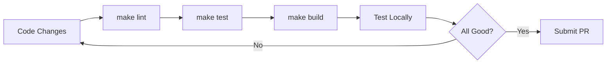
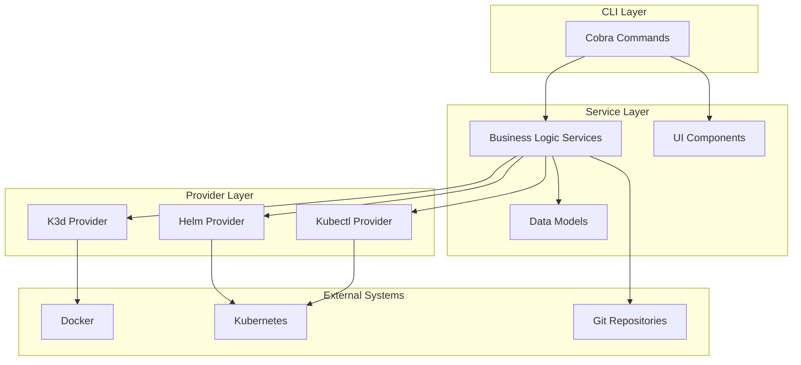

# Developer Getting Started Guide

Welcome to OpenFrame CLI development! This guide will help you set up your development environment, understand the codebase, and start contributing to the project.

## Development Environment Setup

### Prerequisites

| Tool | Version | Purpose |
|------|---------|---------|
| **Go** | 1.21+ | Primary development language |
| **Git** | Latest | Version control |
| **Docker** | Latest | For testing K3d integration |
| **K3d** | v5.0+ | Testing cluster operations |
| **Make** | Latest | Build automation |
| **golangci-lint** | Latest | Code linting |

### Repository Setup

1. **Clone the repository**:
   ```bash
   git clone https://github.com/flamingo-stack/openframe-cli.git
   cd openframe-cli
   ```

2. **Install dependencies**:
   ```bash
   go mod download
   go mod verify
   ```

3. **Install development tools**:
   ```bash
   # Install linting tools
   curl -sSfL https://raw.githubusercontent.com/golangci/golangci-lint/master/install.sh | sh -s -- -b $(go env GOPATH)/bin v1.54.2
   
   # Install other dev tools
   go install github.com/spf13/cobra-cli@latest
   ```

4. **Verify setup**:
   ```bash
   make test
   make lint
   go run main.go --version
   ```

## Repository Structure

```
openframe-cli/
├── cmd/                          # CLI commands (Cobra)
│   ├── bootstrap/                # Bootstrap command
│   ├── cluster/                  # Cluster management commands  
│   ├── chart/                    # Chart installation commands
│   ├── dev/                      # Developer workflow commands
│   └── root.go                   # Root command and CLI entry
├── internal/                     # Internal packages
│   ├── bootstrap/                # Bootstrap service logic
│   ├── cluster/                  # Cluster management services
│   │   ├── models/               # Data structures and validation
│   │   ├── providers/            # K3d, Kind providers
│   │   ├── prerequisites/        # Dependency checking
│   │   └── ui/                   # Interactive prompts
│   ├── chart/                    # Helm chart services
│   │   ├── models/               # Chart configurations
│   │   ├── prerequisites/        # Tool validation
│   │   └── services/             # Installation logic
│   ├── dev/                      # Development workflow services
│   │   └── services/             # Intercept, scaffold services
│   └── shared/                   # Shared utilities
│       ├── config/               # Configuration management
│       ├── errors/               # Error handling
│       ├── executor/             # Command execution
│       └── ui/                   # Common UI components
├── docs/                         # Documentation
├── scripts/                      # Build and automation scripts
├── tests/                        # Test files
├── Makefile                      # Build automation
├── go.mod                        # Go module definition
└── main.go                       # Application entry point
```

## Build and Test Commands

### Development Workflow



### Essential Commands

```bash
# Development
make dev          # Run in development mode
make build        # Build binary
make clean        # Clean build artifacts

# Testing
make test         # Run all tests
make test-unit    # Run unit tests only
make test-integration  # Run integration tests
make coverage     # Generate coverage report

# Quality checks
make lint         # Run golangci-lint
make fmt          # Format code with gofmt
make vet          # Run go vet

# Release
make release      # Build release binaries
make install      # Install to $GOPATH/bin
```

### Local Testing

```bash
# Build and test locally
go build -o bin/openframe .

# Test core functionality
./bin/openframe --help
./bin/openframe cluster create test-dev --skip-wizard
./bin/openframe cluster delete test-dev
```

## Code Style and Conventions

### Go Conventions

1. **Package naming**: Use short, descriptive names
   ```go
   package cluster  // good
   package clusterutils  // avoid
   ```

2. **Error handling**: Always handle errors explicitly
   ```go
   if err != nil {
       return fmt.Errorf("failed to create cluster: %w", err)
   }
   ```

3. **Interface usage**: Define interfaces where needed
   ```go
   type ClusterProvider interface {
       Create(config ClusterConfig) error
       Delete(name string) error
   }
   ```

### Project-Specific Patterns

1. **Command structure**: Follow the established pattern
   ```go
   func getCreateCmd() *cobra.Command {
       cmd := &cobra.Command{
           Use:   "create [NAME]",
           Short: "Create a new cluster",
           RunE:  utils.WrapCommandWithCommonSetup(runCreate),
       }
       return cmd
   }
   ```

2. **Service pattern**: Use service structs for business logic
   ```go
   type Service struct {
       provider ClusterProvider
       ui       UIHandler
   }
   
   func NewService() *Service {
       return &Service{
           provider: k3d.NewProvider(),
           ui:       ui.NewHandler(),
       }
   }
   ```

3. **Error handling**: Use shared error handlers
   ```go
   if err != nil {
       return sharedErrors.HandleGlobalError(err, verbose)
   }
   ```

### Code Organization

- **Commands** (`cmd/`): Keep thin, delegate to services
- **Services** (`internal/*/`): Business logic and orchestration
- **Models** (`internal/*/models/`): Data structures and validation
- **UI** (`internal/*/ui/`): User interaction and display
- **Providers** (`internal/*/providers/`): External tool integration

## Contributing Guidelines

### Development Process

1. **Create feature branch**:
   ```bash
   git checkout -b feature/new-cluster-provider
   ```

2. **Make changes following patterns**:
   - Write tests first (TDD approach)
   - Follow existing code structure
   - Update documentation

3. **Test your changes**:
   ```bash
   make test
   make lint
   make build
   ```

4. **Submit pull request**:
   - Include tests for new functionality
   - Update relevant documentation
   - Add descriptive commit messages

### Testing Guidelines

1. **Unit tests**: Test individual functions and methods
   ```go
   func TestValidateClusterName(t *testing.T) {
       tests := []struct {
           name    string
           input   string
           wantErr bool
       }{
           {"valid name", "my-cluster", false},
           {"invalid chars", "my_cluster!", true},
       }
       
       for _, tt := range tests {
           t.Run(tt.name, func(t *testing.T) {
               err := ValidateClusterName(tt.input)
               if (err != nil) != tt.wantErr {
                   t.Errorf("ValidateClusterName() error = %v, wantErr %v", err, tt.wantErr)
               }
           })
       }
   }
   ```

2. **Integration tests**: Test command execution and workflows
   ```bash
   # Integration test example
   func TestClusterCreateE2E(t *testing.T) {
       if testing.Short() {
           t.Skip("skipping integration test")
       }
       // Test actual cluster creation
   }
   ```

### Debugging Tips

1. **Enable verbose logging**:
   ```bash
   go run main.go cluster create test --verbose
   ```

2. **Use debugger-friendly builds**:
   ```bash
   go build -gcflags="all=-N -l" -o bin/openframe-debug .
   dlv exec ./bin/openframe-debug -- cluster create test
   ```

3. **Log important operations**:
   ```go
   if verbose {
       fmt.Printf("Creating cluster with config: %+v\n", config)
   }
   ```

## Common Development Errors

### Build Issues

| Error | Cause | Solution |
|-------|-------|----------|
| `command not found: make` | Make not installed | Install build tools: `sudo apt install build-essential` |
| `golangci-lint: command not found` | Linter not installed | Install: `go install github.com/golangci/golangci-lint/cmd/golangci-lint@latest` |
| `go mod tidy` errors | Dependency conflicts | Clean module cache: `go clean -modcache` |

### Runtime Issues

| Error | Cause | Solution |
|-------|-------|----------|
| `k3d: command not found` | K3d not in PATH | Install K3d or add to PATH |
| `dial unix /var/run/docker.sock` | Docker not running | Start Docker service |
| Permission denied | Insufficient privileges | Use sudo or adjust Docker group membership |

### Testing Issues

- **Slow tests**: Use `go test -short` to skip integration tests
- **Flaky tests**: Ensure proper cleanup in teardown functions
- **Mock failures**: Verify mock expectations match actual usage

## Project Architecture Deep Dive

### Command Layer Pattern

The CLI follows a layered architecture:



### Key Design Patterns

1. **Command Pattern**: Each CLI command is a separate module
2. **Service Pattern**: Business logic separated from CLI handling
3. **Provider Pattern**: Abstraction for external tool integration
4. **Factory Pattern**: Dynamic provider creation based on configuration

### Extension Points

To add new functionality:

1. **New commands**: Add to `cmd/` and register in root
2. **New providers**: Implement provider interface
3. **New deployment modes**: Extend models and validation
4. **New UI components**: Add to shared UI package

## Next Steps

1. **Explore the codebase**: Start with `cmd/root.go` and follow the flow
2. **Run tests**: `make test` to understand expected behavior
3. **Make small changes**: Start with bug fixes or documentation updates
4. **Join discussions**: Participate in GitHub issues and discussions

## Resources

- **Architecture Overview**: See [Architecture Documentation](architecture-overview-dev.md)
- **API Documentation**: Generated Go docs: `godoc -http=:6060`
- **Git workflow**: Follow GitFlow branching model
- **Code reviews**: All changes require peer review

> **Happy Coding!** 🚀 You're now ready to contribute to OpenFrame CLI. Start with small changes and gradually work up to larger features.