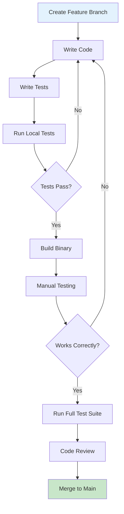

# Developer Getting Started Guide

Welcome to OpenFrame CLI development! This guide will help you set up a complete development environment, understand the codebase structure, and start contributing to the project.

## Prerequisites

Ensure you have the following development tools installed:

| Tool | Version | Purpose | Installation |
|------|---------|---------|--------------|
| **Go** | 1.19+ | Primary language | [Install Go](https://golang.org/doc/install) |
| **Git** | 2.30+ | Version control | [Install Git](https://git-scm.com/downloads) |
| **Docker** | 20.10+ | Container runtime | [Get Docker](https://docs.docker.com/get-docker/) |
| **Make** | 3.8+ | Build automation | Usually pre-installed |
| **kubectl** | 1.24+ | Kubernetes CLI | [Install kubectl](https://kubernetes.io/docs/tasks/tools/) |

## Development Environment Setup

### 1. Clone the Repository
```bash
# Clone the main repository
git clone https://github.com/flamingo-stack/openframe-cli.git
cd openframe-cli

# Set up upstream remote for contributing
git remote add upstream https://github.com/flamingo-stack/openframe-cli.git
```

### 2. Set Up Go Environment
```bash
# Initialize Go modules (if not already done)
go mod download

# Verify Go installation and modules
go version
go mod verify
```

### 3. Install Development Dependencies
```bash
# Install required tools
go install github.com/golangci/golangci-lint/cmd/golangci-lint@latest
go install honnef.co/go/tools/cmd/staticcheck@latest

# Install testing tools
go install github.com/onsi/ginkgo/v2/ginkgo@latest
go install github.com/onsi/gomega/...@latest
```

### 4. Build and Test
```bash
# Build the project
make build

# Run tests
make test

# Run linting
make lint

# Install locally for testing
make install
```

## Repository Structure

Understanding the codebase organization:

```
openframe-cli/
├── cmd/                          # CLI command definitions
│   ├── bootstrap/               # Bootstrap command
│   ├── chart/                   # Chart management commands  
│   ├── cluster/                 # Cluster lifecycle commands
│   └── dev/                     # Development tools
├── internal/                    # Internal packages (not exported)
│   ├── bootstrap/              # Bootstrap service logic
│   ├── chart/                  # Chart installation services
│   │   ├── services/           # Core chart logic
│   │   ├── utils/              # Chart utilities
│   │   └── prerequisites/      # Tool validation
│   ├── cluster/                # Cluster management
│   │   ├── models/             # Data structures
│   │   ├── ui/                 # User interface components
│   │   └── utils/              # Cluster utilities
│   ├── dev/                    # Development workflow tools
│   │   ├── models/             # Dev tool models
│   │   └── prerequisites/      # Dev tool validation
│   └── shared/                 # Shared components
│       ├── ui/                 # Common UI elements
│       └── errors/             # Error handling
├── docs/                       # Documentation
│   ├── tutorials/              # User and dev tutorials
│   └── dev/                    # Architecture documentation
├── scripts/                    # Build and utility scripts
├── tests/                      # Test suites
├── Makefile                    # Build automation
├── go.mod                      # Go module definition
└── go.sum                      # Go module checksums
```

### Key Architecture Patterns

1. **Command Pattern**: Each CLI command is in `cmd/` with logic in `internal/`
2. **Service Layer**: Business logic separated in `internal/*/services/`
3. **UI Abstraction**: User interaction components in `internal/*/ui/`
4. **Shared Components**: Common utilities in `internal/shared/`

## Development Workflow

The following diagram shows the typical development process:



### 1. Feature Development
```bash
# Create feature branch
git checkout -b feature/my-new-feature

# Make changes and commit regularly
git add .
git commit -m "feat: add new cluster validation"

# Keep branch updated
git fetch upstream
git rebase upstream/main
```

### 2. Build and Test Commands
```bash
# Build development version
make build

# Run unit tests
make test

# Run integration tests
make test-integration

# Test specific packages
go test ./internal/cluster/...

# Run with verbose output
go test -v ./internal/chart/services
```

### 3. Code Quality Checks
```bash
# Run all linting
make lint

# Fix auto-fixable issues
golangci-lint run --fix

# Check code formatting
gofmt -l .

# Format all code
gofmt -w .
```

### 4. Manual Testing
```bash
# Build and install local version
make install

# Test commands manually
openframe --help
openframe cluster create test-cluster --verbose

# Test with different flags
openframe bootstrap --dry-run
```

## Build System

### Makefile Targets
```bash
# Core targets
make build          # Build binary
make test           # Run tests
make lint           # Run linters
make clean          # Clean build artifacts
make install        # Install binary locally

# Development targets
make dev            # Watch and rebuild on changes
make test-watch     # Watch tests
make coverage       # Generate test coverage
make docs           # Generate documentation

# Release targets
make build-all      # Build for all platforms
make release        # Create release packages
```

### Custom Build Configuration
```bash
# Build with custom flags
go build -ldflags "-X main.version=dev -X main.buildDate=$(date)" \
  -o bin/openframe-dev ./cmd/openframe

# Build for specific platform
GOOS=linux GOARCH=amd64 go build -o bin/openframe-linux ./cmd/openframe
```

## Code Style and Conventions

### Go Code Standards
- Follow [Effective Go](https://golang.org/doc/effective_go.html) guidelines
- Use `gofmt` for formatting
- Run `golangci-lint` before committing
- Keep functions focused and testable
- Use meaningful variable and function names

### Package Organization
```go
// Package structure example
package cluster

import (
    "context"
    "fmt"
    
    "github.com/flamingo-stack/openframe-cli/internal/cluster/models"
    "github.com/flamingo-stack/openframe-cli/internal/shared/errors"
)

// Service interface for cluster operations
type Service interface {
    Create(ctx context.Context, config models.ClusterConfig) error
    Delete(ctx context.Context, name string) error
    List(ctx context.Context) ([]models.Cluster, error)
}
```

### Error Handling Patterns
```go
// Use shared error handling
if err != nil {
    return sharedErrors.WrapError(err, "failed to create cluster")
}

// Context-aware operations
ctx, cancel := context.WithTimeout(context.Background(), 5*time.Minute)
defer cancel()
```

### Testing Patterns
```go
// Test structure
func TestClusterCreate(t *testing.T) {
    tests := []struct {
        name     string
        config   models.ClusterConfig
        wantErr  bool
        errMsg   string
    }{
        {
            name: "valid config",
            config: models.ClusterConfig{
                Name: "test-cluster",
                Type: "k3d",
            },
            wantErr: false,
        },
        // ... more test cases
    }
    
    for _, tt := range tests {
        t.Run(tt.name, func(t *testing.T) {
            service := NewService()
            err := service.Create(context.Background(), tt.config)
            
            if tt.wantErr {
                assert.Error(t, err)
                assert.Contains(t, err.Error(), tt.errMsg)
            } else {
                assert.NoError(t, err)
            }
        })
    }
}
```

## Contributing Guidelines

### 1. Before Starting
- Check existing issues and PRs to avoid duplication
- Open an issue for large features to discuss approach
- Follow semantic versioning for changes

### 2. Development Process
- Write tests for new functionality
- Update documentation for user-facing changes
- Add comments for complex logic
- Keep commits focused and atomic

### 3. Pull Request Checklist
- [ ] Tests pass locally (`make test`)
- [ ] Linting passes (`make lint`)
- [ ] Manual testing completed
- [ ] Documentation updated
- [ ] Commit messages follow conventional commits
- [ ] Branch is rebased on latest main

### 4. Commit Message Format
```
type(scope): description

[optional body]

[optional footer]
```

Examples:
```
feat(cluster): add cluster validation support
fix(chart): handle ArgoCD installation timeout
docs(tutorial): update getting started guide
```

## Common Development Tasks

### Adding a New Command
1. **Create command file**: `cmd/mycommand/mycommand.go`
2. **Add business logic**: `internal/mycommand/service.go`
3. **Add tests**: `internal/mycommand/service_test.go`
4. **Register command**: Add to main command in root
5. **Update documentation**: Add inline docs and tutorials

### Debugging Tips
```bash
# Enable debug logging
export OPENFRAME_DEBUG=true
openframe cluster create test --verbose

# Use Go debugging
dlv debug ./cmd/openframe -- cluster create test

# Profile performance
go tool pprof cpu.prof
```

### Integration Testing
```bash
# Run against real clusters
make test-integration

# Test specific scenarios
go test -tags integration ./tests/cluster/...

# Clean up test resources
make clean-test-clusters
```

## Local Development Environment

### IDE Setup (VS Code)
Recommended extensions:
- Go (Google)
- Go Test Explorer
- GitLens
- YAML Support

VS Code settings:
```json
{
    "go.useLanguageServer": true,
    "go.lintOnSave": "package",
    "go.formatTool": "goimports",
    "go.testFlags": ["-v"],
    "files.exclude": {
        "**/.git": true,
        "**/bin": true,
        "**/vendor": true
    }
}
```

### Environment Variables
```bash
# Development configuration
export OPENFRAME_DEBUG=true
export OPENFRAME_LOG_LEVEL=debug
export OPENFRAME_CONFIG_DIR=~/.openframe-dev

# Testing configuration  
export OPENFRAME_TEST_TIMEOUT=300s
export OPENFRAME_TEST_CLUSTER_PREFIX=test-
```

## Next Steps

Now that you have your development environment set up:

1. **Explore the codebase**: Start with `cmd/` and trace through to `internal/`
2. **Read the architecture**: Check the [Architecture Overview](./architecture-overview-dev.md)
3. **Pick a first issue**: Look for "good first issue" labels on GitHub
4. **Join discussions**: Participate in design discussions and code reviews

## Getting Help

### Internal Resources
- Code documentation: `godoc -http=:6060`
- Architecture docs: `docs/dev/`
- Test examples: Look at existing tests for patterns

### Community
- **GitHub Discussions**: Ask questions and share ideas
- **Slack/Discord**: Real-time chat with maintainers
- **Office Hours**: Weekly developer sync meetings

### Common Issues
- **Build failures**: Check Go version and dependencies
- **Test timeouts**: Increase timeout or check Docker resources
- **Import errors**: Run `go mod tidy` to fix module issues

---

**Ready to contribute?** 🛠️ Start by picking an issue that interests you and following this development workflow. The maintainers are here to help guide you through your first contribution!