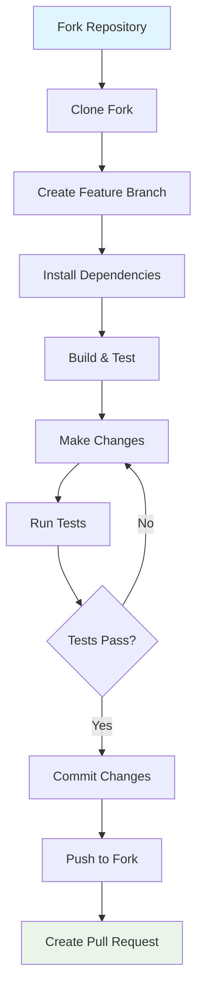

# Developer Getting Started Guide

Welcome to OpenFrame CLI development! This guide will help you set up your development environment, understand the codebase, and start contributing to the project.

## Prerequisites for Development

### Required Tools

| Tool | Version | Purpose | Installation |
|------|---------|---------|-------------|
| **Go** | 1.21+ | Primary language | [Download Go](https://golang.org/dl/) |
| **Docker** | Latest | Container runtime | [Install Docker](https://docs.docker.com/get-docker/) |
| **kubectl** | 1.25+ | Kubernetes CLI | `go install kubectl.dev/kubectl@latest` |
| **Helm** | 3.x | Package manager | `curl https://raw.githubusercontent.com/helm/helm/main/scripts/get-helm-3 \| bash` |
| **k3d** | Latest | Test clusters | `curl -s https://raw.githubusercontent.com/k3d-io/k3d/main/install.sh \| bash` |
| **Git** | Latest | Version control | [Install Git](https://git-scm.com/) |

### Optional Development Tools

| Tool | Purpose | Installation |
|------|---------|-------------|
| **VS Code** | Recommended IDE | [Download VS Code](https://code.visualstudio.com/) |
| **Go Extension** | Go language support | Install from VS Code marketplace |
| **golangci-lint** | Code linting | `go install github.com/golangci/golangci-lint/cmd/golangci-lint@latest` |
| **delve** | Go debugger | `go install github.com/go-delve/delve/cmd/dlv@latest` |

## Setting Up Development Environment

### 1. Clone the Repository

```bash
# Clone the main repository
git clone https://github.com/flamingo-stack/openframe-cli.git
cd openframe-cli

# Set up your fork (recommended for contributions)
gh repo fork flamingo-stack/openframe-cli
git clone https://github.com/YOUR_USERNAME/openframe-cli.git
cd openframe-cli
git remote add upstream https://github.com/flamingo-stack/openframe-cli.git
```

### 2. Install Dependencies

```bash
# Download Go modules
go mod download

# Verify everything is working
go mod verify

# Install development tools
make install-dev-tools
```

### 3. Build and Test

```bash
# Build the project
go build -o bin/openframe ./cmd/main.go

# Run tests
go test ./...

# Run with coverage
go test -coverprofile=coverage.out ./...
go tool cover -html=coverage.out -o coverage.html
```

### 4. Development Workflow Setup



## Repository Structure

The codebase is organized into clear layers following Go best practices:

```
openframe-cli/
├── cmd/                    # CLI command definitions (Cobra)
│   ├── bootstrap/          # Bootstrap command
│   ├── chart/              # Chart management commands
│   ├── cluster/            # Cluster lifecycle commands
│   │   ├── cluster.go      # Main cluster command
│   │   ├── create.go       # Cluster creation
│   │   ├── delete.go       # Cluster deletion
│   │   ├── list.go         # List clusters
│   │   ├── status.go       # Cluster status
│   │   └── cleanup.go      # Resource cleanup
│   ├── dev/                # Development tools commands
│   └── main.go             # Application entry point
├── internal/               # Private application code
│   ├── bootstrap/          # Bootstrap service implementation
│   ├── chart/              # Chart installation logic
│   │   ├── models/         # Chart configuration models
│   │   ├── prerequisites/  # Chart prerequisites checking
│   │   └── services/       # Chart business logic
│   ├── cluster/            # Cluster management implementation
│   │   ├── models/         # Cluster configuration models
│   │   ├── prerequisites/  # Cluster prerequisites checking
│   │   ├── services/       # Core cluster operations
│   │   └── utils/          # Cluster utilities
│   ├── dev/                # Development tools implementation
│   └── shared/             # Shared utilities and components
│       ├── errors/         # Error handling
│       ├── ui/             # CLI user interface components
│       └── models/         # Common data models
├── docs/                   # Documentation
│   ├── dev/                # Developer documentation
│   └── tutorials/          # User and developer tutorials
├── scripts/                # Build and utility scripts
├── go.mod                  # Go module definition
├── go.sum                  # Go module checksums
├── Makefile               # Build automation
└── README.md              # Project overview
```

## Key Architecture Patterns

### 1. Command Layer (cmd/)
- Uses [Cobra](https://github.com/spf13/cobra) framework for CLI structure
- Each command group has its own package
- Commands delegate to internal services for business logic

### 2. Service Layer (internal/)
- Business logic separated from CLI concerns
- Each domain (cluster, chart, dev) has its own service package
- Shared utilities in `internal/shared/`

### 3. Models and Configuration
- Strong typing with Go structs for all configurations
- Validation logic embedded in model methods
- JSON/YAML serialization tags for external data

## Build Commands and Scripts

### Development Commands

```bash
# Build for development
make build

# Run all tests
make test

# Run linting
make lint

# Format code
make fmt

# Generate documentation
make docs

# Clean build artifacts
make clean

# Install development dependencies
make install-dev-tools
```

### Testing Commands

```bash
# Unit tests
go test ./internal/...

# Integration tests (requires Docker)
make test-integration

# Test specific package
go test ./internal/cluster/services/

# Run tests with verbose output
go test -v ./...

# Run tests with race detection
go test -race ./...

# Benchmark tests
go test -bench=. ./...
```

### Debug Commands

```bash
# Build with debug symbols
go build -gcflags="all=-N -l" -o bin/openframe-debug ./cmd/main.go

# Run with debugger
dlv exec ./bin/openframe-debug -- bootstrap my-test

# Debug tests
dlv test ./internal/cluster/services/
```

## Code Style and Conventions

### Go Code Standards

1. **Follow Go conventions**: Use `gofmt`, `golint`, and `go vet`
2. **Error handling**: Always handle errors explicitly
3. **Package organization**: Keep packages focused and cohesive
4. **Naming**: Use descriptive names, avoid abbreviations
5. **Comments**: Document public functions and complex logic

### Example Code Style

```go
// Good: Clear, descriptive function with proper error handling
func (s *ClusterService) CreateCluster(config *models.ClusterConfig) (*models.Cluster, error) {
    if err := config.Validate(); err != nil {
        return nil, fmt.Errorf("invalid cluster configuration: %w", err)
    }
    
    cluster, err := s.k3dClient.Create(config)
    if err != nil {
        return nil, fmt.Errorf("failed to create cluster %s: %w", config.Name, err)
    }
    
    return cluster, nil
}
```

### CLI Command Structure

```go
// Standard command structure
func getCreateCmd() *cobra.Command {
    cmd := &cobra.Command{
        Use:   "create [cluster-name]",
        Short: "Create a new cluster",
        Long:  `Detailed description...`,
        Args:  cobra.MaximumNArgs(1),
        RunE:  func(cmd *cobra.Command, args []string) error {
            // Delegate to service layer
            return services.NewClusterService().Create(cmd, args)
        },
    }
    
    // Add flags
    cmd.Flags().String("config", "", "Configuration file path")
    cmd.Flags().Bool("interactive", true, "Enable interactive mode")
    
    return cmd
}
```

## Contributing Guidelines

### Development Process

1. **Create Feature Branch**
```bash
git checkout -b feature/your-feature-name
```

2. **Make Changes with Tests**
```bash
# Write tests first (TDD approach recommended)
# Implement feature
# Ensure all tests pass
make test lint
```

3. **Commit and Push**
```bash
git add .
git commit -m "feat: add cluster validation logic"
git push origin feature/your-feature-name
```

4. **Create Pull Request**
- Use descriptive title and description
- Reference related issues
- Ensure CI passes

### Commit Message Format

Follow conventional commits:
```
type(scope): description

feat(cluster): add validation for cluster names
fix(chart): resolve ArgoCD installation timeout
docs(dev): update development setup guide
test(cluster): add integration tests for cluster creation
```

### Common Development Errors and Solutions

| Error | Cause | Solution |
|-------|-------|----------|
| `module not found` | Missing dependencies | Run `go mod download` |
| `undefined: SomeType` | Import issues | Check imports, run `go mod tidy` |
| `tests failing` | Code changes broke tests | Fix tests or update them for new behavior |
| `linting errors` | Code style issues | Run `make fmt lint` and fix issues |
| `build fails` | Compilation errors | Check syntax and type errors |

### Debugging Tips

1. **Use Verbose Logging**
```bash
# Enable debug logging in your code
log.SetLevel(log.DebugLevel)

# Use structured logging
log.WithFields(log.Fields{
    "cluster": "my-cluster",
    "action": "create",
}).Debug("Starting cluster creation")
```

2. **Test Individual Components**
```bash
# Test specific functionality
go test -run TestClusterCreate ./internal/cluster/services/

# Debug specific test
dlv test ./internal/cluster/services/ -- -test.run TestClusterCreate
```

3. **Interactive Debugging**
```bash
# Add breakpoints in code
import "github.com/go-delve/delve/pkg/proc"
runtime.Breakpoint() // This will trigger debugger

# Run with debugger
dlv exec ./bin/openframe -- cluster create test
```

## Next Steps

Now that your development environment is set up:

1. **Explore the Codebase**: Read through `internal/cluster/services/` to understand the core logic
2. **Run Integration Tests**: `make test-integration` to see the full workflow
3. **Read Architecture Guide**: Check out [Architecture Overview](architecture-overview-dev.md)
4. **Pick First Issue**: Look for "good first issue" labels in the GitHub repository
5. **Join Development Discussions**: Participate in design discussions and code reviews

## Getting Development Help

- **Code Questions**: Create GitHub discussions or issues
- **Architecture Decisions**: Review design documents in `docs/dev/`
- **Build Issues**: Check CI logs and local build output
- **Testing**: Run `make test-help` for testing guidelines

Welcome to the OpenFrame CLI development team! 🚀