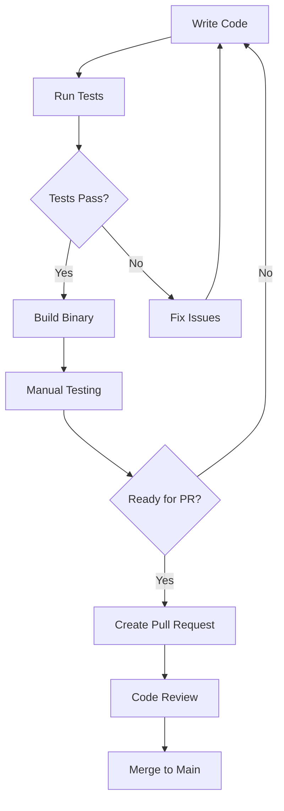
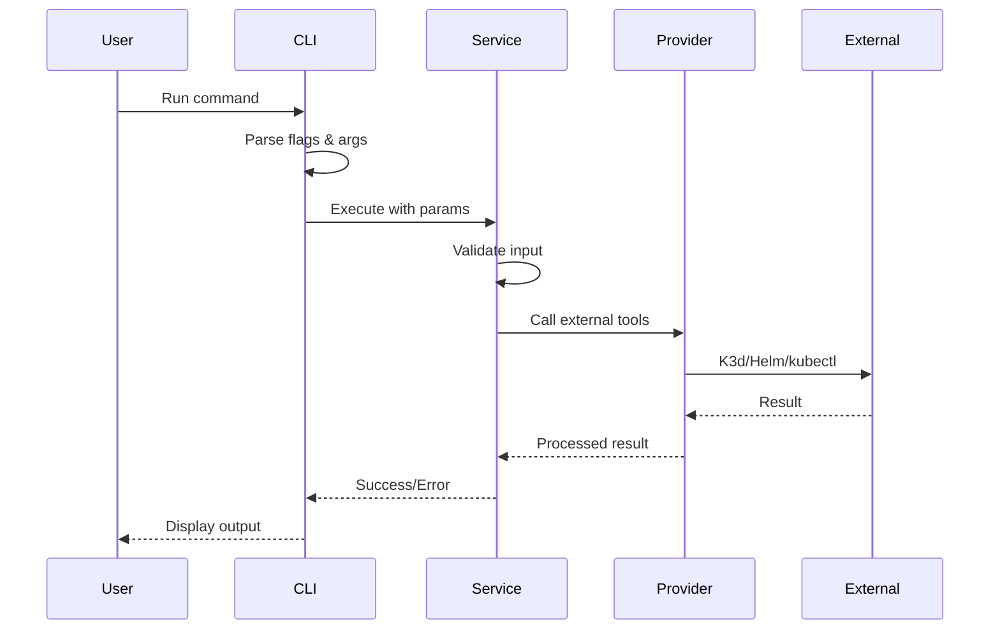

# OpenFrame CLI Developer Getting Started Guide

This guide helps developers set up their development environment for contributing to OpenFrame CLI. You'll learn how to build, test, and contribute to the codebase.

## Development Environment Setup

### Prerequisites

| Tool | Version | Purpose | Installation Check |
|------|---------|---------|-------------------|
| **Go** | 1.21+ | Primary language | `go version` |
| **Git** | Latest | Version control | `git --version` |
| **Docker** | Latest | Container runtime for testing | `docker --version` |
| **kubectl** | Latest | Kubernetes CLI (for testing) | `kubectl version --client` |
| **Make** | Latest | Build automation | `make --version` |

### Repository Setup

1. **Clone the repository**:
   ```bash
   git clone https://github.com/flamingo-stack/openframe-cli.git
   cd openframe-cli
   ```

2. **Install Go dependencies**:
   ```bash
   go mod download
   ```

3. **Verify setup**:
   ```bash
   go run . --version
   ```

## Repository Structure

```
openframe-cli/
├── cmd/                    # CLI command definitions (Cobra commands)
│   ├── bootstrap/         # Bootstrap command implementation
│   ├── chart/            # Helm chart management commands
│   ├── cluster/          # K3d cluster lifecycle commands
│   ├── dev/              # Development tools (intercept, scaffold)
│   └── root.go           # Root command and CLI entry point
├── internal/             # Private application code
│   ├── bootstrap/        # Bootstrap service orchestration
│   ├── chart/            # Chart installation and ArgoCD setup
│   │   ├── models/       # Data structures and types
│   │   ├── prerequisites/ # Tool validation and setup
│   │   └── services/     # Core chart installation logic
│   ├── cluster/          # K3d cluster management
│   ├── dev/              # Development workflow tools
│   └── shared/           # Common utilities and UI components
│       ├── config/       # Configuration management
│       ├── errors/       # Error handling and display
│       └── ui/           # Interactive prompts and branding
├── docs/                 # Documentation
│   ├── codewiki/        # Generated architecture docs
│   └── tutorials/       # User and developer guides
├── go.mod               # Go module definition
├── go.sum              # Go dependency checksums
├── Makefile           # Build automation
└── README.md          # Project overview
```

## Build and Test Commands

### Development Workflow Diagram



### Essential Commands

```bash
# Build the CLI
make build
# or
go build -o openframe .

# Run tests
make test
# or  
go test ./...

# Run with race detection
go test -race ./...

# Test specific package
go test ./internal/cluster/...

# Run linting (if configured)
make lint
# or
golangci-lint run

# Clean build artifacts
make clean
# or
rm -f openframe
```

### Manual Testing

```bash
# Test bootstrap command locally
./openframe bootstrap test-dev --verbose

# Test cluster commands
./openframe cluster create test-cluster
./openframe cluster status test-cluster
./openframe cluster delete test-cluster

# Test with custom flags
./openframe bootstrap --deployment-mode=oss-tenant --non-interactive
```

## Code Style and Conventions

### Go Code Standards

1. **Follow standard Go conventions**:
   - Use `gofmt` for formatting
   - Follow effective Go guidelines
   - Use meaningful variable names

2. **Package organization**:
   - `cmd/` - CLI interface layer (thin, delegates to services)
   - `internal/` - Business logic and implementations
   - `internal/shared/` - Common utilities across packages

3. **Error handling**:
   ```go
   // Wrap errors with context
   if err := someOperation(); err != nil {
       return fmt.Errorf("failed to perform operation: %w", err)
   }

   // Use shared error handler for consistent display
   return sharedErrors.HandleGlobalError(err, verbose)
   ```

4. **CLI patterns**:
   ```go
   // Command structure
   func GetMyCmd() *cobra.Command {
       cmd := &cobra.Command{
           Use:   "mycommand [args]",
           Short: "Short description",
           Long:  `Detailed description with examples`,
           RunE: func(cmd *cobra.Command, args []string) error {
               return myService.Execute(cmd, args)
           },
       }
       // Add flags
       cmd.Flags().String("flag-name", "", "Flag description")
       return cmd
   }
   ```

### Documentation Standards

- **Inline docs**: Add `.{command}.md` files for command documentation
- **CodeWiki**: Architecture changes should update `docs/codewiki/`
- **Comments**: Document public functions and complex logic
- **Examples**: Include usage examples in command help text

## Contributing Guidelines

### Development Process

1. **Create feature branch**:
   ```bash
   git checkout -b feature/my-new-feature
   ```

2. **Make changes following conventions**:
   - Write tests for new functionality
   - Update documentation
   - Follow existing code patterns

3. **Test thoroughly**:
   ```bash
   # Unit tests
   go test ./...
   
   # Manual integration testing
   ./openframe bootstrap test-feature --verbose
   ```

4. **Commit with descriptive messages**:
   ```bash
   git commit -m "feat: add cluster cleanup command
   
   - Implements cleanup of unused K3d resources
   - Adds --dry-run flag for safety
   - Updates cluster service with cleanup logic"
   ```

5. **Create Pull Request**:
   - Use descriptive title and description
   - Link to relevant issues
   - Include testing instructions

### Common Development Tasks

#### Adding a New Command

1. **Create command file** in appropriate `cmd/` subdirectory
2. **Add command registration** in parent command
3. **Implement service layer** in `internal/`
4. **Add tests** for both command and service
5. **Update documentation**

Example structure:
```go
// cmd/cluster/new-command.go
func GetNewCommandCmd() *cobra.Command {
    return &cobra.Command{
        Use:   "new-command",
        Short: "Description",
        RunE: func(cmd *cobra.Command, args []string) error {
            return services.NewService().ExecuteNewCommand(cmd, args)
        },
    }
}

// internal/cluster/services/new-service.go
func (s *Service) ExecuteNewCommand(cmd *cobra.Command, args []string) error {
    // Implementation
}
```

#### Adding New Prerequisites

1. **Create checker** in `internal/{service}/prerequisites/`
2. **Implement validation logic**
3. **Add to prerequisite chain**
4. **Test with missing tools**

#### Updating UI Components

1. **Modify shared UI** in `internal/shared/ui/`
2. **Test interactive flows**
3. **Ensure consistent branding**

### Debugging Tips

#### Common Development Issues

| Issue | Symptoms | Solution |
|-------|----------|----------|
| **Import cycle** | Build fails with cycle error | Reorganize packages, use interfaces |
| **Flag conflicts** | CLI flags don't work | Check flag inheritance and naming |
| **Test failures** | Inconsistent test results | Use table-driven tests, avoid globals |
| **K3d issues** | Cluster operations fail | Check Docker, update K3d version |

#### Debug Commands

```bash
# Debug with verbose output
./openframe --verbose bootstrap test-debug

# Debug specific package
go test -v ./internal/cluster/

# Debug with race detection
go test -race -v ./...

# Profile performance
go test -cpuprofile cpu.prof -memprofile mem.prof ./...
```

#### IDE Setup

**VS Code recommended extensions**:
- Go extension
- Go Test Explorer
- YAML support
- Kubernetes extension

**IntelliJ/GoLand**:
- Built-in Go support
- Kubernetes plugin
- Docker integration

## Testing Strategy

### Test Types

1. **Unit Tests**: Test individual functions and methods
2. **Integration Tests**: Test component interactions
3. **CLI Tests**: Test command-line interface behavior
4. **End-to-End Tests**: Full workflow testing

### Test Structure

```go
func TestClusterCreate(t *testing.T) {
    tests := []struct {
        name        string
        clusterName string
        wantErr     bool
    }{
        {"valid cluster name", "test-cluster", false},
        {"empty cluster name", "", true},
        {"invalid characters", "test@cluster", true},
    }

    for _, tt := range tests {
        t.Run(tt.name, func(t *testing.T) {
            service := NewService()
            err := service.CreateCluster(tt.clusterName)
            if (err != nil) != tt.wantErr {
                t.Errorf("CreateCluster() error = %v, wantErr %v", err, tt.wantErr)
            }
        })
    }
}
```

## Architecture Understanding

### Key Design Patterns

1. **Command Pattern**: Each CLI command delegates to a service
2. **Service Layer**: Business logic separated from CLI interface  
3. **Provider Pattern**: External tool integrations abstracted
4. **Interactive UI**: Consistent user experience across commands

### Data Flow



### Module Dependencies

The codebase follows a clear dependency hierarchy:
- `cmd/` depends on `internal/` services
- Services depend on providers and shared utilities
- Shared utilities have no dependencies on business logic
- External tool integrations are isolated in providers

## Next Steps

1. **Explore the codebase**: Start with `cmd/root.go` and follow the command flow
2. **Run tests**: Understand the testing patterns and coverage
3. **Make a small contribution**: Fix a bug or add a feature flag
4. **Read the architecture docs**: Study `docs/codewiki/overview.md`
5. **Join the community**: Participate in code reviews and discussions

## Getting Help

- **Code Questions**: Create GitHub issues with `question` label
- **Bug Reports**: Use the issue template with reproduction steps
- **Feature Requests**: Discuss in issues before implementing
- **Development Chat**: Join team Slack/Discord (if applicable)

> **Remember**: The OpenFrame CLI codebase prioritizes clarity and maintainability. When in doubt, ask questions and follow existing patterns.