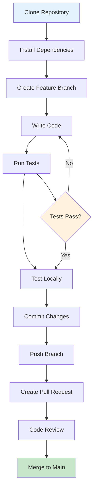

# OpenFrame CLI - Developer Getting Started Guide

Welcome to the OpenFrame CLI development team! This guide will help you set up your development environment, understand the codebase structure, and start contributing to the project.

## Development Environment Setup

### Prerequisites

| Tool | Version | Purpose | Installation |
|------|---------|---------|--------------|
| **Go** | 1.21+ | Primary language | [Install Go](https://golang.org/doc/install) |
| **Git** | 2.30+ | Version control | [Install Git](https://git-scm.com/downloads) |
| **Docker** | 20.0+ | Container runtime | [Install Docker](https://docs.docker.com/get-docker/) |
| **kubectl** | 1.20+ | Kubernetes CLI | [Install kubectl](https://kubernetes.io/docs/tasks/tools/) |
| **k3d** | 5.0+ | Local K8s clusters | [Install k3d](https://k3d.io/stable/#installation) |
| **Helm** | 3.0+ | Package manager | [Install Helm](https://helm.sh/docs/intro/install/) |

### Clone and Setup

```bash
# Clone the repository
git clone https://github.com/flamingo-stack/openframe-cli.git
cd openframe-cli

# Install dependencies
go mod download

# Build the project
make build

# Or build with Go directly
go build -o bin/openframe ./cmd/main.go
```

### Development Workflow



## Repository Structure

```
openframe-cli/
├── cmd/                          # CLI command definitions
│   ├── bootstrap/               
│   │   └── bootstrap.go         # Bootstrap command implementation
│   ├── chart/                   
│   │   ├── chart.go            # Chart command group
│   │   └── install.go          # Chart installation logic
│   ├── cluster/                 
│   │   ├── cluster.go          # Cluster command group
│   │   ├── create.go           # Cluster creation
│   │   ├── delete.go           # Cluster deletion
│   │   ├── list.go             # List clusters
│   │   ├── status.go           # Cluster status
│   │   └── cleanup.go          # Resource cleanup
│   └── dev/                     
│       └── dev.go              # Development tools commands
├── internal/                    # Internal packages (not exported)
│   ├── bootstrap/              # Bootstrap service logic
│   ├── cluster/                # Cluster management services
│   │   ├── models/             # Data models and validation
│   │   ├── services/           # Business logic
│   │   ├── ui/                 # User interface components
│   │   └── utils/              # Utilities and helpers
│   ├── chart/                  # Chart installation services
│   ├── dev/                    # Development workflow services
│   └── shared/                 # Shared utilities
│       ├── ui/                 # Common UI components
│       └── errors/             # Error handling
├── docs/                       # Documentation
│   ├── dev/                    # Developer documentation
│   └── tutorials/              # Tutorial files
├── scripts/                    # Build and utility scripts
├── go.mod                      # Go module definition
├── go.sum                      # Go dependency checksums
├── Makefile                    # Build automation
└── README.md                   # Project overview
```

## Key Architecture Concepts

### Command Structure

OpenFrame CLI follows a layered architecture:

1. **Command Layer** (`cmd/`): Cobra commands that handle CLI parsing and validation
2. **Service Layer** (`internal/*/services/`): Business logic and orchestration
3. **UI Layer** (`internal/*/ui/`): User interaction and display logic
4. **Provider Layer**: External tool integrations (k3d, Helm, ArgoCD)

### Package Organization

| Package | Purpose | Example Files |
|---------|---------|---------------|
| `cmd/cluster/` | Cluster CLI commands | `create.go`, `delete.go`, `list.go` |
| `internal/cluster/services/` | Cluster business logic | Cluster lifecycle management |
| `internal/cluster/ui/` | Cluster UI components | Interactive wizards, status display |
| `internal/cluster/models/` | Data structures | `ClusterConfig`, validation functions |
| `internal/shared/` | Common utilities | Error handling, shared UI components |

## Build and Test Commands

### Building the Project

```bash
# Build for current platform
make build

# Build for all platforms
make build-all

# Cross-compile for Linux
GOOS=linux GOARCH=amd64 go build -o bin/openframe-linux ./cmd/main.go

# Build with version information
go build -ldflags "-X main.version=dev" -o bin/openframe ./cmd/main.go
```

### Running Tests

```bash
# Run all tests
make test

# Run tests with coverage
go test -cover ./...

# Run specific package tests
go test ./cmd/cluster/...

# Run tests with verbose output
go test -v ./internal/cluster/...

# Run integration tests (requires Docker)
make test-integration
```

### Code Quality

```bash
# Run linting
make lint

# Format code
make fmt
# or
go fmt ./...

# Run security checks
make security

# Run all quality checks
make check-all
```

## Development Best Practices

### Code Style and Conventions

1. **Package Naming**: Use lowercase, single-word package names
2. **Function Naming**: Use camelCase, start with capital letter for exported functions
3. **Error Handling**: Always handle errors explicitly, use wrapped errors for context
4. **Comments**: Document exported functions and complex logic

```go
// Good: Exported function with clear documentation
func CreateCluster(config ClusterConfig) error {
    if err := validateConfig(config); err != nil {
        return fmt.Errorf("invalid cluster config: %w", err)
    }
    // Implementation...
    return nil
}

// Good: Internal function with descriptive name
func validateConfig(config ClusterConfig) error {
    // Validation logic...
}
```

### Testing Guidelines

```go
// Example test structure
func TestCreateCluster(t *testing.T) {
    tests := []struct {
        name        string
        config      ClusterConfig
        expectError bool
    }{
        {
            name: "valid config",
            config: ClusterConfig{
                Name: "test-cluster",
                Type: ClusterTypeK3d,
                NodeCount: 3,
            },
            expectError: false,
        },
        {
            name: "invalid name",
            config: ClusterConfig{
                Name: "",
            },
            expectError: true,
        },
    }

    for _, tt := range tests {
        t.Run(tt.name, func(t *testing.T) {
            err := CreateCluster(tt.config)
            if tt.expectError && err == nil {
                t.Error("expected error but got none")
            }
            if !tt.expectError && err != nil {
                t.Errorf("unexpected error: %v", err)
            }
        })
    }
}
```

### Adding New Commands

1. **Create command file** in appropriate `cmd/` subdirectory
2. **Add to parent command** in the command group file
3. **Implement business logic** in `internal/` services
4. **Add UI components** if needed for user interaction
5. **Write tests** for both command and service layers
6. **Update documentation** including inline docs

Example command structure:
```go
package cluster

func getMyNewCmd() *cobra.Command {
    cmd := &cobra.Command{
        Use:   "mynew [args]",
        Short: "Short description",
        Long:  `Long description with examples`,
        Args:  cobra.ExactArgs(1),
        RunE:  utils.WrapCommandWithCommonSetup(runMyNew),
    }
    return cmd
}

func runMyNew(cmd *cobra.Command, args []string) error {
    service := utils.GetCommandService()
    return service.MyNewOperation(args[0])
}
```

## Common Development Errors and Solutions

| Error | Cause | Solution |
|-------|-------|----------|
| `go: module not found` | Missing dependencies | Run `go mod download` |
| `undefined: SomeFunction` | Import missing | Add proper import statement |
| `docker: command not found` | Docker not installed/running | Install Docker and ensure it's running |
| `k3d cluster create failed` | Port conflicts | Use different ports or stop conflicting services |
| Tests failing locally | Environment differences | Use `make test-clean` to run in clean environment |

### Debug Tips

```bash
# Enable verbose logging
export OPENFRAME_DEBUG=true
./bin/openframe cluster create test-debug --verbose

# Use Go's race detector during development
go build -race -o bin/openframe ./cmd/main.go

# Profile memory usage
go build -o bin/openframe ./cmd/main.go
./bin/openframe cluster create test --memprofile=mem.prof

# Use delve debugger
dlv debug ./cmd/main.go -- cluster create test
```

## Contributing Guidelines

### Branch Naming

- `feature/your-feature-name` - For new features
- `bugfix/issue-description` - For bug fixes
- `docs/documentation-update` - For documentation changes
- `refactor/component-name` - For code refactoring

### Commit Messages

Follow conventional commits format:

```
type(scope): description

feat(cluster): add support for custom node labels
fix(bootstrap): resolve ArgoCD installation timeout
docs(readme): update installation instructions
test(cluster): add integration tests for deletion
```

### Pull Request Process

1. **Create feature branch** from `main`
2. **Make changes** with appropriate tests
3. **Run quality checks** (`make check-all`)
4. **Update documentation** if needed
5. **Create pull request** with clear description
6. **Address review feedback**
7. **Ensure CI passes** before merging

### Code Review Checklist

- [ ] Code follows project conventions
- [ ] Tests cover new functionality
- [ ] Documentation updated
- [ ] Error handling implemented
- [ ] No breaking changes (or properly documented)
- [ ] Performance impact considered

## Debugging and Testing

### Local Testing Workflow

```bash
# Build and test new feature
make build
./bin/openframe cluster create test-local

# Test with real cluster
./bin/openframe bootstrap test-integration --verbose

# Clean up after testing
./bin/openframe cluster delete test-local
./bin/openframe cluster delete test-integration
```

### Integration Testing

```bash
# Run full integration test suite
make test-integration

# Test specific scenarios
go test -tags=integration ./test/integration/cluster_test.go
```

## Advanced Development Topics

<details>
<summary>🔧 Working with External Dependencies</summary>

OpenFrame CLI integrates with several external tools:

- **k3d**: For local Kubernetes clusters
- **Helm**: For package management
- **ArgoCD**: For GitOps deployments
- **Telepresence**: For traffic interception

When adding new integrations:
1. Create provider interface in `internal/providers/`
2. Implement concrete provider
3. Add to dependency injection in services
4. Write integration tests

</details>

<details>
<summary>🏗️ Extending the Architecture</summary>

To add new command groups:
1. Create new directory under `cmd/`
2. Implement command group with subcommands
3. Add corresponding service layer in `internal/`
4. Register with main CLI in root command
5. Follow existing patterns for UI and error handling

</details>

## Getting Help

- **Internal Documentation**: Check `.*.md` files in source directories
- **Architecture Questions**: Review [Architecture Overview](architecture-overview-dev.md)
- **Team Chat**: Join the development team Slack/Discord
- **Code Reviews**: Tag experienced team members for complex changes

## Next Steps

1. **Pick a starter issue** labeled "good first issue"
2. **Read existing code** in the area you want to contribute
3. **Run the test suite** to understand expected behavior
4. **Start small** with documentation or minor bug fixes
5. **Ask questions** - the team is here to help!

> **Welcome to the team!** 🎉 Start by building the project and running a few commands to get familiar with the codebase. Then pick a small issue and make your first contribution!