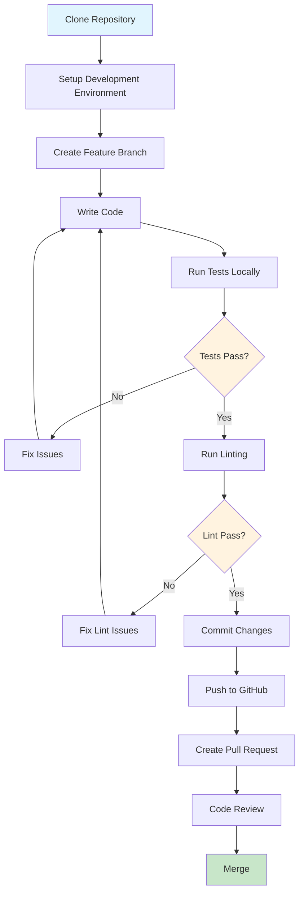

# Developer Getting Started Guide

Welcome to the OpenFrame CLI development environment! This guide will help you set up a complete development environment, understand the project structure, and start contributing effectively to the codebase.

## Development Environment Setup

### Prerequisites for Development

| Tool | Purpose | Installation Check | Required Version |
|------|---------|-------------------|------------------|
| **Go** | Programming language | `go version` | 1.23+ |
| **Git** | Version control | `git --version` | 2.30+ |
| **Docker** | Container runtime | `docker --version` | 20.10+ |
| **Make** | Build automation | `make --version` | 4.0+ |
| **golangci-lint** | Code linting | `golangci-lint version` | 1.50+ |

### Installing Development Tools

```bash
# Install Go (macOS with Homebrew)
brew install go

# Install Go (Linux)
wget https://go.dev/dl/go1.23.6.linux-amd64.tar.gz
sudo tar -C /usr/local -xzf go1.23.6.linux-amd64.tar.gz
echo 'export PATH=$PATH:/usr/local/go/bin' >> ~/.bashrc

# Install golangci-lint
curl -sSfL https://raw.githubusercontent.com/golangci/golangci-lint/master/install.sh | sh -s -- -b $(go env GOPATH)/bin

# Install additional dev tools
go install golang.org/x/tools/cmd/goimports@latest
go install github.com/onsi/ginkgo/v2/ginkgo@latest
```

### Repository Setup

```bash
# Clone the repository
git clone https://github.com/flamingo-stack/openframe-cli.git
cd openframe-cli

# Initialize Go module
go mod download

# Verify setup
make test
```

## Project Repository Structure

```
openframe-cli/
├── cmd/                          # CLI command definitions (Cobra)
│   ├── bootstrap/               # Bootstrap command implementation
│   ├── chart/                   # Chart management commands
│   ├── cluster/                 # Cluster lifecycle commands  
│   ├── dev/                     # Development workflow commands
│   └── root.go                  # Root command and CLI entry point
├── internal/                    # Internal packages (not importable)
│   ├── bootstrap/               # Bootstrap service implementation
│   │   └── service.go          # Main bootstrap orchestration
│   ├── chart/                   # Chart management services
│   │   ├── models/             # Chart domain models
│   │   └── service.go          # Chart installation logic
│   ├── cluster/                 # Cluster management core
│   │   ├── models/             # Domain models and validation
│   │   ├── providers/          # Infrastructure providers (K3d, etc.)
│   │   ├── prerequisites/      # Dependency validation and installation
│   │   ├── ui/                 # User interface components
│   │   └── service.go          # Cluster business logic
│   └── shared/                  # Shared utilities
│       ├── config/             # Configuration management
│       ├── errors/             # Error handling
│       ├── executor/           # Command execution abstraction
│       └── ui/                 # Shared UI components
├── docs/                        # Documentation
│   ├── codewiki/               # Generated architecture docs
│   └── tutorials/              # User and developer guides
├── scripts/                     # Build and utility scripts
├── main.go                      # Application entry point
├── go.mod                       # Go module definition
├── Makefile                     # Build automation
└── README.md                    # Project overview
```

### Key Directories Explained

| Directory | Purpose | When to Modify |
|-----------|---------|----------------|
| `cmd/` | CLI command definitions using Cobra framework | Adding new commands or flags |
| `internal/bootstrap/` | Main bootstrap service orchestrating cluster + chart setup | Changing bootstrap workflow |
| `internal/cluster/` | Core cluster management business logic | Adding cluster providers or features |
| `internal/shared/` | Common utilities like error handling, UI, command execution | Adding shared functionality |
| `docs/` | All documentation including generated and manual docs | Adding tutorials or updating docs |

## Development Workflow



## Build and Test Commands

The project uses a `Makefile` for common development tasks:

```bash
# Build the CLI binary
make build

# Run all tests
make test

# Run tests with coverage
make test-coverage

# Run linting
make lint

# Format code
make fmt

# Run all quality checks
make check

# Clean build artifacts
make clean

# Install binary locally
make install

# Cross-compile for all platforms
make build-all
```

### Manual Build Commands

```bash
# Build for current platform
go build -o bin/openframe main.go

# Build with version information
go build -ldflags "-X main.version=dev -X main.commit=$(git rev-parse HEAD)" -o bin/openframe main.go

# Cross-compile for different platforms
GOOS=linux GOARCH=amd64 go build -o bin/openframe-linux-amd64 main.go
GOOS=darwin GOARCH=amd64 go build -o bin/openframe-darwin-amd64 main.go
GOOS=windows GOARCH=amd64 go build -o bin/openframe-windows-amd64.exe main.go
```

## Code Style and Conventions

### Go Code Standards

The project follows standard Go conventions with some specific guidelines:

```go
// Package naming: lowercase, single word
package cluster

// Interface naming: descriptive, often ending with -er
type ClusterProvider interface {
    CreateCluster(ctx context.Context, config *models.ClusterConfig) error
    DeleteCluster(ctx context.Context, name string) error
}

// Struct naming: PascalCase
type ClusterService struct {
    provider    ClusterProvider
    validator   *Validator
    ui          ui.Interface
}

// Method naming: PascalCase, descriptive
func (s *ClusterService) CreateCluster(ctx context.Context, config *models.ClusterConfig) error {
    // Implementation
}

// Error handling: explicit, wrapped with context
func (s *ClusterService) validateConfig(config *models.ClusterConfig) error {
    if config.Name == "" {
        return fmt.Errorf("cluster name cannot be empty")
    }
    return nil
}
```

### Project-Specific Conventions

1. **Error Handling**: Use the `internal/shared/errors` package for consistent error handling
2. **UI Components**: Use `internal/shared/ui` for consistent terminal output
3. **Command Execution**: Use `internal/shared/executor` for running external commands
4. **Testing**: Follow table-driven tests pattern with testify assertions

### Linting Rules

The project uses `golangci-lint` with these key rules:

```yaml
# .golangci.yml (key settings)
linters:
  enable:
    - gofmt
    - goimports
    - govet
    - staticcheck
    - gosec
    - errcheck
    - ineffassign
    - misspell
```

## Contributing Guidelines

### Before You Start

1. **Check existing issues**: Look for related issues or feature requests
2. **Discuss large changes**: Open an issue to discuss significant changes before implementation
3. **Follow conventions**: Adhere to the established code style and patterns

### Making Changes

1. **Create a feature branch**:
   ```bash
   git checkout -b feature/add-new-provider
   ```

2. **Write tests first** (TDD approach):
   ```bash
   # Create test file
   touch internal/cluster/providers/new_provider_test.go
   # Write failing tests, then implement functionality
   ```

3. **Implement the feature**:
   ```go
   // Example: Adding a new cluster provider
   type NewProvider struct {
       executor shared.CommandExecutor
       config   *Config
   }

   func (p *NewProvider) CreateCluster(ctx context.Context, config *models.ClusterConfig) error {
       // Implementation with proper error handling
   }
   ```

4. **Update documentation**:
   ```bash
   # Add inline documentation
   # Update relevant tutorials if needed
   ```

### Testing Your Changes

```bash
# Run unit tests
make test

# Test specific package
go test ./internal/cluster/...

# Run integration tests (requires Docker)
make test-integration

# Manual testing with local build
make build
./bin/openframe bootstrap test-cluster --deployment-mode=oss-tenant --verbose
```

### Submitting Changes

1. **Ensure all checks pass**:
   ```bash
   make check  # Runs lint, test, and format checks
   ```

2. **Commit with descriptive messages**:
   ```bash
   git commit -m "feat(cluster): add support for custom node configuration
   
   - Add NodeConfig struct with CPU and memory settings
   - Update K3d provider to accept custom node specs
   - Add validation for resource limits
   
   Closes #123"
   ```

3. **Push and create PR**:
   ```bash
   git push origin feature/add-new-provider
   # Create PR on GitHub
   ```

## Debugging Tips

### Common Development Errors

| Error Type | Symptoms | Debug Strategy |
|------------|----------|----------------|
| **Import cycles** | `import cycle not allowed` | Use `go mod graph \| grep cycle` |
| **Interface mismatches** | Type assertion failures | Check interface implementations with `go build` |
| **Test failures** | Flaky or failing tests | Run with `-v` flag and check mocks |
| **Command execution** | External commands fail | Use `--dry-run` flag to inspect commands |

### Debug Commands

```bash
# Debug with verbose output
go run main.go bootstrap test-cluster --deployment-mode=oss-tenant --verbose

# Run specific test with output
go test -v ./internal/cluster -run TestClusterService

# Debug race conditions
go test -race ./...

# Memory profiling
go test -memprofile=mem.prof ./...
go tool pprof mem.prof

# Check dependencies
go mod why github.com/dependency/name
go mod graph
```

### IDE Setup Recommendations

#### VS Code Configuration

```json
// .vscode/settings.json
{
    "go.toolsManagement.checkForUpdates": "local",
    "go.useLanguageServer": true,
    "go.lintTool": "golangci-lint",
    "go.testFlags": ["-v"],
    "editor.formatOnSave": true,
    "go.formatTool": "goimports"
}
```

#### GoLand Configuration

- Enable Go modules integration
- Set up golangci-lint as external tool
- Configure test runners for table-driven tests

## Advanced Development Topics

### Adding a New Command

1. **Create command file**:
   ```bash
   touch cmd/cluster/new-command.go
   ```

2. **Implement Cobra command**:
   ```go
   func getNewCmd() *cobra.Command {
       cmd := &cobra.Command{
           Use:   "new-command",
           Short: "Description of new command",
           RunE:  runNewCommand,
       }
       // Add flags
       return cmd
   }
   ```

3. **Add to parent command**:
   ```go
   // In cmd/cluster/cluster.go
   clusterCmd.AddCommand(getNewCmd())
   ```

### Adding a New Provider

1. **Define interface** in `internal/cluster/models/`
2. **Implement provider** in `internal/cluster/providers/`
3. **Add tests** with mocked dependencies
4. **Register provider** in service constructor

### Working with UI Components

```go
// Using shared UI components
import "github.com/flamingo-stack/openframe-cli/internal/shared/ui"

// Display success message
ui.Success("Cluster created successfully!")

// Show progress
spinner := ui.NewSpinner("Creating cluster...")
spinner.Start()
defer spinner.Stop()

// Interactive prompts
name, err := ui.PromptForString("Cluster name", "default-cluster")
```

## Release Process (for Maintainers)

<details>
<summary>Click to expand release process details</summary>

```bash
# 1. Update version
git tag v1.2.3

# 2. Push tag
git push origin v1.2.3

# 3. GitHub Actions will automatically:
#    - Build binaries for all platforms
#    - Create GitHub release
#    - Publish artifacts

# 4. Update documentation if needed
# 5. Announce release
```

</details>

---

## Quick Reference

### Essential Development Commands
```bash
# Setup
make build && make test

# Development cycle
make fmt && make lint && make test

# Manual testing
./bin/openframe bootstrap test --deployment-mode=oss-tenant --dry-run

# Debug output
go run main.go cluster create test --verbose
```

### Key Files to Know
- `main.go` - Application entry point
- `cmd/root.go` - Root command and global flags
- `internal/bootstrap/service.go` - Main bootstrap orchestration
- `internal/cluster/service.go` - Cluster management business logic
- `internal/shared/executor/executor.go` - Command execution abstraction

### Package Architecture Patterns
- **Clean Architecture**: Separation of concerns with clear layers
- **Dependency Injection**: Services receive dependencies via constructors
- **Interface Segregation**: Small, focused interfaces
- **Error Wrapping**: Contextual error messages with `fmt.Errorf`

---

🚀 **Ready to contribute?** Check out the [Architecture Overview](architecture-overview-dev.md) to understand the system design, then pick an issue from the GitHub repository and start coding!

> **💡 Development Tip**: Use `make check` before committing to ensure your code meets all quality standards.