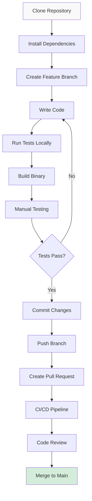

# OpenFrame CLI - Developer Getting Started Guide

This guide helps developers set up their environment for contributing to OpenFrame CLI, understand the codebase structure, and learn the development workflow.

## Development Environment Setup

### Prerequisites

| Tool | Version | Purpose |
|------|---------|---------|
| **Go** | 1.21+ | Primary development language |
| **Git** | Latest | Version control |
| **Docker** | Latest | For running/testing K3d clusters |
| **kubectl** | Latest | Kubernetes testing |
| **Make** | Latest | Build automation |
| **GoReleaser** *(optional)* | Latest | Release automation |

### Getting the Source Code

1. **Clone the repository**:
   ```bash
   git clone https://github.com/flamingo-stack/openframe-cli.git
   cd openframe-cli
   ```

2. **Set up Go modules**:
   ```bash
   go mod download
   go mod tidy
   ```

3. **Verify setup**:
   ```bash
   go version
   go mod verify
   ```

## Repository Structure

```
openframe-cli/
├── cmd/                          # CLI command definitions
│   ├── bootstrap/               # Bootstrap command
│   ├── cluster/                 # Cluster management commands
│   ├── chart/                   # Chart installation commands
│   ├── dev/                     # Development tools
│   └── root.go                  # Root command and CLI entry point
├── internal/                    # Internal packages (not importable)
│   ├── bootstrap/               # Bootstrap service implementation
│   ├── chart/                   # Chart management services
│   │   ├── models/             # Chart data models
│   │   ├── prerequisites/      # Prerequisites checking
│   │   └── services/           # Chart installation logic
│   ├── cluster/                 # Cluster management services
│   │   ├── models/             # Cluster configuration models
│   │   ├── providers/          # K3d, Kind providers
│   │   ├── services/           # Cluster lifecycle management
│   │   └── ui/                 # Cluster-specific UI components
│   ├── dev/                     # Development tools services
│   │   ├── providers/          # Telepresence, Skaffold providers
│   │   └── services/           # Dev workflow implementations
│   └── shared/                  # Shared utilities and components
│       ├── config/             # Configuration management
│       ├── errors/             # Error handling and display
│       ├── executor/           # Command execution abstraction
│       └── ui/                 # Common UI components and styling
├── docs/                        # Documentation
│   ├── dev/                    # Developer documentation
│   └── tutorials/              # User and developer tutorials
├── scripts/                     # Build and automation scripts
├── go.mod                       # Go module definition
├── go.sum                       # Go module checksums
├── Makefile                     # Build automation
└── main.go                      # Application entry point
```

## Key Architecture Patterns

### Command Pattern
Each CLI command follows a consistent pattern:
- **Command Definition**: In `cmd/` package with Cobra setup
- **Service Layer**: In `internal/` with business logic
- **Provider Layer**: External tool integration (K3d, Helm, etc.)

### Example Command Structure:
```go
// cmd/cluster/create.go - Command definition
func getCreateCmd() *cobra.Command {
    return &cobra.Command{
        Use:   "create [NAME]",
        Short: "Create a new cluster",
        RunE:  runCreateCluster, // Delegates to service
    }
}

// internal/cluster/services/ - Business logic
func (s *Service) CreateCluster(config *models.ClusterConfig) error {
    // Validation, UI interactions, provider calls
}

// internal/cluster/providers/ - External integration
func (p *K3dProvider) Create(config *models.ClusterConfig) error {
    // Direct tool integration
}
```

## Build and Test Commands

### Building

```bash
# Build for current platform
go build -o openframe .

# Build for all platforms (requires GoReleaser)
goreleaser build --snapshot --clean

# Install to $GOPATH/bin
go install .
```

### Testing

```bash
# Run all tests
go test ./...

# Run tests with coverage
go test -cover ./...

# Run tests in specific package
go test ./internal/cluster/...

# Run integration tests (requires Docker)
go test -tags=integration ./...
```

### Development Workflow



## Code Style and Conventions

### Go Standards
- Follow standard Go formatting: `go fmt ./...`
- Use `golangci-lint` for linting: `golangci-lint run`
- Follow [Effective Go](https://golang.org/doc/effective_go.html) guidelines

### Project-Specific Conventions

#### Package Organization
```go
// Good - clear package responsibility
package cluster      // Cluster management
package chart        // Chart operations
package shared       // Shared utilities

// Avoid - too generic
package utils
package helpers
```

#### Error Handling
```go
// Use shared error handler for consistent UX
return sharedErrors.HandleGlobalError(err, verbose)

// Wrap errors with context
return fmt.Errorf("failed to create cluster %s: %w", name, err)
```

#### UI Components
```go
// Use shared UI components for consistency
ui.ShowLogo()
ui.DisplaySuccess("Cluster created successfully!")
ui.ShowSpinner("Creating cluster...")
```

#### Flag Handling
```go
// Use consistent flag patterns
cmd.Flags().StringVar(&deploymentMode, "deployment-mode", "", "Deployment mode (oss-tenant, saas-tenant, saas-shared)")
cmd.Flags().BoolVar(&nonInteractive, "non-interactive", false, "Run without interactive prompts")
```

### Naming Conventions

| Type | Convention | Example |
|------|------------|---------|
| **Packages** | lowercase, descriptive | `cluster`, `bootstrap`, `shared` |
| **Types** | PascalCase | `ClusterConfig`, `ChartService` |
| **Functions** | PascalCase (public), camelCase (private) | `CreateCluster()`, `validateConfig()` |
| **Constants** | PascalCase or SCREAMING_SNAKE | `DefaultClusterName`, `MAX_RETRIES` |
| **Files** | snake_case | `cluster_service.go`, `helm_provider.go` |

## Development Debugging

### Debug Configuration

Add debug logging to your development:
```go
// Use structured logging
log.Printf("[DEBUG] Creating cluster with config: %+v", config)

// Conditional debug output
if verbose {
    fmt.Printf("Executing command: %s\n", cmd)
}
```

### Testing Your Changes

1. **Build and test locally**:
   ```bash
   go build -o openframe-dev .
   ./openframe-dev bootstrap --verbose
   ```

2. **Test specific commands**:
   ```bash
   ./openframe-dev cluster create test-cluster --verbose
   ./openframe-dev cluster delete test-cluster
   ```

3. **Integration testing with real clusters**:
   ```bash
   # Test full workflow
   ./openframe-dev bootstrap --deployment-mode oss-tenant --non-interactive
   
   # Verify results
   kubectl get pods -A
   kubectl get applications -n argocd
   
   # Cleanup
   ./openframe-dev cluster cleanup
   ```

### Common Development Issues

| Issue | Symptom | Solution |
|-------|---------|----------|
| **Import cycle** | `import cycle not allowed` | Reorganize packages, use interfaces |
| **Command not found** | `unknown command` | Check command registration in parent |
| **Flag conflicts** | Flags not working | Verify flag inheritance and scope |
| **Provider errors** | External tool failures | Check tool installation and versions |
| **UI issues** | Formatting problems | Test in different terminal environments |

## Contributing Guidelines

### Before Starting
1. **Check existing issues** for planned work
2. **Create an issue** for new features or bugs
3. **Discuss approach** with maintainers for large changes

### Development Process
1. **Create feature branch** from `main`
2. **Write tests** for new functionality
3. **Update documentation** as needed
4. **Test thoroughly** including edge cases
5. **Submit PR** with clear description

### Pull Request Guidelines
- **Clear title** describing the change
- **Detailed description** of what and why
- **Link to issue** if applicable
- **Include tests** for new features
- **Update docs** if behavior changes

### Code Review Checklist
- [ ] Code follows project conventions
- [ ] Tests pass locally
- [ ] Documentation updated
- [ ] No breaking changes (unless intentional)
- [ ] Error handling is appropriate
- [ ] Performance impact considered

## Advanced Development Topics

### Adding New Commands

1. **Create command file**:
   ```bash
   # Add to appropriate cmd/ subdirectory
   touch cmd/cluster/new-command.go
   ```

2. **Implement command**:
   ```go
   func getNewCmd() *cobra.Command {
       return &cobra.Command{
           Use:   "new [args]",
           Short: "Description",
           RunE:  runNewCommand,
       }
   }
   ```

3. **Register with parent**:
   ```go
   // In parent command file
   cmd.AddCommand(getNewCmd())
   ```

### Adding New Providers

1. **Define interface**:
   ```go
   type NewProvider interface {
       Create(config *Config) error
       Delete(name string) error
   }
   ```

2. **Implement provider**:
   ```go
   type NewProviderImpl struct{}
   
   func (p *NewProviderImpl) Create(config *Config) error {
       // Implementation
   }
   ```

3. **Integrate with service**:
   ```go
   type Service struct {
       provider NewProvider
   }
   ```

### Adding UI Components

1. **Create in shared/ui**:
   ```go
   func ShowCustomPrompt(message string) (string, error) {
       return pterm.DefaultInteractiveTextInput.Show(message)
   }
   ```

2. **Use consistently** across commands:
   ```go
   result, err := ui.ShowCustomPrompt("Enter value:")
   ```

## Release Process

### Versioning
- Follow [Semantic Versioning](https://semver.org/)
- Tag releases: `v1.2.3`
- Update version in code before release

### Building Releases
```bash
# Create release builds
goreleaser release --clean

# Test release locally
goreleaser build --snapshot --clean
```

## Getting Help

### Internal Resources
- **Code Documentation**: Use `go doc` for package docs
- **Architecture Decision Records**: Check `docs/dev/` for design decisions
- **Issue Templates**: Use GitHub issue templates for bugs/features

### External Resources
- **Go Documentation**: [golang.org/doc](https://golang.org/doc/)
- **Cobra CLI**: [github.com/spf13/cobra](https://github.com/spf13/cobra)
- **PTerm UI**: [github.com/pterm/pterm](https://github.com/pterm/pterm)

### Community
- **GitHub Discussions**: For general questions
- **Issues**: For bugs and feature requests
- **Pull Requests**: For code contributions

---

🚀 **Ready to contribute?** Start with a small issue or documentation improvement to get familiar with the codebase and development process!