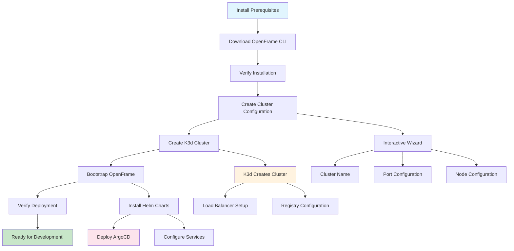

# 🚀 Getting Started with OpenFrame CLI

Welcome to OpenFrame CLI! This guide will help you set up and start using OpenFrame to manage Kubernetes clusters and development workflows in minutes.

## 📋 Prerequisites

Before you begin, ensure you have the following tools installed on your system:

| Tool | Version | Platform | Installation Link |
|------|---------|----------|-------------------|
| **Docker** | 20.10+ | All | [docker.com/get-started](https://docker.com/get-started) |
| **kubectl** | 1.20+ | All | [kubernetes.io/docs/tasks/tools](https://kubernetes.io/docs/tasks/tools/) |
| **Helm** | 3.8+ | All | [helm.sh/docs/intro/install](https://helm.sh/docs/intro/install/) |
| **Git** | 2.30+ | All | [git-scm.com/downloads](https://git-scm.com/downloads) |

> **💡 Pro tip:** Most package managers (brew, apt, chocolatey) can install these tools quickly with a single command.

## 🛠 Installation

### Method 1: Download Pre-built Binary (Recommended)

Choose your platform and run the appropriate command:

<details>
<summary>🍎 <strong>macOS</strong></summary>

```bash
# For Apple Silicon (M1/M2)
curl -L https://github.com/flamingo-stack/openframe-cli/releases/latest/download/openframe-cli_darwin_arm64.tar.gz | tar xz
sudo mv openframe /usr/local/bin/

# For Intel Macs
curl -L https://github.com/flamingo-stack/openframe-cli/releases/latest/download/openframe-cli_darwin_amd64.tar.gz | tar xz
sudo mv openframe /usr/local/bin/
```

</details>

<details>
<summary>🐧 <strong>Linux</strong></summary>

```bash
curl -L https://github.com/flamingo-stack/openframe-cli/releases/latest/download/openframe-cli_linux_amd64.tar.gz | tar xz
sudo mv openframe /usr/local/bin/
```

</details>

<details>
<summary>🪟 <strong>Windows</strong></summary>

Download the binary manually from [GitHub Releases](https://github.com/flamingo-stack/openframe-cli/releases/latest) and add it to your PATH.

</details>

### Method 2: Build from Source

```bash
git clone https://github.com/flamingo-stack/openframe-cli.git
cd openframe-cli
go build -o openframe .
sudo mv openframe /usr/local/bin/  # Linux/macOS
```

### Verify Installation

```bash
openframe --version
```

## 🔧 Setup Process Flow

Here's the complete setup process you'll follow:



## 🚀 Quick Start Guide

### Step 1: Create Your First Cluster

OpenFrame provides an interactive wizard to create your cluster:

```bash
openframe cluster create
```

The wizard will prompt you for:
- **Cluster name** (default: `openframe-dev`)
- **Node count** (default: 1)
- **Port mappings** for services
- **Registry configuration**

> **📝 Note:** The wizard automatically detects your system capabilities and suggests optimal configurations.

### Step 2: Verify Cluster Status

```bash
# List all clusters
openframe cluster list

# Check detailed status
openframe cluster status
```

Expected output:
```
✅ Cluster: openframe-dev
📊 Status: Running
🔗 Nodes: 1/1 Ready
🌐 API Server: https://127.0.0.1:6443
```

### Step 3: Bootstrap OpenFrame Services

Install the core OpenFrame components:

```bash
openframe bootstrap --deployment-mode=oss-tenant
```

This command will:
- Install Helm charts for core services
- Deploy ArgoCD for GitOps
- Configure monitoring and observability
- Set up development tools

### Step 4: Verify Deployment

Check that all services are running:

```bash
kubectl get pods --all-namespaces
```

You should see pods in `running` state across multiple namespaces.

## 📁 Basic Configuration

### Cluster Configuration File

OpenFrame automatically creates a configuration file at `~/.openframe/config.yaml`:

```yaml
# ~/.openframe/config.yaml
clusters:
  openframe-dev:
    name: openframe-dev
    nodes: 1
    ports:
      - "80:80@loadbalancer"
      - "443:443@loadbalancer"
    registry:
      enabled: true
      port: 5000
current_cluster: openframe-dev
```

### Environment Variables

You can customize behavior with these environment variables:

```bash
# Set default cluster
export OPENFRAME_CLUSTER=my-cluster

# Set custom kubeconfig location
export KUBECONFIG=~/.kube/config

# Enable debug logging
export OPENFRAME_DEBUG=true
```

## 🎯 Your First "Hello World"

Let's deploy a simple application to verify everything works:

### 1. Create a simple deployment

```yaml
# hello-world.yaml
apiVersion: apps/v1
kind: Deployment
metadata:
  name: hello-world
spec:
  replicas: 1
  selector:
    matchLabels:
      app: hello-world
  template:
    metadata:
      labels:
        app: hello-world
    spec:
      containers:
      - name: hello-world
        image: nginx:alpine
        ports:
        - containerPort: 80
---
apiVersion: v1
kind: Service
metadata:
  name: hello-world
spec:
  selector:
    app: hello-world
  ports:
  - port: 80
    targetPort: 80
  type: ClusterIP
```

### 2. Deploy the application

```bash
kubectl apply -f hello-world.yaml
```

### 3. Test the deployment

```bash
# Port forward to access the service
kubectl port-forward service/hello-world 8080:80

# In another terminal, test the connection
curl http://localhost:8080
```

You should see the nginx welcome page! 🎉

### 4. Clean up

```bash
kubectl delete -f hello-world.yaml
```

## ⚡ Essential Commands

Here are the most common commands you'll use:

```bash
# Cluster management
openframe cluster list              # List clusters
openframe cluster status           # Check cluster health
openframe cluster delete <name>    # Delete a cluster
openframe cluster start <name>     # Start stopped cluster

# Development workflow
openframe dev scaffold             # Start Skaffold for development
openframe dev intercept           # Intercept traffic with Telepresence

# Chart management
openframe chart install           # Install additional charts
```

## ❗ Common Issues & Solutions

| Issue | Symptoms | Solution |
|-------|----------|----------|
| **Docker not running** | `Error: Cannot connect to Docker daemon` | Start Docker Desktop or `systemctl start docker` |
| **Port already in use** | `Port 80 is already allocated` | Use `openframe cluster create` wizard to select different ports |
| **kubectl not found** | `kubectl: command not found` | Install kubectl using your package manager |
| **Cluster creation fails** | `Failed to create cluster` | Check Docker has enough resources (4GB+ RAM) |
| **Bootstrap timeout** | `Timeout waiting for pods` | Increase Docker memory limit and retry |
| **Permission denied** | `Permission denied: /usr/local/bin/openframe` | Run installation commands with `sudo` |

### Need Help?

If you encounter issues not covered here:

1. **Check logs**: `openframe cluster status --verbose`
2. **GitHub Issues**: [Report a bug](https://github.com/flamingo-stack/openframe-cli/issues)
3. **Documentation**: [Full docs](https://github.com/flamingo-stack/openframe-oss-tenant/tree/main/docs)

---

## 🎊 Next Steps

Congratulations! You now have OpenFrame CLI running. Here's what you can explore next:

- 📖 Read the [Architecture Guide](https://github.com/flamingo-stack/openframe-oss-tenant/tree/main/docs) to understand the system
- 🛠 Try the [Development Workflow](./development-workflow.md) tutorial
- 🚀 Deploy your first real application with [Chart Management](./chart-management.md)
- 🔍 Set up [Monitoring and Observability](./monitoring.md)

Happy coding! 🚀