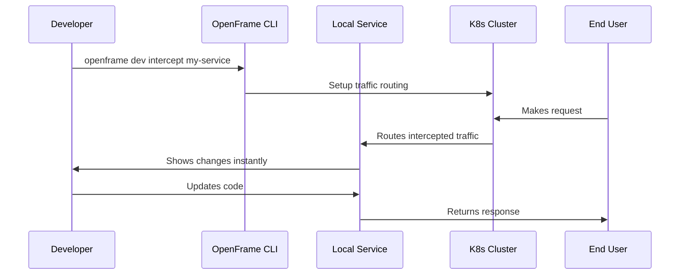

# Common Use Cases for OpenFrame CLI

This guide covers the most common scenarios you'll encounter when using OpenFrame CLI. Each use case includes step-by-step instructions and best practices.

## Use Case 1: Setting Up a Development Environment

**Goal**: Create a complete development environment for OpenFrame applications.

### Step-by-Step Instructions

1. **Create your development cluster**:
   ```bash
   openframe bootstrap dev-environment --deployment-mode=oss-tenant
   ```

2. **Verify the setup**:
   ```bash
   openframe cluster status dev-environment
   kubectl get pods -A
   ```

3. **Access development tools**:
   ```bash
   # Access ArgoCD for application management
   kubectl port-forward svc/argocd-server -n argocd 8080:443
   # Visit https://localhost:8080 (admin/password from cluster status)
   ```

### Best Practices
- Use descriptive cluster names for different projects
- Keep development clusters separate from testing/staging
- Regularly clean up unused clusters: `openframe cluster cleanup`

---

## Use Case 2: Testing Different Deployment Configurations

**Goal**: Test how your application behaves in different OpenFrame deployment modes.

### Testing OSS Single Tenant

```bash
# Create OSS environment
openframe bootstrap test-oss --deployment-mode=oss-tenant --non-interactive

# Deploy your application
kubectl apply -f your-app-manifest.yaml

# Test functionality
curl http://your-app.test-oss.local
```

### Testing SaaS Configurations

```bash
# Test SaaS single tenant
openframe bootstrap test-saas-single --deployment-mode=saas-tenant --non-interactive

# Test SaaS shared infrastructure  
openframe bootstrap test-saas-shared --deployment-mode=saas-shared --non-interactive
```

### Comparing Results

| Deployment Mode | Resource Usage | Multi-tenancy | Best For |
|----------------|----------------|---------------|----------|
| **oss-tenant** | Low | Single tenant | Development, POCs |
| **saas-tenant** | Medium | Single tenant | Customer demos |
| **saas-shared** | High | Multi-tenant | Production testing |

### Best Practices
- Use consistent naming: `test-[mode]-[feature]`
- Document differences between environments
- Clean up test clusters promptly

---

## Use Case 3: Application Development with Live Reloading

**Goal**: Develop applications with immediate feedback using Telepresence intercepts.

### Setting Up Development Intercepts

1. **Prepare your cluster**:
   ```bash
   openframe bootstrap dev-cluster --deployment-mode=oss-tenant
   ```

2. **Set up service interception**:
   ```bash
   # Intercept traffic to your service
   openframe dev intercept my-service
   
   # Follow the interactive prompts to configure:
   # - Service name to intercept
   # - Local port to forward traffic
   # - Headers for conditional routing
   ```

3. **Start local development**:
   ```bash
   # In another terminal, run your local service
   npm run dev  # or equivalent for your stack
   ```

### Live Development Workflow



### Best Practices
- Test intercepts with staging data first
- Use header-based routing for production intercepts
- Monitor resource usage during development

---

## Use Case 4: Managing Multiple Environments

**Goal**: Maintain separate clusters for different stages of development.

### Environment Setup Strategy

```bash
# Development environment
openframe bootstrap dev-main --deployment-mode=oss-tenant

# Feature testing environment  
openframe bootstrap dev-feature-auth --deployment-mode=oss-tenant

# Integration testing environment
openframe bootstrap test-integration --deployment-mode=saas-tenant

# Demo environment
openframe bootstrap demo-latest --deployment-mode=saas-shared
```

### Environment Management Commands

```bash
# List all your environments
openframe cluster list

# Quick status check across environments
for cluster in dev-main dev-feature-auth test-integration demo-latest; do
    echo "=== $cluster ==="
    openframe cluster status $cluster
    echo
done

# Clean up feature environments when done
openframe cluster delete dev-feature-auth
```

### Environment Naming Convention

| Pattern | Example | Purpose |
|---------|---------|---------|
| `dev-[feature]` | `dev-auth`, `dev-billing` | Feature development |
| `test-[type]` | `test-integration`, `test-performance` | Testing phases |
| `demo-[version]` | `demo-v1.2`, `demo-latest` | Demonstrations |
| `staging-[env]` | `staging-prod`, `staging-uat` | Pre-production |

---

## Use Case 5: Debugging Application Issues

**Goal**: Diagnose and fix issues in OpenFrame applications using cluster tools.

### Investigation Steps

1. **Check cluster health**:
   ```bash
   openframe cluster status my-cluster --verbose
   kubectl get nodes
   kubectl top nodes  # Resource usage
   ```

2. **Examine application status**:
   ```bash
   # Check all pods
   kubectl get pods -A
   
   # Look for failed pods
   kubectl get pods --field-selector=status.phase=Failed -A
   
   # Check pod logs
   kubectl logs -f deployment/my-app -n my-namespace
   ```

3. **Use ArgoCD for application state**:
   ```bash
   # Port forward to ArgoCD
   kubectl port-forward svc/argocd-server -n argocd 8080:443
   
   # Check sync status
   kubectl get applications -n argocd
   ```

### Common Debug Commands

<details>
<summary>📝 Debug Command Reference</summary>

```bash
# Pod debugging
kubectl describe pod [pod-name] -n [namespace]
kubectl logs [pod-name] -n [namespace] --previous
kubectl exec -it [pod-name] -n [namespace] -- /bin/bash

# Service debugging  
kubectl get endpoints [service-name] -n [namespace]
kubectl describe service [service-name] -n [namespace]

# Networking debugging
kubectl get networkpolicies -A
kubectl describe ingress -A

# Storage debugging
kubectl get pv,pvc -A
kubectl describe pvc [pvc-name] -n [namespace]

# Events and troubleshooting
kubectl get events --sort-by=.metadata.creationTimestamp -A
kubectl get events --field-selector type=Warning -A
```

</details>

---

## Use Case 6: Cleaning Up and Maintenance

**Goal**: Keep your development environment clean and efficient.

### Regular Maintenance Tasks

```bash
# Weekly cleanup routine
openframe cluster cleanup

# Check cluster resource usage
kubectl top nodes
kubectl top pods -A

# Remove unused clusters
openframe cluster list
openframe cluster delete old-cluster-name

# Update OpenFrame CLI
# Download latest version and replace binary
openframe --version
```

### Automated Cleanup Script

```bash
#!/bin/bash
# cleanup-old-clusters.sh

# Delete clusters older than 7 days
for cluster in $(openframe cluster list | grep -E '(test-|demo-)' | awk '{print $1}'); do
    echo "Cleaning up cluster: $cluster"
    openframe cluster delete $cluster --force
done

echo "Cleanup complete!"
```

---

## Use Case 7: Team Collaboration Setup

**Goal**: Create standardized environments for team development.

### Team Environment Template

```bash
# Create team development environment
openframe bootstrap team-backend --deployment-mode=saas-tenant --non-interactive

# Share cluster connection info
openframe cluster status team-backend > team-backend-info.txt

# Set up shared development tools
kubectl apply -f team-shared-configs/
```

### Team Best Practices

- **Naming Convention**: Use team prefixes (`team-backend`, `team-frontend`)
- **Shared Configuration**: Store common manifests in version control
- **Access Management**: Document how to access shared resources
- **Cleanup Schedule**: Establish regular cleanup schedules

---

## Tips and Tricks

### 💡 Pro Tips

1. **Use aliases for frequent commands**:
   ```bash
   alias of='openframe'
   alias ofc='openframe cluster'
   alias ofd='openframe dev'
   ```

2. **Save cluster contexts**:
   ```bash
   # Switch between clusters easily
   kubectl config get-contexts
   kubectl config use-context k3d-my-cluster
   ```

3. **Monitor resource usage**:
   ```bash
   # Watch resource usage in real-time
   watch -n 2 kubectl top pods -A
   ```

4. **Quick port forwarding**:
   ```bash
   # Create convenient port-forward aliases
   alias argocd='kubectl port-forward svc/argocd-server -n argocd 8080:443'
   ```

### 🚨 Common Gotchas

- **Port conflicts**: K3d uses ports 80, 443, 6443 by default
- **Memory limits**: Ensure Docker has enough memory allocated
- **Cleanup delays**: Allow time for graceful cluster deletion
- **Network issues**: Check firewall settings for cluster networking

---

## Getting Help

- **Command help**: `openframe [command] --help`
- **Verbose mode**: Add `-v` to any command for detailed output
- **Cluster diagnostics**: `openframe cluster status [cluster] --verbose`

> **Next Steps**: Ready for advanced development workflows? Check out our [Developer Getting Started Guide](../dev/getting-started-dev.md) for deeper technical usage.