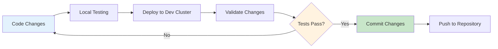

# Common Use Cases for OpenFrame CLI

Now that you have OpenFrame CLI set up, let's explore the most common ways to use it effectively. This guide covers real-world scenarios with step-by-step instructions and practical examples.

## Overview

OpenFrame CLI supports several key workflows:

| Use Case | Time Required | Complexity | When to Use |
|----------|---------------|------------|-------------|
| [Development Environment](#1-setting-up-a-development-environment) | 5 minutes | ⭐ Beginner | Daily development work |
| [Multi-Environment Management](#2-managing-multiple-environments) | 10 minutes | ⭐⭐ Intermediate | Testing different configurations |
| [CI/CD Integration](#3-cicd-integration) | 15 minutes | ⭐⭐⭐ Advanced | Automated deployments |
| [Application Deployment](#4-deploying-applications) | 20 minutes | ⭐⭐ Intermediate | Adding custom apps |
| [Environment Cleanup](#5-environment-cleanup-and-maintenance) | 5 minutes | ⭐ Beginner | Resource management |
| [Troubleshooting Issues](#6-troubleshooting-and-debugging) | Variable | ⭐⭐ Intermediate | Problem resolution |

---

## 1. Setting Up a Development Environment

**Scenario**: You're a developer who needs a consistent, isolated Kubernetes environment for daily work.

### Step-by-Step Setup

**Step 1: Create your development cluster**
```bash
# Create a cluster specifically for development
openframe bootstrap dev-environment --deployment-mode=oss-tenant
```

**Step 2: Verify the setup**
```bash
# Check cluster status
openframe cluster status

# Verify applications are running
kubectl get pods --all-namespaces
```

**Step 3: Set up port forwarding for development**
```bash
# Access ArgoCD UI
kubectl port-forward svc/argocd-server -n argocd 8080:443 &

# Access your applications (example)
kubectl port-forward svc/your-app -n default 3000:80 &
```

### Development Workflow



### Pro Tips for Development

> **💡 Quick Access Aliases**: Add these to your shell profile:
> ```bash
> alias of-dev='openframe cluster status'
> alias of-logs='kubectl logs -f'
> alias of-pods='kubectl get pods --all-namespaces'
> ```

---

## 2. Managing Multiple Environments

**Scenario**: You need separate environments for development, staging, and testing different deployment modes.

### Creating Multiple Clusters

**Development Environment**:
```bash
openframe bootstrap dev --deployment-mode=oss-tenant
```

**Staging Environment**:
```bash
openframe bootstrap staging --deployment-mode=saas-tenant
```

**Testing Environment**:
```bash
openframe bootstrap test --deployment-mode=saas-shared
```

### Managing Multiple Clusters

**List all your clusters**:
```bash
openframe cluster list
```

Example output:
```
NAME      STATUS    TYPE   NODES   VERSION
dev       Running   k3d    3       v1.27.4+k3s1
staging   Running   k3d    3       v1.27.4+k3s1  
test      Running   k3d    3       v1.27.4+k3s1
```

**Switch between clusters**:
```bash
# Set kubectl context to specific cluster
kubectl config use-context k3d-dev
kubectl config use-context k3d-staging
kubectl config use-context k3d-test
```

**Check status of specific cluster**:
```bash
openframe cluster status dev
openframe cluster status staging
```

### Environment Comparison Table

| Environment | Purpose | Deployment Mode | Resource Usage | Uptime |
|-------------|---------|-----------------|----------------|---------|
| **dev** | Daily development | oss-tenant | Low | As needed |
| **staging** | Pre-production testing | saas-tenant | Medium | During testing |  
| **test** | Feature testing | saas-shared | Low | Temporary |

---

## 3. CI/CD Integration

**Scenario**: You want to integrate OpenFrame CLI into your continuous integration pipeline.

### GitHub Actions Example

Create `.github/workflows/deploy.yml`:

```yaml
name: Deploy to OpenFrame
on:
  push:
    branches: [ main ]
  pull_request:
    branches: [ main ]

jobs:
  deploy:
    runs-on: ubuntu-latest
    steps:
    - uses: actions/checkout@v3
    
    - name: Setup OpenFrame CLI
      run: |
        curl -L https://github.com/flamingo-stack/openframe-cli/releases/latest/download/openframe-cli-linux-amd64 -o openframe
        chmod +x openframe
        sudo mv openframe /usr/local/bin/
        
    - name: Bootstrap Environment
      run: |
        openframe bootstrap ci-test \
          --deployment-mode=oss-tenant \
          --non-interactive \
          --verbose
          
    - name: Run Tests
      run: |
        # Your test commands here
        kubectl wait --for=condition=ready pod -l app=your-app --timeout=300s
        curl http://localhost:8080/health
        
    - name: Cleanup
      if: always()
      run: openframe cluster delete ci-test
```

### Jenkins Pipeline Example

```groovy
pipeline {
    agent any
    
    stages {
        stage('Setup') {
            steps {
                sh '''
                    curl -L https://github.com/flamingo-stack/openframe-cli/releases/latest/download/openframe-cli-linux-amd64 -o openframe
                    chmod +x openframe
                    sudo mv openframe /usr/local/bin/
                '''
            }
        }
        
        stage('Deploy') {
            steps {
                sh '''
                    openframe bootstrap jenkins-${BUILD_NUMBER} \
                      --deployment-mode=oss-tenant \
                      --non-interactive
                '''
            }
        }
        
        stage('Test') {
            steps {
                sh '''
                    kubectl get pods --all-namespaces
                    # Run your integration tests
                '''
            }
        }
    }
    
    post {
        always {
            sh 'openframe cluster delete jenkins-${BUILD_NUMBER}'
        }
    }
}
```

### Best Practices for CI/CD

- ✅ Use `--non-interactive` flag to avoid prompts
- ✅ Always specify `--deployment-mode` for consistency  
- ✅ Use unique cluster names with build numbers
- ✅ Include cleanup steps in `finally` or `post` blocks
- ✅ Set reasonable timeouts for cluster creation

---

## 4. Deploying Applications

**Scenario**: You want to deploy your own applications to an OpenFrame cluster.

### Method 1: Using ArgoCD (Recommended)

**Step 1: Prepare your application repository**

Create `k8s/application.yaml`:
```yaml
apiVersion: argoproj.io/v1alpha1
kind: Application
metadata:
  name: my-app
  namespace: argocd
spec:
  project: default
  source:
    repoURL: https://github.com/your-org/your-app
    targetRevision: HEAD
    path: k8s
  destination:
    server: https://kubernetes.default.svc
    namespace: default
  syncPolicy:
    automated:
      prune: true
      selfHeal: true
```

**Step 2: Deploy via ArgoCD**
```bash
# Apply the application manifest
kubectl apply -f k8s/application.yaml

# Check application status
argocd app list
argocd app get my-app
```

### Method 2: Direct Kubectl Deployment

**Step 1: Create application manifests**

`k8s/deployment.yaml`:
```yaml
apiVersion: apps/v1
kind: Deployment
metadata:
  name: my-app
spec:
  replicas: 3
  selector:
    matchLabels:
      app: my-app
  template:
    metadata:
      labels:
        app: my-app
    spec:
      containers:
      - name: app
        image: nginx:1.21
        ports:
        - containerPort: 80
```

**Step 2: Deploy to cluster**
```bash
# Apply manifests
kubectl apply -f k8s/

# Check deployment status
kubectl get pods -l app=my-app
kubectl get services
```

### Method 3: Helm Charts

**Step 1: Install via Helm**
```bash
# Add a Helm repository
helm repo add bitnami https://charts.bitnami.com/bitnami
helm repo update

# Install application
helm install my-wordpress bitnami/wordpress \
  --set service.type=NodePort \
  --set service.nodePort=30080
```

**Step 2: Access your application**
```bash
# Get service details
kubectl get svc

# Port forward if needed
kubectl port-forward svc/my-wordpress 8080:80
```

---

## 5. Environment Cleanup and Maintenance

**Scenario**: You need to manage resources and clean up unused environments.

### Regular Maintenance Tasks

**Check resource usage**:
```bash
# View cluster resource consumption
kubectl top nodes
kubectl top pods --all-namespaces

# Check disk usage
docker system df
```

**Clean up old clusters**:
```bash
# List all clusters
openframe cluster list

# Delete unused clusters
openframe cluster delete old-test-env
openframe cluster delete feature-branch-123
```

**Clean up Docker resources**:
```bash
# Remove unused containers and images
docker system prune -a

# Clean up volumes
docker volume prune
```

### Automated Cleanup Script

Create `cleanup.sh`:
```bash
#!/bin/bash

# Remove clusters older than 7 days
openframe cluster list | grep -E "(test|temp|ci)-" | while read cluster; do
    echo "Cleaning up cluster: $cluster"
    openframe cluster delete "$cluster"
done

# Clean Docker resources
docker system prune -af --volumes

echo "Cleanup completed!"
```

### Maintenance Schedule

| Task | Frequency | Command |
|------|-----------|---------|
| **Check cluster health** | Daily | `openframe cluster status` |
| **Clean temp clusters** | Weekly | `openframe cluster delete temp-*` |
| **Docker cleanup** | Weekly | `docker system prune -a` |
| **Resource monitoring** | Daily | `kubectl top nodes` |

---

## 6. Troubleshooting and Debugging

**Scenario**: Something isn't working as expected, and you need to diagnose the issue.

### Common Issues and Solutions

<details>
<summary><strong>🔴 Cluster Creation Fails</strong></summary>

**Symptoms**: Bootstrap command hangs or fails during cluster creation

**Diagnosis**:
```bash
# Check Docker status
docker ps
docker system info

# Check available resources
free -h
df -h
```

**Solutions**:
```bash
# Restart Docker
sudo systemctl restart docker

# Clean up resources
docker system prune -a

# Try with verbose logging
openframe bootstrap test --verbose
```
</details>

<details>
<summary><strong>🟡 Applications Not Starting</strong></summary>

**Symptoms**: Pods stuck in Pending or CrashLoopBackOff state

**Diagnosis**:
```bash
# Check pod status
kubectl get pods --all-namespaces

# Describe problematic pods
kubectl describe pod <pod-name> -n <namespace>

# Check logs
kubectl logs <pod-name> -n <namespace>
```

**Solutions**:
```bash
# Check resource constraints
kubectl describe nodes

# Check ArgoCD sync status
kubectl get applications -n argocd

# Manual sync if needed
argocd app sync <app-name>
```
</details>

<details>
<summary><strong>🟠 Network/Port Issues</strong></summary>

**Symptoms**: Cannot access services or UI dashboards

**Diagnosis**:
```bash
# Check service endpoints
kubectl get svc --all-namespaces

# Test internal connectivity
kubectl run test-pod --image=busybox -it --rm -- /bin/sh
# From inside pod: nslookup argocd-server.argocd.svc.cluster.local
```

**Solutions**:
```bash
# Restart port forwarding
pkill kubectl # Kill existing port forwards
kubectl port-forward svc/argocd-server -n argocd 8080:443

# Check firewall settings
sudo ufw status
```
</details>

### Debug Commands Cheat Sheet

```bash
# Cluster overview
openframe cluster status
kubectl cluster-info

# Resource usage
kubectl top nodes
kubectl top pods --all-namespaces

# Events and logs
kubectl get events --sort-by=.metadata.creationTimestamp
kubectl logs -f deployment/argocd-server -n argocd

# Network debugging
kubectl get svc,endpoints --all-namespaces
kubectl exec -it <pod> -- /bin/sh
```

### Getting Help

When you encounter issues:

1. **Enable verbose logging**: Add `--verbose` to commands
2. **Check the logs**: Use `kubectl logs` for application logs
3. **Gather system info**: Run diagnostic commands above
4. **Search existing issues**: Check GitHub issues for similar problems
5. **Create detailed bug reports**: Include logs, system info, and reproduction steps

---

## Tips and Tricks

### Performance Optimization

> **💡 Speed up cluster creation**:
> ```bash
> # Pre-pull images to avoid download delays
> docker pull rancher/k3s:latest
> docker pull quay.io/argoproj/argocd:latest
> ```

### Useful Aliases

Add to your `~/.bashrc` or `~/.zshrc`:
```bash
# OpenFrame shortcuts
alias of='openframe'
alias ofb='openframe bootstrap'
alias ofc='openframe cluster'
alias ofl='openframe cluster list'
alias ofs='openframe cluster status'

# Kubernetes shortcuts  
alias k='kubectl'
alias kga='kubectl get all --all-namespaces'
alias kgp='kubectl get pods --all-namespaces'
```

### Configuration Files

Save commonly used settings in `~/.openframe/config.yaml`:
```yaml
default:
  deployment-mode: "oss-tenant"
  verbose: true
  cluster-name: "dev"

environments:
  dev:
    deployment-mode: "oss-tenant"
  staging:
    deployment-mode: "saas-tenant"
```

---

## Next Steps

🚀 **You're now ready to use OpenFrame CLI like a pro!** Here are some advanced topics to explore:

- **Custom Helm Charts**: Learn to deploy your own applications
- **ArgoCD Best Practices**: Master GitOps workflows
- **Multi-Cluster Management**: Scale to production environments
- **Security Hardening**: Implement security best practices

> **📚 Want to dive deeper?** Check out the [Developer Tutorials](../dev/getting-started-dev.md) for advanced usage and customization options.