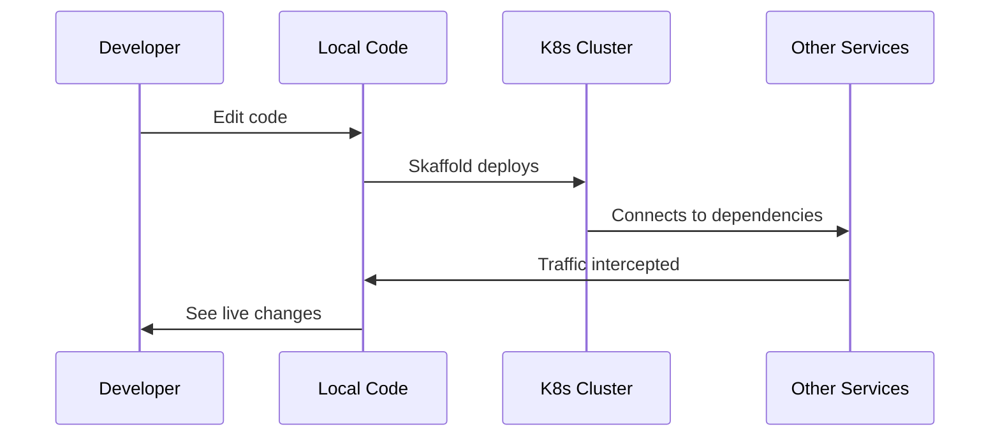

# Common Use Cases for OpenFrame CLI

This guide covers the most common scenarios you'll encounter when using OpenFrame CLI for Kubernetes development. Each section includes step-by-step instructions and practical examples.

## Use Case 1: Setting Up a Development Environment

### Scenario
You need to create a local Kubernetes environment for developing cloud-native applications.

### Steps

1. **Quick Setup for Single Developer**
   ```bash
   # Create environment with defaults
   openframe bootstrap my-dev-env
   
   # Wait for completion (usually 2-3 minutes)
   # Verify everything is running
   openframe cluster status
   ```

2. **Team Environment Setup**
   ```bash
   # Create shared configuration
   openframe bootstrap team-dev --deployment-mode=saas-tenant
   
   # Share cluster config with team
   kubectl config view --minify --flatten > team-kubeconfig.yaml
   ```

3. **Multiple Environment Setup**
   ```bash
   # Development environment
   openframe cluster create development --nodes 3
   
   # Testing environment  
   openframe cluster create testing --nodes 2
   
   # Switch between environments
   kubectl config use-context k3d-development
   kubectl config use-context k3d-testing
   ```

### Best Practices
- Use descriptive cluster names (`frontend-dev`, `api-testing`)
- Keep development clusters small (1-3 nodes)
- Use separate clusters for different projects or teams

---

## Use Case 2: Application Deployment and Testing

### Scenario
You want to deploy and test applications using GitOps with ArgoCD.

### Steps

1. **Access ArgoCD Dashboard**
   ```bash
   # Get admin password
   kubectl -n argocd get secret argocd-initial-admin-secret \
     -o jsonpath="{.data.password}" | base64 -d
   
   # Port forward (keep terminal open)
   kubectl port-forward svc/argocd-server -n argocd 8080:443
   
   # Open browser: https://localhost:8080
   # Login: admin / [password from above]
   ```

2. **Deploy Your First Application**
   ```bash
   # Install ArgoCD with your application repo
   openframe chart install --verbose
   
   # Or add application manually in ArgoCD UI:
   # - Repository URL: https://github.com/your-org/your-app
   # - Path: k8s-manifests/
   # - Destination: https://kubernetes.default.svc
   # - Namespace: default
   ```

3. **Monitor Deployment Status**
   ```bash
   # Check application status in cluster
   kubectl get pods -n default
   kubectl get services -n default
   
   # View application logs
   kubectl logs deployment/your-app -n default -f
   ```

### Tips for Success
- Keep your Kubernetes manifests in a separate `/k8s` or `/manifests` directory
- Use ArgoCD's sync policies for automatic deployments
- Test with small applications first before deploying complex systems

---

## Use Case 3: Development with Live Reload

### Scenario
You want to develop locally while your code runs in the Kubernetes cluster, with live reload capabilities.

### Steps

1. **Setup Skaffold Development**
   ```bash
   # Navigate to your project directory
   cd /path/to/your-project
   
   # Initialize skaffold (if skaffold.yaml doesn't exist)
   skaffold init
   
   # Start development with live reload
   openframe dev skaffold
   ```

2. **Traffic Interception for Local Development**
   ```bash
   # Intercept traffic from a cluster service
   openframe dev intercept my-service
   
   # Now traffic to my-service in cluster routes to localhost:8080
   # Develop locally while connected to cluster dependencies
   ```

3. **Monitor Development Session**
   ```bash
   # Check intercept status
   telepresence status
   
   # View logs from intercepted service
   kubectl logs deployment/my-service -f
   
   # Stop intercept when done
   telepresence leave
   ```

### Development Workflow


---

## Use Case 4: Multiple Cluster Management

### Scenario
You need to manage several clusters for different purposes (dev, staging, testing).

### Steps

1. **Create Multiple Clusters**
   ```bash
   # Frontend development
   openframe cluster create frontend-dev --nodes 2
   
   # Backend development
   openframe cluster create backend-dev --nodes 3
   
   # Integration testing
   openframe cluster create integration-test --nodes 4
   ```

2. **List and Switch Between Clusters**
   ```bash
   # See all OpenFrame clusters
   openframe cluster list
   
   # Check current cluster status
   openframe cluster status
   
   # Switch kubectl context
   kubectl config get-contexts
   kubectl config use-context k3d-frontend-dev
   ```

3. **Install Charts on Specific Clusters**
   ```bash
   # Switch to target cluster
   kubectl config use-context k3d-backend-dev
   
   # Install charts
   openframe chart install --deployment-mode=oss-tenant
   ```

### Management Tips
| Task | Command | Notes |
|------|---------|-------|
| **List clusters** | `openframe cluster list` | Shows only OpenFrame-managed clusters |
| **Check status** | `openframe cluster status` | Details about current cluster |
| **Switch context** | `kubectl config use-context k3d-CLUSTER` | Change active cluster |
| **Delete cluster** | `openframe cluster delete CLUSTER` | Removes cluster completely |
| **Cleanup resources** | `openframe cluster cleanup` | Removes stuck/orphaned resources |

---

## Use Case 5: Team Collaboration

### Scenario
Multiple developers need to share cluster configurations and work together.

### Steps

1. **Export Cluster Configuration**
   ```bash
   # Export current cluster config
   kubectl config view --minify --flatten > shared-cluster-config.yaml
   
   # Share this file with your team
   # Team members can import with:
   # kubectl config set-cluster ... (from exported config)
   ```

2. **Standardize Team Setup**
   ```bash
   # Create team bootstrap script
   cat << 'EOF' > team-setup.sh
   #!/bin/bash
   openframe bootstrap team-cluster \
     --deployment-mode=saas-tenant \
     --non-interactive
   EOF
   
   chmod +x team-setup.sh
   # Share this script for consistent setup
   ```

3. **Shared Development Workflow**
   ```bash
   # Each developer creates their own namespace
   kubectl create namespace dev-$USER
   kubectl config set-context --current --namespace=dev-$USER
   
   # Deploy to personal namespace
   openframe dev skaffold --namespace=dev-$USER
   ```

---

## Use Case 6: Testing and CI/CD Integration

### Scenario
You want to integrate OpenFrame CLI into your testing and CI/CD pipelines.

### Steps

1. **Automated Testing Setup**
   ```bash
   # CI script example
   #!/bin/bash
   set -e
   
   # Create test cluster
   openframe bootstrap test-cluster-$BUILD_ID \
     --non-interactive \
     --deployment-mode=oss-tenant
   
   # Deploy application
   kubectl apply -f k8s-manifests/
   
   # Wait for deployment
   kubectl wait --for=condition=available --timeout=300s deployment/app
   
   # Run tests
   kubectl exec deployment/app -- /run-tests.sh
   
   # Cleanup
   openframe cluster delete test-cluster-$BUILD_ID
   ```

2. **Performance Testing**
   ```bash
   # Create cluster with more resources
   openframe cluster create perf-test --nodes 5
   
   # Install monitoring
   kubectl apply -f monitoring-manifests/
   
   # Run load tests
   kubectl run load-test --image=loadtest:latest
   ```

### CI/CD Integration Tips
- Use `--non-interactive` flag for automation
- Include cleanup steps in your scripts
- Use unique cluster names per build (`cluster-$BUILD_ID`)
- Set timeouts for cluster operations

---

## Troubleshooting Common Issues

### Issue: Cluster Creation Fails

**Symptoms**: `openframe cluster create` returns errors

**Solutions**:
```bash
# Check Docker is running
docker ps

# Clean up any stuck resources
openframe cluster cleanup

# Check available disk space (K3d needs ~2GB)
df -h

# Check for port conflicts
lsof -i :6443 -i :80 -i :443
```

### Issue: ArgoCD Not Accessible

**Symptoms**: Cannot access ArgoCD dashboard

**Solutions**:
```bash
# Check ArgoCD pods
kubectl get pods -n argocd

# Restart port forwarding
pkill -f "kubectl port-forward"
kubectl port-forward svc/argocd-server -n argocd 8080:443

# Reset ArgoCD admin password
kubectl -n argocd delete secret argocd-initial-admin-secret
kubectl -n argocd get secret argocd-initial-admin-secret
```

### Issue: Development Intercept Not Working

**Symptoms**: Traffic not routing to local development

**Solutions**:
```bash
# Check telepresence status
telepresence status

# Restart intercept
telepresence leave
openframe dev intercept my-service

# Check service exists
kubectl get service my-service
```

## Quick Reference Commands

| Task | Command |
|------|---------|
| **Create environment** | `openframe bootstrap [name]` |
| **List clusters** | `openframe cluster list` |
| **Switch cluster** | `kubectl config use-context k3d-CLUSTER` |
| **Deploy apps** | `openframe chart install` |
| **Live development** | `openframe dev skaffold` |
| **Traffic intercept** | `openframe dev intercept SERVICE` |
| **Check status** | `openframe cluster status` |
| **Cleanup** | `openframe cluster cleanup` |
| **Delete cluster** | `openframe cluster delete CLUSTER` |

---

> **Pro Tip**: Combine commands for powerful workflows. For example: `openframe bootstrap && openframe dev skaffold` creates a complete development environment and starts live reload in one command chain.