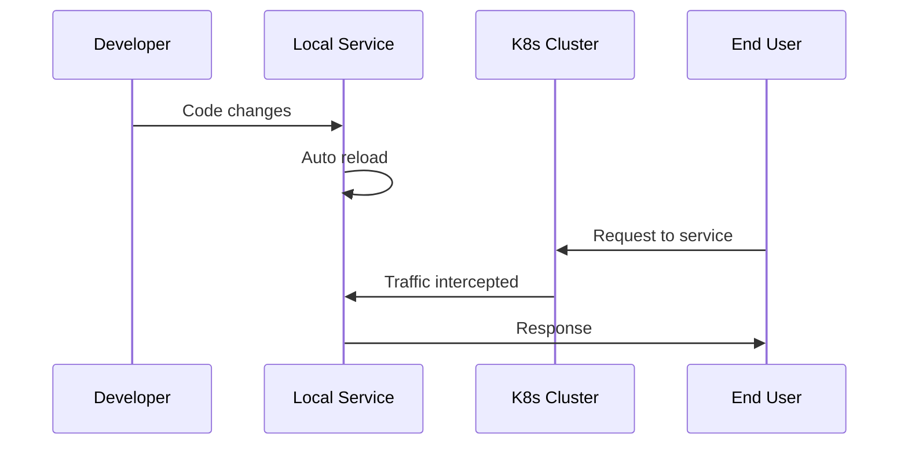

# Common Use Cases for OpenFrame CLI

This guide covers the most common workflows and practical scenarios you'll encounter when using OpenFrame CLI for Kubernetes development and deployment management.

## Overview of Use Cases

OpenFrame CLI is designed to streamline several key workflows:

1. **Environment Setup** - Quick cluster bootstrap
2. **Cluster Management** - Creating, monitoring, and cleaning up clusters  
3. **Application Deployment** - Managing charts and GitOps workflows
4. **Development Workflows** - Local development with intercepts and live reload
5. **Troubleshooting** - Debugging and monitoring tools

---

## Use Case 1: Setting Up a New Development Environment

**Scenario:** You're joining a project team and need to set up a local Kubernetes environment identical to your teammates.

### Step-by-Step Process

```bash
# 1. Quick environment setup with team standards
openframe bootstrap team-dev --deployment-mode=oss-tenant --non-interactive

# 2. Verify the environment is ready
openframe cluster status team-dev

# 3. Check that applications are deployed
kubectl get applications -n argocd
```

### Expected Output
```
✅ Cluster 'team-dev' created successfully
✅ ArgoCD installed and ready
✅ Applications synced and healthy
🎉 Environment ready for development!
```

### Pro Tips
- Use a consistent cluster naming convention across your team
- Document your team's preferred `deployment-mode` setting
- Create a team script that runs the same bootstrap command for everyone

---

## Use Case 2: Managing Multiple Project Clusters

**Scenario:** You're working on multiple projects and need separate isolated environments for each.

### Managing Multiple Clusters

```bash
# Create project-specific clusters
openframe bootstrap project-alpha --deployment-mode=oss-tenant
openframe bootstrap project-beta --deployment-mode=saas-tenant  
openframe bootstrap testing-env --deployment-mode=oss-tenant

# List all your clusters
openframe cluster list
```

### Switching Between Clusters

```bash
# Check which cluster kubectl is pointing to
kubectl config current-context

# Switch context (K3d automatically configures this)
kubectl config use-context k3d-project-alpha

# Verify you're in the right cluster
kubectl get nodes
```

### Cluster Cleanup Strategy

| Cluster Type | Cleanup Frequency | Command |
|--------------|-------------------|---------|
| **Active Development** | Keep running | - |
| **Testing/Staging** | After feature completion | `openframe cluster delete testing-env` |
| **Experimental** | Daily/Weekly | `openframe cluster cleanup` |
| **All Clusters** | When needed | `openframe cluster list` → delete individually |

---

## Use Case 3: Application Development with Live Reload

**Scenario:** You're developing a microservice and want to test changes in real-time without rebuilding container images.

### Setting Up Development Workflow

```bash
# 1. Start with a running cluster
openframe bootstrap dev-cluster --deployment-mode=oss-tenant

# 2. Set up traffic intercept for your service
openframe dev intercept my-service --port=8080

# 3. Start local development server
# Your application runs locally but receives traffic from the cluster
```

### Using Skaffold for Live Development

```bash
# Initialize Skaffold in your project
openframe dev scaffold my-service

# This sets up:
# - Automatic image building
# - Live reload capabilities  
# - Integration with your K8s cluster
```

### Development Workflow Diagram



---

## Use Case 4: Chart and Application Management

**Scenario:** You need to install additional charts or update application configurations in your cluster.

### Installing Additional Charts

```bash
# Install charts to an existing cluster
openframe chart install my-cluster --deployment-mode=oss-tenant

# Check installation progress
kubectl get applications -n argocd -w

# Verify ArgoCD is managing your applications
kubectl get applications -n argocd -o wide
```

### Managing ArgoCD Applications

| Task | Command | Notes |
|------|---------|-------|
| **View app status** | `kubectl get applications -n argocd` | Shows sync status |
| **Force sync** | `kubectl -n argocd argocd app sync <app-name>` | Manually trigger deployment |
| **View app details** | `kubectl -n argocd describe application <app-name>` | Detailed status info |
| **Access ArgoCD UI** | Port-forward and visit localhost | Visual management |

### Troubleshooting Application Deployments

```bash
# Check ArgoCD server status
kubectl get pods -n argocd

# View application sync status
kubectl get applications -n argocd

# Get detailed error information
kubectl -n argocd describe application <failing-app>

# Check application logs
kubectl logs -n <app-namespace> deployment/<app-name>
```

---

## Use Case 5: Team Collaboration and CI/CD Integration

**Scenario:** Your team wants to standardize development environments and integrate with CI/CD pipelines.

### Standardizing Team Environments

Create a team setup script:

```bash
#!/bin/bash
# team-setup.sh

echo "Setting up OpenFrame development environment for Team Alpha"

# Standard cluster setup
openframe bootstrap team-alpha \
  --deployment-mode=oss-tenant \
  --non-interactive \
  --verbose

# Verify setup
echo "Verifying cluster status..."
openframe cluster status team-alpha

echo "Environment ready! 🚀"
```

### CI/CD Pipeline Integration

```yaml
# .github/workflows/test.yml
name: Test with OpenFrame CLI

jobs:
  test:
    runs-on: ubuntu-latest
    steps:
      - uses: actions/checkout@v2
      
      - name: Install OpenFrame CLI
        run: |
          curl -LO https://github.com/flamingo-stack/openframe-cli/releases/latest/download/openframe-cli-linux-amd64
          chmod +x openframe-cli-linux-amd64
          sudo mv openframe-cli-linux-amd64 /usr/local/bin/openframe
          
      - name: Bootstrap test environment
        run: |
          openframe bootstrap ci-test-cluster \
            --deployment-mode=oss-tenant \
            --non-interactive \
            --verbose
            
      - name: Run tests
        run: |
          # Your test commands here
          kubectl get pods --all-namespaces
          
      - name: Cleanup
        run: |
          openframe cluster delete ci-test-cluster
```

---

## Use Case 6: Troubleshooting and Monitoring

**Scenario:** Something isn't working correctly and you need to diagnose the issue.

### Common Troubleshooting Commands

```bash
# Check overall cluster health
openframe cluster status my-cluster

# Verbose mode for detailed logs
openframe cluster create test-cluster --verbose

# Check resource usage
kubectl top nodes
kubectl top pods --all-namespaces

# Examine recent events
kubectl get events --sort-by=.metadata.creationTimestamp
```

### Diagnostic Information Checklist

| Check | Command | What to Look For |
|-------|---------|------------------|
| **Cluster Status** | `openframe cluster list` | Running clusters |
| **Node Health** | `kubectl get nodes` | Ready status |
| **Pod Status** | `kubectl get pods -A` | Running/Failed pods |
| **ArgoCD Health** | `kubectl get pods -n argocd` | All pods ready |
| **Applications** | `kubectl get applications -n argocd` | Sync status |
| **Resources** | `kubectl top nodes` | CPU/Memory usage |
| **Events** | `kubectl get events` | Error messages |

### When Things Go Wrong

<details>
<summary>Cluster won't start</summary>

```bash
# Check Docker status
docker ps

# Look for port conflicts
openframe cluster list
netstat -tlnp | grep :6443

# Clean up and retry
openframe cluster cleanup
openframe cluster create new-cluster
```
</details>

<details>
<summary>Applications not syncing</summary>

```bash
# Check ArgoCD server
kubectl get pods -n argocd

# Check application status  
kubectl describe application -n argocd <app-name>

# Force sync
kubectl patch application -n argocd <app-name> -p '{"operation":{"sync":{}}}' --type=merge
```
</details>

---

## Use Case 7: Environment Cleanup and Maintenance

**Scenario:** You need to clean up resources and maintain a tidy development environment.

### Regular Maintenance Commands

```bash
# List all clusters to see what you have
openframe cluster list

# Remove unused clusters
openframe cluster delete old-cluster

# Clean up Docker resources used by clusters
openframe cluster cleanup

# Check Docker disk usage
docker system df
docker system prune  # Remove unused Docker resources
```

### Cleanup Schedule Recommendations

| Frequency | Action | Command |
|-----------|--------|---------|
| **Daily** | Check cluster status | `openframe cluster list` |
| **Weekly** | Remove test clusters | `openframe cluster delete test-*` |
| **Monthly** | Full system cleanup | `openframe cluster cleanup && docker system prune` |
| **As needed** | Free up disk space | `docker system df && docker system prune -a` |

---

## Best Practices and Tips

### Naming Conventions

- **Projects:** `project-alpha`, `project-beta`
- **Environments:** `dev`, `staging`, `testing`
- **Features:** `feature-auth`, `feature-ui`
- **Personal:** `yourname-dev`, `yourname-testing`

### Resource Management

> **Memory Tip:** Each K3d cluster uses ~1GB RAM. Monitor usage with `docker stats`

> **Storage Tip:** Clean up unused clusters regularly to free disk space

### Team Collaboration

- Share bootstrap commands via team documentation
- Use consistent deployment modes across the team
- Document any custom configurations
- Create team-specific setup scripts

### Troubleshooting Tips

1. **Always start with verbose mode** when debugging: `--verbose`
2. **Check prerequisites first:** Docker, kubectl, Helm, Git
3. **Verify cluster status** before application operations
4. **Use kubectl for detailed diagnostics** when OpenFrame commands aren't enough
5. **Check Docker resources** if clusters are slow to start

---

## Quick Reference

| Task | Command | Notes |
|------|---------|-------|
| **New environment** | `openframe bootstrap` | Interactive setup |
| **List clusters** | `openframe cluster list` | See all clusters |
| **Cluster status** | `openframe cluster status <name>` | Health check |
| **Delete cluster** | `openframe cluster delete <name>` | Remove cluster |
| **Install charts** | `openframe chart install <cluster>` | Add applications |
| **Development mode** | `openframe dev intercept <service>` | Live development |
| **Cleanup** | `openframe cluster cleanup` | Remove unused resources |
| **Help** | `openframe <command> --help` | Command documentation |

---

Ready to dive deeper? Check out the [Developer Getting Started Guide](../dev/getting-started-dev.md) for information about contributing to OpenFrame CLI itself.