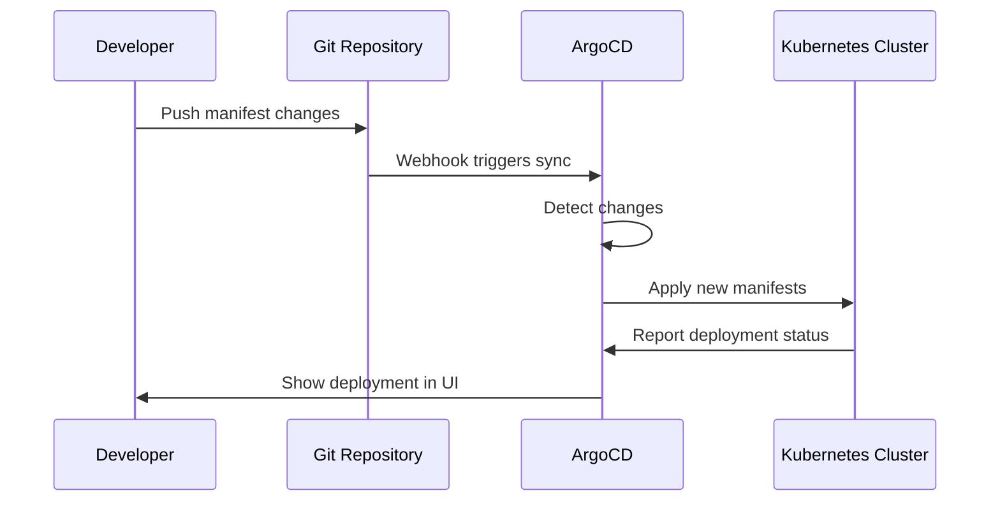

# OpenFrame CLI Common Use Cases

This guide covers the most common workflows and use cases for OpenFrame CLI users. Whether you're a developer, DevOps engineer, or team lead, these practical examples will help you get the most out of OpenFrame.

## Table of Contents

1. [Setting Up Development Environments](#setting-up-development-environments)
2. [Managing Multiple Clusters](#managing-multiple-clusters)
3. [Deploying Applications with ArgoCD](#deploying-applications-with-argocd)
4. [Development Workflows](#development-workflows)
5. [Troubleshooting and Maintenance](#troubleshooting-and-maintenance)
6. [Team Collaboration](#team-collaboration)
7. [CI/CD Integration](#cicd-integration)

## Setting Up Development Environments

### Use Case 1: Quick Development Environment

**Scenario**: You need a fast, disposable Kubernetes environment for testing.

**Solution**: Use the bootstrap command with defaults:

```bash
# Create environment with default settings
openframe bootstrap dev-test

# Start working immediately
kubectl get nodes
```

**When to use**: 
- Quick prototyping
- Testing Kubernetes manifests
- Learning Kubernetes concepts
- Disposable test environments

---

### Use Case 2: Production-like Environment

**Scenario**: You need an environment that closely mirrors production setup.

**Solution**: Use interactive configuration to customize your cluster:

```bash
# Start interactive setup
openframe bootstrap prod-like

# Choose these options in the wizard:
# - Deployment Mode: saas-tenant
# - Node Count: 5
# - Kubernetes Version: 1.28.0 (match production)
```

**When to use**:
- Pre-production testing
- Integration testing
- Performance testing
- Training production scenarios

---

### Use Case 3: Multiple Service Development

**Scenario**: You're working on a microservices project and need to test service interactions.

**Solution**: Create dedicated clusters for different testing scenarios:

```bash
# Main development cluster
openframe bootstrap services-main --deployment-mode=oss-tenant

# Integration testing cluster  
openframe bootstrap services-integration --deployment-mode=saas-shared

# Performance testing cluster
openframe bootstrap services-perf --deployment-mode=saas-tenant
```

**Benefits**:
- Isolated testing environments
- Parallel development streams
- Risk-free experimentation

## Managing Multiple Clusters

### Viewing and Switching Between Clusters

```bash
# List all your clusters
openframe cluster list

# Check specific cluster status
openframe cluster status services-main

# Switch kubectl context
kubectl config use-context k3d-services-main
```

### Cluster Naming Best Practices

| Pattern | Example | Use Case |
|---------|---------|----------|
| `feature-[name]` | `feature-payment` | Feature development |
| `[team]-dev` | `backend-dev` | Team development |
| `[env]-[purpose]` | `staging-load-test` | Environment-specific testing |
| `[ticket]-test` | `bug-1234-test` | Bug investigation |

### Cleaning Up Unused Clusters

```bash
# Remove specific cluster
openframe cluster delete old-feature

# Clean up Docker resources
openframe cluster cleanup

# List remaining clusters
openframe cluster list
```

## Deploying Applications with ArgoCD

### Use Case 4: Deploy Your First Application

**Scenario**: You have a Git repository with Kubernetes manifests and want to deploy it.

**Step-by-step process**:

1. **Access ArgoCD Dashboard**:
```bash
# Get admin password
kubectl -n argocd get secret argocd-initial-admin-secret -o jsonpath="{.data.password}" | base64 -d

# Forward port (keep this running)
kubectl port-forward svc/argocd-server -n argocd 8080:443
```

2. **Create Application via UI**:
   - Open https://localhost:8080
   - Login with `admin` and the password from step 1
   - Click "NEW APP"
   - Fill in your Git repository details

3. **Or create via CLI**:
```bash
# Install ArgoCD CLI first
curl -sSL -o argocd-linux-amd64 https://github.com/argoproj/argo-cd/releases/latest/download/argocd-linux-amd64
sudo install -m 555 argocd-linux-amd64 /usr/local/bin/argocd

# Login to ArgoCD
argocd login localhost:8080 --username admin --password [password-from-step-1]

# Create application
argocd app create my-app \
  --repo https://github.com/your-org/your-app-manifests \
  --path . \
  --dest-server https://kubernetes.default.svc \
  --dest-namespace default
```

---

### Use Case 5: GitOps Workflow

**Scenario**: You want to implement GitOps for continuous deployment.

**Workflow**:



**Setup steps**:

1. **Prepare your repository structure**:
```
my-app-config/
├── environments/
│   ├── dev/
│   │   ├── kustomization.yaml
│   │   └── patches/
│   ├── staging/
│   └── production/
├── base/
│   ├── deployment.yaml
│   ├── service.yaml
│   └── kustomization.yaml
└── argocd-apps/
    └── my-app-dev.yaml
```

2. **Configure ArgoCD application**:
```yaml
# argocd-apps/my-app-dev.yaml
apiVersion: argoproj.io/v1alpha1
kind: Application
metadata:
  name: my-app-dev
  namespace: argocd
spec:
  source:
    repoURL: https://github.com/your-org/my-app-config
    path: environments/dev
    targetRevision: main
  destination:
    server: https://kubernetes.default.svc
    namespace: my-app
  syncPolicy:
    automated:
      prune: true
      selfHeal: true
```

3. **Apply the application**:
```bash
kubectl apply -f argocd-apps/my-app-dev.yaml
```

## Development Workflows

### Use Case 6: Live Development with Traffic Interception

**Scenario**: You want to develop a service locally while it runs in the cluster.

**Solution**: Use the dev intercept functionality:

```bash
# Start development mode for a service
openframe dev intercept my-service

# This allows you to:
# - Run the service locally
# - Route cluster traffic to your local instance
# - Debug with full cluster context
```

**Benefits**:
- Real-time testing with cluster dependencies
- Local debugging capabilities
- Fast development cycles

---

### Use Case 7: Continuous Development with Skaffold

**Scenario**: You want automatic rebuilds and deployments during development.

**Solution**: Use Skaffold integration:

```bash
# Start live development workflow
openframe dev skaffold my-service

# Skaffold will:
# - Watch for code changes
# - Rebuild container images
# - Redeploy to cluster automatically
```

**Best for**:
- Frontend development
- API development
- Integration testing

## Troubleshooting and Maintenance

### Use Case 8: Cluster Health Monitoring

**Regular health checks**:

```bash
# Check cluster overall health
openframe cluster status

# Check node resources
kubectl top nodes

# Check pod status across namespaces
kubectl get pods --all-namespaces

# Check ArgoCD application health
kubectl get applications -n argocd
```

### Use Case 9: Resource Cleanup and Optimization

**When your system gets cluttered**:

```bash
# Clean Docker resources
openframe cluster cleanup

# Remove unused clusters
openframe cluster list
openframe cluster delete unused-cluster

# Clean Kubernetes resources
kubectl delete pods --field-selector=status.phase=Succeeded
```

### Common Issues Resolution

| Problem | Symptoms | Quick Fix |
|---------|----------|-----------|
| **Cluster Won't Start** | `Error creating cluster` | Check Docker is running: `docker info` |
| **Out of Disk Space** | `No space left on device` | Run cleanup: `openframe cluster cleanup` |
| **Port Conflicts** | `Port already in use` | Change ports or stop conflicting services |
| **ArgoCD Not Accessible** | Can't reach dashboard | Verify port-forward: `kubectl port-forward svc/argocd-server -n argocd 8080:443` |
| **Applications Not Syncing** | ArgoCD shows `OutOfSync` | Check Git credentials and repository access |

## Team Collaboration

### Use Case 10: Shared Development Standards

**Scenario**: Your team needs consistent development environments.

**Solution**: Create standardized bootstrap configurations:

```bash
# Team lead creates standard environment
openframe bootstrap team-standard \
  --deployment-mode=oss-tenant \
  --verbose

# Team members replicate with same settings
openframe bootstrap [dev-name] \
  --deployment-mode=oss-tenant \
  --non-interactive
```

**Documentation for team**:

Create a team wiki with:
- Standard cluster naming conventions
- Required deployment mode
- Common troubleshooting steps
- Shared ArgoCD applications

---

### Use Case 11: Environment Handoffs

**Scenario**: Passing environments between team members or shifts.

**Checklist for handoffs**:

```bash
# Document current state
openframe cluster status > environment-state.txt
kubectl get applications -n argocd > argocd-apps.txt

# Share access credentials
kubectl config view --minify > kubeconfig-backup.yaml

# Document any custom configurations
kubectl get configmaps --all-namespaces > custom-configs.txt
```

## CI/CD Integration

### Use Case 12: Automated Testing Pipeline

**Scenario**: You want to create/destroy test environments in CI/CD.

**GitLab CI example**:

```yaml
# .gitlab-ci.yml
test_deployment:
  stage: test
  script:
    # Create test cluster
    - openframe bootstrap test-$CI_PIPELINE_ID --deployment-mode=oss-tenant --non-interactive
    
    # Run tests
    - kubectl apply -f test-manifests/
    - ./run-integration-tests.sh
    
    # Cleanup
    - openframe cluster delete test-$CI_PIPELINE_ID
  after_script:
    - openframe cluster cleanup
```

**GitHub Actions example**:

```yaml
# .github/workflows/test.yml
name: Integration Tests
on: [push, pull_request]

jobs:
  test:
    runs-on: ubuntu-latest
    steps:
      - uses: actions/checkout@v2
      
      - name: Setup OpenFrame
        run: |
          # Install OpenFrame CLI
          curl -L https://github.com/flamingo-stack/openframe-cli/releases/latest/download/openframe-cli-linux-amd64 -o openframe
          chmod +x openframe
          sudo mv openframe /usr/local/bin/
          
      - name: Create test environment
        run: |
          openframe bootstrap test-${{ github.run_id }} \
            --deployment-mode=oss-tenant \
            --non-interactive \
            --verbose
            
      - name: Run tests
        run: |
          kubectl apply -f test-manifests/
          ./run-tests.sh
          
      - name: Cleanup
        if: always()
        run: |
          openframe cluster delete test-${{ github.run_id }}
          openframe cluster cleanup
```

## Tips and Best Practices

### Performance Optimization

> **💡 Tip**: Use `--verbose` flag for detailed logging during troubleshooting

> **💡 Tip**: Regular cleanup prevents Docker storage issues: `openframe cluster cleanup`

### Security Considerations

> **⚠️ Warning**: Never commit ArgoCD passwords or kubeconfig files to Git

> **💡 Tip**: Use separate clusters for different security contexts

### Resource Management

> **💡 Tip**: Monitor resource usage with `kubectl top nodes` and `kubectl top pods`

> **💡 Tip**: Use meaningful cluster names to track resource ownership

## Quick Reference Commands

```bash
# Environment Management
openframe bootstrap [name]                 # Create complete environment
openframe cluster list                     # List all clusters
openframe cluster status [name]            # Check cluster health
openframe cluster delete [name]            # Remove cluster
openframe cluster cleanup                  # Clean Docker resources

# Development Workflows  
openframe dev intercept [service]          # Traffic interception
openframe dev skaffold [service]           # Live development

# ArgoCD Access
kubectl port-forward svc/argocd-server -n argocd 8080:443
kubectl -n argocd get secret argocd-initial-admin-secret -o jsonpath="{.data.password}" | base64 -d
```

## What's Next?

- **Advanced Workflows**: Learn about custom ArgoCD applications
- **Monitoring Setup**: Configure observability tools
- **Production Migration**: Strategies for moving to production clusters
- **Custom Extensions**: Developing plugins and extensions

For more advanced topics, check our [Developer Documentation](../dev/architecture-overview-dev.md).