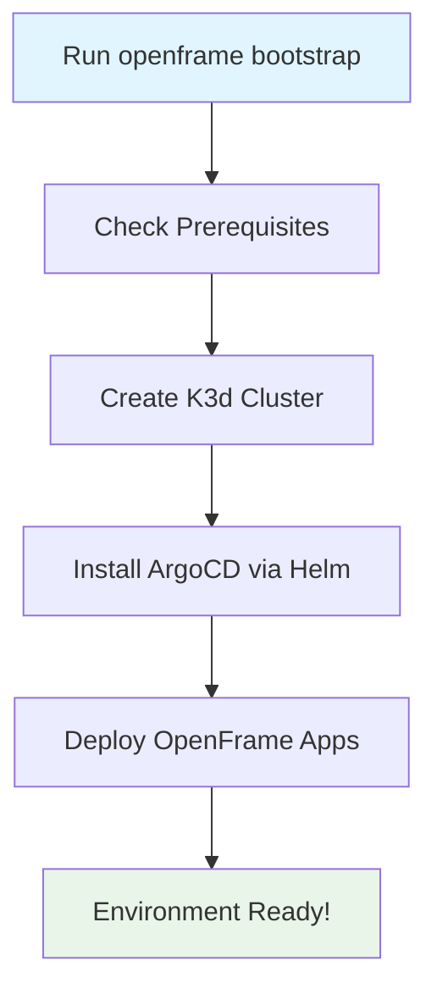

# Getting Started with OpenFrame CLI

Welcome to OpenFrame CLI! This guide will help you get up and running with your first OpenFrame Kubernetes cluster in minutes.

## What is OpenFrame CLI?

OpenFrame CLI is a command-line tool that simplifies Kubernetes cluster management for local development. It automatically sets up lightweight clusters with ArgoCD for GitOps deployments and provides development tools for traffic interception and live reloading.

## Prerequisites

Before installing OpenFrame CLI, make sure you have the following tools installed:

| Tool | Purpose | Installation Command |
|------|---------|---------------------|
| **Docker** | Container runtime for cluster nodes | [Install Docker](https://docs.docker.com/get-docker/) |
| **kubectl** | Kubernetes command-line tool | `curl -LO "https://dl.k8s.io/release/$(curl -L -s https://dl.k8s.io/release/stable.txt)/bin/linux/amd64/kubectl"` |
| **Helm** | Kubernetes package manager | `curl https://raw.githubusercontent.com/helm/helm/main/scripts/get-helm-3 \| bash` |
| **k3d** | Lightweight Kubernetes distribution | `curl -s https://raw.githubusercontent.com/k3d-io/k3d/main/install.sh \| bash` |

> **Note**: OpenFrame CLI will check for these prerequisites automatically and guide you through installation if any are missing.

## Installation

### Option 1: Download Binary (Recommended)

```bash
# Download the latest release
curl -LO https://github.com/flamingo-stack/openframe-cli/releases/latest/download/openframe-linux-amd64

# Make it executable
chmod +x openframe-linux-amd64

# Move to system PATH
sudo mv openframe-linux-amd64 /usr/local/bin/openframe

# Verify installation
openframe --help
```

### Option 2: Build from Source

```bash
# Clone the repository
git clone https://github.com/flamingo-stack/openframe-cli.git
cd openframe-cli

# Build the binary
go build -o openframe ./cmd/main.go

# Move to system PATH
sudo mv openframe /usr/local/bin/

# Verify installation
openframe --help
```

## Quick Start: Bootstrap Your First Environment

The fastest way to get started is with the `bootstrap` command, which creates a cluster and installs all necessary components:



### Interactive Setup (Recommended for First-Time Users)

```bash
# Start the interactive bootstrap process
openframe bootstrap

# You'll be prompted to:
# 1. Enter a cluster name (or use default)
# 2. Select deployment mode (oss-tenant, saas-tenant, or saas-shared)
# 3. Configure additional options
```

### Quick Non-Interactive Setup

```bash
# Create a cluster with default settings
openframe bootstrap my-dev-cluster --deployment-mode=oss-tenant --non-interactive

# With verbose logging to see detailed progress
openframe bootstrap my-dev-cluster --deployment-mode=oss-tenant --verbose
```

## What Happens During Bootstrap

The bootstrap process performs these steps automatically:

1. **Prerequisites Check** - Verifies Docker, kubectl, Helm, and k3d are installed
2. **Cluster Creation** - Creates a K3d cluster with proper networking and storage
3. **ArgoCD Installation** - Deploys ArgoCD for GitOps continuous deployment
4. **OpenFrame Apps** - Installs OpenFrame applications via ArgoCD app-of-apps pattern

## Verify Your Installation

After bootstrap completes, verify everything is working:

```bash
# Check cluster status
openframe cluster status

# List all clusters
openframe cluster list

# Check ArgoCD is running
kubectl get pods -n argocd

# Access ArgoCD UI (optional)
kubectl port-forward svc/argocd-server -n argocd 8080:443
# Visit https://localhost:8080 in your browser
```

## Common First Steps

### 1. Explore Available Commands

```bash
# See all available commands
openframe --help

# Get help for specific command groups
openframe cluster --help
openframe chart --help
openframe dev --help
```

### 2. Check Your Cluster

```bash
# View cluster details
openframe cluster status my-dev-cluster --detailed

# See cluster resources
kubectl get nodes
kubectl get namespaces
```

### 3. Access ArgoCD Dashboard

```bash
# Port forward to access ArgoCD UI
kubectl port-forward svc/argocd-server -n argocd 8080:443

# Get admin password
kubectl get secret argocd-initial-admin-secret -n argocd -o jsonpath="{.data.password}" | base64 -d
```

## Development Workflow

Once your environment is ready, you can use development tools:

```bash
# Set up traffic interception for local development
openframe dev intercept my-service

# Use Skaffold for continuous development
openframe dev skaffold my-service
```

## Common Issues and Solutions

| Issue | Solution |
|-------|----------|
| "Docker is not running" | Start Docker Desktop or Docker daemon: `sudo systemctl start docker` |
| "k3d command not found" | Install k3d: `curl -s https://raw.githubusercontent.com/k3d-io/k3d/main/install.sh \| bash` |
| "Cluster creation failed" | Check Docker has enough resources (4GB+ RAM recommended) |
| "ArgoCD pods not starting" | Wait 2-3 minutes for all pods to start, or check with `kubectl get pods -n argocd` |
| "Permission denied" | Make sure the binary is executable: `chmod +x openframe` |

## Next Steps

Now that you have OpenFrame running:

1. **Learn Common Use Cases** - Read our [Common Use Cases Guide](common-use-cases.md) for practical examples
2. **Explore Development Tools** - Try traffic interception and live reloading features  
3. **Customize Your Setup** - Modify deployment configurations for your needs
4. **Join the Community** - Get help and share feedback with other users

## Getting Help

- **Command Help**: Use `openframe [command] --help` for detailed command information
- **Verbose Logging**: Add `--verbose` to any command for detailed output
- **Check Status**: Use `openframe cluster status` to diagnose issues

Congratulations! You now have a fully functional OpenFrame development environment. Happy coding! 🚀