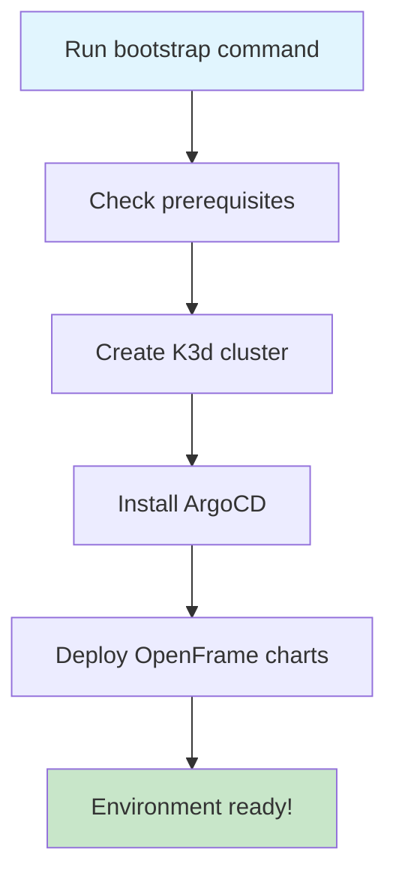

# OpenFrame CLI - Getting Started Guide

Welcome to OpenFrame CLI! This guide will help you get up and running with OpenFrame in minutes. OpenFrame CLI is a modern command-line tool for managing Kubernetes clusters and development workflows with a focus on simplicity and developer experience.

## Prerequisites

Before you begin, ensure you have the following tools installed on your system:

| Tool | Required Version | Purpose | Installation Guide |
|------|------------------|---------|-------------------|
| **Docker** | 20.10+ | Container runtime for local clusters | [Install Docker](https://docs.docker.com/get-docker/) |
| **kubectl** | 1.20+ | Kubernetes command-line tool | [Install kubectl](https://kubernetes.io/docs/tasks/tools/) |
| **Helm** | 3.7+ | Kubernetes package manager | [Install Helm](https://helm.sh/docs/intro/install/) |
| **k3d** | 5.0+ | Lightweight Kubernetes clusters | [Install k3d](https://k3d.io/v5.4.6/#installation) |

> **💡 Tip**: OpenFrame CLI will automatically check these prerequisites and guide you through installation if any are missing.

## Installation

### Download and Install OpenFrame CLI

1. **Download the latest release** from the GitHub releases page:
   ```bash
   # For Linux/MacOS
   curl -L https://github.com/flamingo-stack/openframe-cli/releases/latest/download/openframe-cli-linux -o openframe
   chmod +x openframe
   sudo mv openframe /usr/local/bin/
   ```

2. **Verify installation**:
   ```bash
   openframe --version
   ```

### Quick Installation Script (Recommended)

```bash
# One-line installer (downloads and installs automatically)
curl -sSL https://raw.githubusercontent.com/flamingo-stack/openframe-cli/main/install.sh | bash
```

## Your First OpenFrame Environment

The fastest way to get started is using the `bootstrap` command, which sets up everything you need in one step:



### Step 1: Bootstrap Your Environment

```bash
# Interactive mode (recommended for first-time users)
openframe bootstrap

# Or with a custom cluster name
openframe bootstrap my-dev-cluster
```

This command will:
1. 🔍 Check that all prerequisites are installed
2. 🚀 Create a local Kubernetes cluster using k3d
3. 📦 Install ArgoCD for application management
4. ⚙️  Deploy OpenFrame components
5. ✅ Verify everything is working

### Step 2: Choose Your Deployment Mode

During bootstrap, you'll be prompted to select a deployment mode:

| Mode | Description | Best For |
|------|-------------|----------|
| **OSS Tenant** | Open source multi-tenant setup | Development and testing |
| **SaaS Tenant** | Managed service tenant configuration | Production-ready deployments |
| **SaaS Shared** | Shared infrastructure setup | Resource-optimized environments |

> **🎯 For beginners**: Choose **OSS Tenant** for your first setup.

### Step 3: Verify Your Installation

After bootstrap completes, verify your environment:

```bash
# Check cluster status
openframe cluster status

# List all clusters
openframe cluster list

# Check ArgoCD applications
kubectl get applications -n argocd
```

## Basic Configuration

### Cluster Configuration

OpenFrame creates clusters with sensible defaults, but you can customize them:

```bash
# Create a cluster with custom settings
openframe cluster create my-cluster --nodes 3 --k8s-version v1.25.0

# Interactive configuration wizard
openframe cluster create --interactive
```

### Environment Variables

Set these environment variables for easier usage:

```bash
# Add to your ~/.bashrc or ~/.zshrc
export OPENFRAME_CLUSTER_NAME="my-dev-cluster"
export OPENFRAME_NAMESPACE="openframe-system"
```

## Common First Steps

### 1. Access the ArgoCD UI

```bash
# Get ArgoCD admin password
kubectl -n argocd get secret argocd-initial-admin-secret -o jsonpath="{.data.password}" | base64 -d

# Port forward to access UI
kubectl port-forward svc/argocd-server -n argocd 8080:443
```

Then visit: https://localhost:8080 (username: `admin`)

### 2. Deploy Your First Application

```bash
# Install a sample application
openframe chart install my-cluster --deployment-mode oss-tenant
```

### 3. Start Development Workflow

```bash
# Begin development with live reload
openframe dev intercept my-service

# Use Skaffold for continuous development
openframe dev skaffold my-cluster
```

## Common Issues and Solutions

| Issue | Solution |
|-------|----------|
| **"k3d not found"** | Install k3d: `curl -s https://raw.githubusercontent.com/k3d-io/k3d/main/install.sh \| bash` |
| **"Docker not running"** | Start Docker Desktop or run `sudo systemctl start docker` |
| **"Cluster creation failed"** | Check Docker has enough resources (4GB RAM minimum) |
| **"Port already in use"** | Stop existing clusters: `openframe cluster cleanup` |
| **"ArgoCD not accessible"** | Wait 2-3 minutes for ArgoCD to fully start, then retry |

### Troubleshooting Commands

```bash
# Check cluster health
openframe cluster status my-cluster

# Clean up resources
openframe cluster cleanup

# Verbose output for debugging
openframe bootstrap --verbose

# Reset everything and start fresh
openframe cluster delete my-cluster
openframe bootstrap my-cluster
```

## Next Steps

Once your environment is running:

1. **📚 Read the [Common Use Cases Guide](common-use-cases.md)** - Learn practical workflows
2. **🔧 Configure your IDE** - Set up kubectl context and namespace
3. **🚀 Deploy your applications** - Start building with OpenFrame
4. **📈 Monitor your cluster** - Use built-in observability tools

## Getting Help

- 📖 **Documentation**: Check the [OpenFrame docs](https://docs.openframe.io)
- 💬 **Community**: Join our [Discord server](https://discord.gg/openframe)
- 🐛 **Issues**: Report bugs on [GitHub Issues](https://github.com/flamingo-stack/openframe-cli/issues)
- 📧 **Support**: Contact support@openframe.io

## Quick Reference

```bash
# Essential commands you'll use daily
openframe bootstrap                    # Set up new environment
openframe cluster list                # Show all clusters
openframe cluster status             # Check cluster health
openframe cluster delete my-cluster  # Clean up when done
openframe dev intercept my-service   # Start development

# Get help for any command
openframe --help
openframe cluster --help
openframe bootstrap --help
```

---

**🎉 Congratulations!** You now have a fully functional OpenFrame environment. Ready to start building? Check out our [Common Use Cases](common-use-cases.md) guide for practical examples.