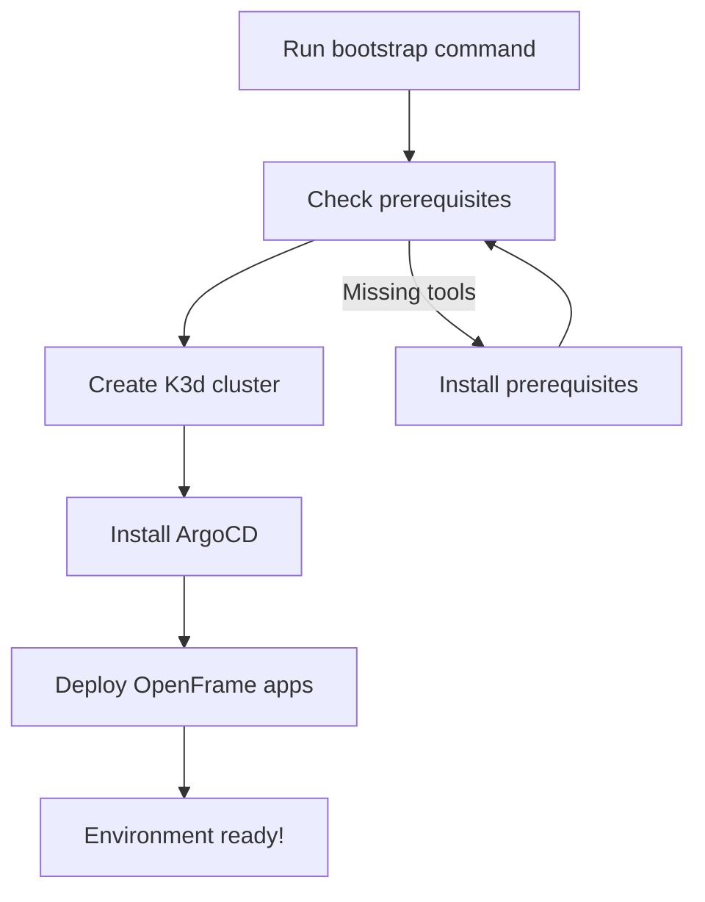

# Getting Started with OpenFrame CLI

Welcome to OpenFrame CLI! This guide will help you set up a complete Kubernetes development environment with ArgoCD and OpenFrame applications in just a few minutes.

## What is OpenFrame CLI?

OpenFrame CLI is a command-line tool that simplifies Kubernetes cluster management and application deployment. It provides interactive wizards to bootstrap development environments, manage local K3d clusters, and streamline developer workflows with tools like Telepresence and Skaffold.

## Prerequisites

Before you begin, ensure you have the following tools installed on your system:

| Tool | Required Version | Purpose | Installation Guide |
|------|------------------|---------|-------------------|
| **Docker** | Latest stable | Container runtime for K3d clusters | [Install Docker](https://docs.docker.com/get-docker/) |
| **kubectl** | v1.20+ | Kubernetes command-line tool | [Install kubectl](https://kubernetes.io/docs/tasks/tools/install-kubectl/) |
| **Helm** | v3.0+ | Package manager for Kubernetes | [Install Helm](https://helm.sh/docs/intro/install/) |
| **Git** | Latest | Version control for chart repositories | [Install Git](https://git-scm.com/book/en/v2/Getting-Started-Installing-Git) |

> **Note:** The OpenFrame CLI will automatically check for these prerequisites and guide you through installation if any are missing.

## Installation

### Option 1: Download Binary (Recommended)

Download the latest release for your platform from the releases page and add it to your PATH:

```bash
# Linux/macOS
curl -LO https://github.com/flamingo-stack/openframe-cli/releases/latest/download/openframe-cli-linux-amd64
chmod +x openframe-cli-linux-amd64
sudo mv openframe-cli-linux-amd64 /usr/local/bin/openframe

# Verify installation
openframe --version
```

### Option 2: Build from Source

```bash
# Clone the repository
git clone https://github.com/flamingo-stack/openframe-cli.git
cd openframe-cli

# Build the binary
go build -o openframe main.go

# Move to PATH (optional)
sudo mv openframe /usr/local/bin/
```

## Quick Start - Bootstrap Your First Environment

The fastest way to get started is with the `bootstrap` command, which creates a complete development environment in one step:



### Interactive Bootstrap (Recommended for beginners)

```bash
# Start the interactive bootstrap wizard
openframe bootstrap

# The CLI will guide you through:
# 1. Cluster name selection (default: openframe-dev)
# 2. Deployment mode selection:
#    - oss-tenant: Open source tenant mode
#    - saas-tenant: SaaS tenant mode  
#    - saas-shared: SaaS shared mode
# 3. Automatic cluster creation and app deployment
```

### Non-Interactive Bootstrap (CI/CD friendly)

```bash
# Bootstrap with specific settings
openframe bootstrap my-cluster --deployment-mode=oss-tenant --non-interactive

# With verbose output for troubleshooting
openframe bootstrap --deployment-mode=oss-tenant --non-interactive --verbose
```

## Basic Configuration

### Cluster Configuration

OpenFrame CLI uses sensible defaults, but you can customize your setup:

```bash
# List all clusters
openframe cluster list

# Check cluster status
openframe cluster status my-cluster

# Create a custom cluster
openframe cluster create my-custom-cluster
```

### Default Settings

| Setting | Default Value | Description |
|---------|---------------|-------------|
| Cluster Name | `openframe-dev` | Name of the K3d cluster |
| Kubernetes Version | Latest stable | K8s version for the cluster |
| Node Count | 3 | Number of worker nodes |
| Deployment Mode | Interactive selection | OpenFrame deployment configuration |

## Your First Steps After Bootstrap

Once bootstrap completes successfully, you can:

### 1. Verify Your Installation

```bash
# Check cluster status
kubectl get nodes

# Verify ArgoCD is running
kubectl get pods -n argocd

# Access ArgoCD UI (get admin password)
kubectl -n argocd get secret argocd-initial-admin-secret -o jsonpath="{.data.password}" | base64 -d
```

### 2. Explore Available Commands

```bash
# View all available commands
openframe --help

# Cluster management commands
openframe cluster --help

# Chart management commands  
openframe chart --help

# Development tools
openframe dev --help
```

### 3. Access Your Applications

After bootstrap, your applications will be deployed via ArgoCD. You can:

- Access ArgoCD UI at `http://localhost:8080` (if port-forwarded)
- View application status: `kubectl get applications -n argocd`
- Monitor deployment progress: `kubectl get pods --all-namespaces`

## Common Issues and Solutions

<details>
<summary>Docker not running</summary>

**Error:** `Cannot connect to the Docker daemon`

**Solution:**
```bash
# Start Docker service (Linux)
sudo systemctl start docker

# Or start Docker Desktop (macOS/Windows)
```
</details>

<details>
<summary>Cluster creation fails</summary>

**Error:** `Failed to create cluster: port already in use`

**Solution:**
```bash
# Check for existing clusters
openframe cluster list

# Clean up existing cluster
openframe cluster delete openframe-dev

# Try again with different cluster name
openframe bootstrap my-unique-cluster
```
</details>

<details>
<summary>ArgoCD installation timeout</summary>

**Error:** `Timeout waiting for ArgoCD to be ready`

**Solution:**
```bash
# Check cluster resources
kubectl get nodes
kubectl top nodes

# Increase verbosity to see detailed logs
openframe bootstrap --verbose

# Try with more time for slower systems
openframe bootstrap --non-interactive --deployment-mode=oss-tenant
```
</details>

| Issue | Common Cause | Quick Fix |
|-------|--------------|-----------|
| Command not found | OpenFrame not in PATH | Add binary to `/usr/local/bin/` |
| Permission denied | Binary not executable | Run `chmod +x openframe` |
| Cluster creation slow | Limited resources | Close other applications, increase Docker memory |
| Git authentication | Missing Git credentials | Configure `git config` user/email |

## Next Steps

Now that you have OpenFrame CLI set up, explore these guides:

- **[Common Use Cases](common-use-cases.md)** - Learn practical workflows and examples
- **[Developer Documentation](../dev/getting-started-dev.md)** - Contributing to the project
- **[Architecture Overview](../dev/architecture-overview-dev.md)** - Understanding the system design

## Getting Help

- **CLI Help:** Run `openframe --help` or `openframe <command> --help`
- **GitHub Issues:** Report bugs and request features
- **Verbose Mode:** Add `--verbose` to any command for detailed logging
- **Documentation:** Visit the project documentation for advanced topics

---

> **Tip:** Use the alias `openframe k` instead of `openframe cluster` for faster cluster management commands!