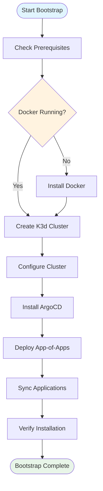

# Getting Started with OpenFrame CLI

OpenFrame CLI is a modern Kubernetes cluster management tool that provides developers with a streamlined workflow for creating, managing, and deploying applications to local K3d clusters. This guide will walk you through setting up your first OpenFrame environment.

## Prerequisites

Before you begin, ensure you have the following software installed on your system:

| Software | Version | Purpose | Installation Guide |
|----------|---------|---------|-------------------|
| **Docker** | 20.10+ | Container runtime for K3d clusters | [Install Docker](https://docs.docker.com/get-docker/) |
| **kubectl** | 1.20+ | Kubernetes command-line tool | [Install kubectl](https://kubernetes.io/docs/tasks/tools/) |
| **Helm** | 3.0+ | Kubernetes package manager | [Install Helm](https://helm.sh/docs/intro/install/) |
| **K3d** | 5.0+ | Lightweight Kubernetes in Docker | [Install K3d](https://k3d.io/#installation) |
| **OpenFrame CLI** | Latest | This tool | Follow installation steps below |

> **Note**: OpenFrame CLI will check for these prerequisites and guide you through installation if any are missing.

## Installation

### Download OpenFrame CLI

Choose your installation method:

#### Option 1: Direct Download (Recommended)
```bash
# Download latest release for your platform
curl -L https://github.com/flamingo-stack/openframe-cli/releases/latest/download/openframe-cli-linux-amd64 -o openframe
chmod +x openframe
sudo mv openframe /usr/local/bin/

# Verify installation
openframe --version
```

#### Option 2: Build from Source
```bash
# Clone the repository
git clone https://github.com/flamingo-stack/openframe-cli.git
cd openframe-cli

# Build the CLI
go build -o openframe .

# Move to PATH
sudo mv openframe /usr/local/bin/
```

### Verify Prerequisites

Run the prerequisite check to ensure all dependencies are installed:

```bash
openframe cluster create --help
```

If any prerequisites are missing, OpenFrame CLI will display installation instructions.

## Quick Start

The fastest way to get started is using the bootstrap command, which creates a complete OpenFrame environment in one step.

### 1. Bootstrap Your First Environment

```bash
# Create a complete OpenFrame environment with interactive setup
openframe bootstrap

# Or specify a custom cluster name
openframe bootstrap my-dev-cluster
```

This command will:
1. 🚀 Create a K3d Kubernetes cluster
2. 🔧 Install ArgoCD for GitOps deployments
3. 📦 Set up OpenFrame charts and applications
4. ✅ Verify everything is running correctly

### 2. Verify Your Setup

Check that your cluster is running:

```bash
# List your clusters
openframe cluster list

# Check cluster status
openframe cluster status

# View Kubernetes resources
kubectl get nodes
kubectl get pods --all-namespaces
```

### 3. Access ArgoCD Dashboard

After bootstrap completes, you can access the ArgoCD web interface:

```bash
# Get ArgoCD admin password
kubectl -n argocd get secret argocd-initial-admin-secret -o jsonpath="{.data.password}" | base64 -d

# Port forward to access UI (in a separate terminal)
kubectl port-forward svc/argocd-server -n argocd 8080:443

# Open browser to https://localhost:8080
# Username: admin
# Password: (from step above)
```

## Setup Process Flow

Here's what happens during the bootstrap process:



## Configuration Options

### Interactive Mode (Default)

When you run `openframe bootstrap`, you'll be prompted to configure:

- **Cluster Name**: Choose a name for your cluster (default: openframe-dev)
- **Deployment Mode**: Select from:
  - `oss-tenant`: Open source tenant deployment
  - `saas-tenant`: SaaS tenant deployment  
  - `saas-shared`: Shared SaaS deployment
- **Node Count**: Number of worker nodes (default: 3)
- **Kubernetes Version**: K8s version to use (default: latest stable)

### Non-Interactive Mode

For automation or CI/CD, use flags to skip prompts:

```bash
# Fully automated bootstrap
openframe bootstrap \
  --deployment-mode=oss-tenant \
  --non-interactive \
  --verbose

# Quick defaults
openframe bootstrap my-cluster --deployment-mode=oss-tenant
```

## Common Issues and Solutions

| Issue | Symptoms | Solution |
|-------|----------|----------|
| **Docker Not Running** | `Cannot connect to Docker daemon` | Start Docker: `sudo systemctl start docker` |
| **Port Conflicts** | `Port already in use` | Stop conflicting services or use different ports |
| **Insufficient Memory** | Cluster creation fails | Ensure at least 4GB RAM available for Docker |
| **Network Issues** | Image pull failures | Check internet connection and Docker registry access |
| **Permission Denied** | `Permission denied` errors | Add user to docker group: `sudo usermod -aG docker $USER` |

### Troubleshooting Commands

```bash
# Check Docker status
docker info

# View cluster logs
openframe cluster status my-cluster

# Reset everything and start fresh
openframe cluster delete my-cluster
openframe cluster cleanup
```

## Next Steps

Now that you have OpenFrame running:

1. **Explore the Dashboard**: Access ArgoCD to see your applications
2. **Deploy Applications**: Use ArgoCD to deploy your first app
3. **Learn Development Workflows**: See our [Common Use Cases](common-use-cases.md) guide
4. **Set up Monitoring**: Configure observability for your cluster

## Getting Help

- **Built-in Help**: Run `openframe --help` or `openframe [command] --help`
- **Verbose Logging**: Add `--verbose` flag to see detailed output
- **Community Support**: Visit our GitHub repository for issues and discussions

## Quick Reference Commands

```bash
# Essential commands
openframe bootstrap                    # Complete environment setup
openframe cluster create             # Create cluster only
openframe cluster list               # Show all clusters
openframe cluster delete [name]      # Remove cluster
openframe cluster status [name]      # Show cluster details
openframe cluster cleanup           # Clean unused resources
```

Congratulations! You now have a working OpenFrame environment. Continue with our [Common Use Cases](common-use-cases.md) guide to learn about daily workflows and advanced features.