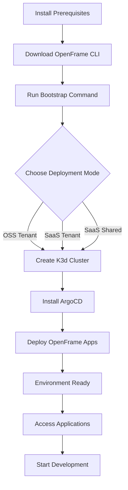

# OpenFrame CLI Getting Started Guide

Welcome to OpenFrame CLI! This guide will help you quickly set up and start using the OpenFrame development environment. OpenFrame CLI is a command-line tool that simplifies Kubernetes cluster management and deployment workflows.

## Prerequisites

Before you begin, ensure you have the following tools installed on your system:

| Tool | Version | Purpose | Installation Guide |
|------|---------|---------|-------------------|
| **Docker** | Latest | Container runtime for K3d clusters | [Docker Installation](https://docs.docker.com/get-docker/) |
| **K3d** | v5.0+ | Lightweight Kubernetes clusters | `curl -s https://raw.githubusercontent.com/k3d-io/k3d/main/install.sh \| bash` |
| **Helm** | v3.0+ | Kubernetes package manager | [Helm Installation](https://helm.sh/docs/intro/install/) |
| **kubectl** | Latest | Kubernetes CLI tool | [kubectl Installation](https://kubernetes.io/docs/tasks/tools/) |

### Verify Prerequisites

Run these commands to verify your installation:

```bash
# Check Docker
docker --version

# Check K3d
k3d version

# Check Helm
helm version

# Check kubectl
kubectl version --client
```

## Installation

### Download OpenFrame CLI

> 🚨 **Important**: Replace `<version>` with the latest version number from the releases page.

```bash
# Download for Linux/macOS
curl -L -o openframe https://github.com/flamingo-stack/openframe-cli/releases/download/<version>/openframe-<os>-<arch>

# Make it executable
chmod +x openframe

# Move to PATH (optional)
sudo mv openframe /usr/local/bin/
```

### Verify Installation

```bash
openframe --help
```

You should see the OpenFrame CLI help menu with available commands.

## Quick Start Setup Process

Here's the complete setup process from zero to running OpenFrame environment:



## Your First OpenFrame Environment

The fastest way to get started is using the bootstrap command, which sets up everything in one go:

### Option 1: Interactive Setup (Recommended for Beginners)

```bash
# Start interactive bootstrap - will guide you through all options
openframe bootstrap
```

This will:
1. Prompt you to choose a deployment mode
2. Ask for cluster configuration preferences
3. Create the Kubernetes cluster
4. Install ArgoCD and OpenFrame applications
5. Show you how to access your new environment

### Option 2: Quick Setup with Defaults

```bash
# Quick setup with default settings for OSS tenant
openframe bootstrap --deployment-mode=oss-tenant

# Or for SaaS development
openframe bootstrap --deployment-mode=saas-tenant
```

### Option 3: Custom Cluster Name

```bash
# Create environment with custom cluster name
openframe bootstrap my-dev-cluster --deployment-mode=oss-tenant
```

## Basic Configuration

### Deployment Modes Explained

| Mode | Description | Use Case |
|------|-------------|----------|
| **oss-tenant** | Open source tenant deployment | Development, testing, self-hosted |
| **saas-tenant** | SaaS tenant-specific setup | Customer-specific development |
| **saas-shared** | SaaS shared infrastructure | Multi-tenant development |

### Common Configuration Options

```bash
# Verbose output to see detailed progress
openframe bootstrap --verbose

# Non-interactive mode (for CI/CD)
openframe bootstrap --deployment-mode=oss-tenant --non-interactive

# Custom cluster with specific settings
openframe cluster create my-cluster --nodes=3
```

## Accessing Your Environment

After successful bootstrap, you'll see output similar to:

```
✅ Bootstrap completed successfully!

🚀 Your OpenFrame environment is ready:
   - Cluster: my-cluster
   - ArgoCD UI: https://localhost:8080
   - Default credentials will be displayed
   
📋 Next steps:
   - Access ArgoCD to monitor deployments
   - Use 'openframe cluster status' to check health
   - Start development with 'openframe dev' commands
```

### Check Environment Status

```bash
# View cluster information
openframe cluster status

# List all clusters
openframe cluster list

# View detailed cluster info
kubectl cluster-info
```

## Common Commands Quick Reference

```bash
# Environment Management
openframe bootstrap                    # Complete setup
openframe cluster create my-cluster   # Create cluster only
openframe cluster delete my-cluster   # Delete cluster
openframe cluster list                # Show all clusters

# Application Management  
openframe chart install              # Install ArgoCD and apps
openframe chart install --verbose    # With detailed progress

# Development Tools
openframe dev intercept my-service   # Traffic interception
openframe dev skaffold my-cluster    # Development workflow

# Maintenance
openframe cluster cleanup my-cluster # Clean unused resources
```

## Common Issues and Solutions

<details>
<summary>❌ "Docker daemon not running"</summary>

**Problem**: Docker is not started or accessible.

**Solution**: 
```bash
# Start Docker service
sudo systemctl start docker

# Or restart Docker Desktop on macOS/Windows
```
</details>

<details>
<summary>❌ "k3d cluster creation failed"</summary>

**Problem**: Port conflicts or insufficient resources.

**Solutions**:
```bash
# Check for port conflicts
lsof -i :6443

# Delete conflicting cluster
k3d cluster delete <cluster-name>

# Try with different ports
openframe cluster create --api-port=6444
```
</details>

<details>
<summary>❌ "Helm chart installation timeout"</summary>

**Problem**: Network issues or resource constraints.

**Solutions**:
```bash
# Check cluster resources
kubectl get nodes
kubectl top nodes

# Retry with verbose logging
openframe chart install --verbose

# Manual debugging
kubectl get pods -A
```
</details>

<details>
<summary>❌ "Command not found: openframe"</summary>

**Problem**: OpenFrame CLI not in PATH.

**Solutions**:
```bash
# Use full path
./openframe --help

# Or add to PATH
export PATH=$PATH:$(pwd)

# Or move to system PATH
sudo mv openframe /usr/local/bin/
```
</details>

## Next Steps

Now that you have OpenFrame running:

1. **Explore the Web UI**: Access ArgoCD to see your deployed applications
2. **Learn Development Workflows**: Check out [Common Use Cases](common-use-cases.md)
3. **Join the Community**: Get help and share feedback
4. **Read the Documentation**: Dive deeper into specific features

> 💡 **Pro Tip**: Use `openframe --help` or `openframe <command> --help` to explore all available options and flags.

## Getting Help

- 📖 **Documentation**: Use built-in help with `--help` flag
- 🐛 **Issues**: Report bugs on the GitHub issues page  
- 💬 **Community**: Join our community discussions
- 📧 **Support**: Contact the OpenFrame team

---

**🎉 Congratulations!** You now have a working OpenFrame environment. Ready to start building?