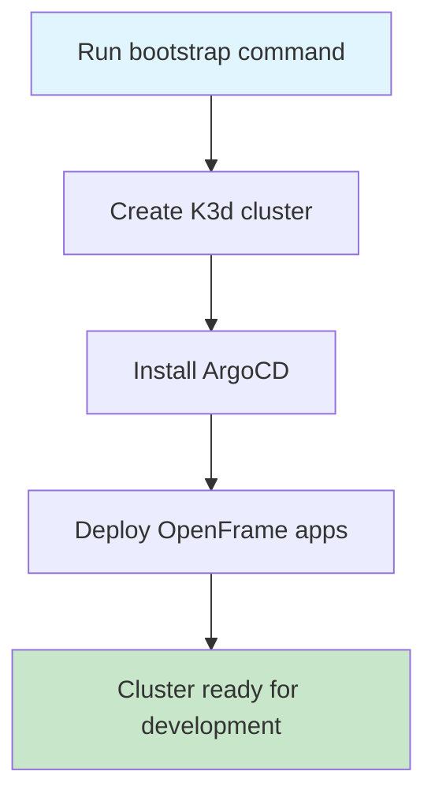

# Getting Started with OpenFrame CLI

Welcome to OpenFrame CLI! This guide will help you get up and running with your first OpenFrame Kubernetes cluster in just a few minutes.

## What is OpenFrame CLI?

OpenFrame CLI is a command-line tool that makes it easy to create and manage local Kubernetes clusters for development. It automates the setup of K3d clusters, installs ArgoCD for GitOps deployments, and provides development tools for testing your applications.

## Prerequisites

Before you begin, make sure you have the following tools installed on your system:

| Tool | Purpose | Installation Guide |
|------|---------|-------------------|
| **Docker** | Container runtime for K3d | [Install Docker](https://docs.docker.com/get-docker/) |
| **kubectl** | Kubernetes command-line tool | [Install kubectl](https://kubernetes.io/docs/tasks/tools/) |
| **Helm** | Package manager for Kubernetes | [Install Helm](https://helm.sh/docs/intro/install/) |
| **K3d** | Lightweight Kubernetes in Docker | [Install K3d](https://k3d.io/v5.4.6/#installation) |

> **Note**: OpenFrame CLI will check for these prerequisites and guide you through installation if any are missing.

## Installation

### Option 1: Download Pre-built Binary
```bash
# Download the latest release (replace with actual download URL)
curl -L https://github.com/flamingo-stack/openframe-cli/releases/latest/download/openframe-cli -o openframe
chmod +x openframe
sudo mv openframe /usr/local/bin/
```

### Option 2: Build from Source
```bash
git clone https://github.com/flamingo-stack/openframe-cli.git
cd openframe-cli
go build -o openframe main.go
sudo mv openframe /usr/local/bin/
```

### Verify Installation
```bash
openframe --help
```

You should see the OpenFrame CLI help message with available commands.

## Quick Start: Your First Cluster

The fastest way to get started is with the bootstrap command, which creates a cluster and installs all necessary components:



### Step 1: Bootstrap Your Environment
```bash
openframe bootstrap
```

This command will:
1. Show you the OpenFrame logo
2. Ask for your deployment preference (OSS Tenant, SaaS Tenant, or SaaS Shared)
3. Create a Kubernetes cluster named "openframe-dev"
4. Install ArgoCD for GitOps deployments
5. Deploy the OpenFrame application stack

### Step 2: Choose Your Deployment Mode
When prompted, select one of these options:

- **OSS Tenant**: Open source tenant deployment
- **SaaS Tenant**: Software-as-a-Service tenant mode  
- **SaaS Shared**: Shared SaaS deployment

If you're just getting started, choose **OSS Tenant**.

### Step 3: Wait for Installation
The bootstrap process takes 2-5 minutes. You'll see progress indicators for:
- ✅ Cluster creation
- ✅ ArgoCD installation
- ✅ Application deployment

### Step 4: Verify Your Installation
```bash
# Check cluster status
openframe cluster status

# List running clusters
openframe cluster list

# Check Kubernetes pods
kubectl get pods --all-namespaces
```

## What's Next?

Congratulations! You now have a running OpenFrame cluster. Here are some things you can try:

### Access ArgoCD Dashboard
```bash
# Get ArgoCD admin password
kubectl -n argocd get secret argocd-initial-admin-secret -o jsonpath="{.data.password}" | base64 -d

# Port forward to access dashboard
kubectl port-forward svc/argocd-server -n argocd 8080:443
```

Visit `https://localhost:8080` and login with username `admin` and the password from above.

### Explore Available Commands
```bash
# Cluster management
openframe cluster --help

# Chart operations  
openframe chart --help

# Development tools
openframe dev --help
```

## Common Issues and Solutions

| Issue | Solution |
|-------|----------|
| **Docker not running** | Start Docker Desktop or Docker daemon |
| **Permission denied** | Run `sudo chmod +x openframe` after download |
| **Cluster creation fails** | Check Docker has enough resources (4GB+ RAM recommended) |
| **kubectl not found** | Install kubectl using your package manager |
| **Port already in use** | Stop other services using ports 80, 443, or 6443 |

## Getting Help

If you encounter issues:

1. **Check prerequisites**: Run `openframe cluster create --help` to see requirement checks
2. **Enable verbose logging**: Add `-v` flag to any command for detailed output
3. **Check cluster logs**: Use `kubectl logs` to inspect pod logs
4. **Clean up and retry**: Run `openframe cluster cleanup` then try again

## Advanced Configuration

<details>
<summary>Custom Cluster Names and Settings</summary>

### Create Named Clusters
```bash
# Create cluster with custom name
openframe bootstrap my-project-cluster

# Non-interactive mode for CI/CD
openframe bootstrap --deployment-mode=oss-tenant --non-interactive
```

### Manual Step-by-Step Setup
```bash
# 1. Create cluster only
openframe cluster create my-cluster

# 2. Install charts separately
openframe chart install --deployment-mode=oss-tenant
```

</details>

<details>
<summary>Multiple Cluster Management</summary>

### Working with Multiple Clusters
```bash
# List all clusters
openframe cluster list

# Switch between clusters
kubectl config use-context k3d-my-cluster-name

# Delete specific cluster
openframe cluster delete my-cluster-name
```

</details>

> **💡 Tip**: Use `openframe bootstrap -v` for verbose output that shows exactly what's happening during setup.

---

**Next Steps**: Check out our [Common Use Cases Guide](common-use-cases.md) to learn practical workflows with OpenFrame CLI.