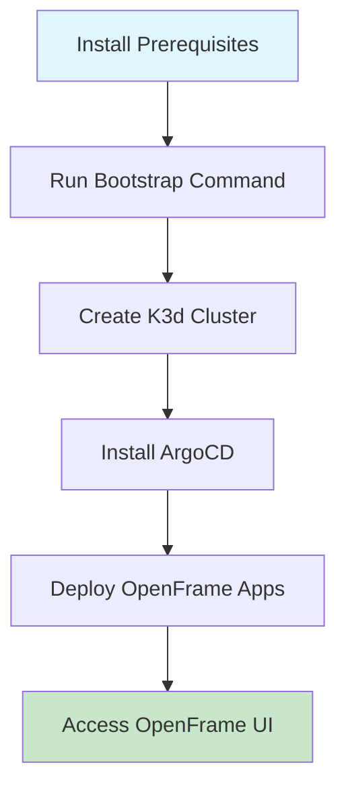

# Getting Started with OpenFrame CLI

Welcome to OpenFrame CLI! This guide will help you set up a complete OpenFrame Kubernetes environment for local development in minutes.

## Prerequisites

Before you begin, ensure you have the following tools installed:

| Tool | Version | Purpose | Installation Link |
|------|---------|---------|-------------------|
| **Docker** | 20.10+ | Container runtime for K3d | [Get Docker](https://docs.docker.com/get-docker/) |
| **kubectl** | 1.24+ | Kubernetes command-line tool | [Install kubectl](https://kubernetes.io/docs/tasks/tools/) |
| **Helm** | 3.8+ | Kubernetes package manager | [Install Helm](https://helm.sh/docs/intro/install/) |
| **K3d** | 5.4+ | Lightweight Kubernetes distribution | [Install K3d](https://k3d.io/v5.4.6/#installation) |

> **Note**: OpenFrame CLI will check for these prerequisites and help install missing tools when you run commands.

## Installation

### Quick Install (Recommended)
```bash
# Download and install the latest version
curl -fsSL https://get.openframe.io/install.sh | sh

# Add to your PATH (add this to your shell profile)
export PATH=$PATH:/usr/local/bin
```

### Manual Install
1. Download the latest binary from [GitHub Releases](https://github.com/flamingo-stack/openframe-cli/releases)
2. Extract and move to your PATH:
   ```bash
   tar -xzf openframe-cli-linux-amd64.tar.gz
   sudo mv openframe /usr/local/bin/
   chmod +x /usr/local/bin/openframe
   ```

### Verify Installation
```bash
openframe --version
```

## Setup Process Overview

The setup process follows these steps:



## Quick Start (5 Minutes)

The fastest way to get started is with the bootstrap command, which creates everything you need in one go:

### 1. Bootstrap Your Environment
```bash
openframe bootstrap
```

This command will:
- Display an interactive menu to choose your deployment mode
- Create a new K3d Kubernetes cluster
- Install ArgoCD for GitOps workflows
- Deploy OpenFrame applications
- Set up access to the OpenFrame dashboard

### 2. Choose Your Deployment Mode
When prompted, select from these options:

| Mode | Description | Best For |
|------|-------------|----------|
| **OSS Tenant** | Open source single-tenant setup | Individual developers |
| **SaaS Tenant** | Multi-tenant configuration | Team development |
| **SaaS Shared** | Shared multi-tenant setup | Enterprise teams |

### 3. Wait for Installation
The bootstrap process typically takes 2-3 minutes. You'll see progress updates as each component is installed.

### 4. Access Your Environment
Once complete, you can access:
- **OpenFrame Dashboard**: `https://openframe.local`
- **ArgoCD UI**: `https://argocd.local`
- **Kubernetes API**: `kubectl cluster-info`

## Alternative Setup (Step-by-Step)

If you prefer more control, you can set up components individually:

### 1. Create a Cluster
```bash
# Interactive mode with options
openframe cluster create

# Or create with a specific name
openframe cluster create my-dev-cluster
```

### 2. Install OpenFrame Charts
```bash
# Interactive installation
openframe chart install

# Or install on specific cluster
openframe chart install my-dev-cluster
```

### 3. Check Status
```bash
# List all clusters
openframe cluster list

# Check cluster status
openframe cluster status my-dev-cluster
```

## Common Configuration Options

### Custom Cluster Names
```bash
# Create cluster with custom name
openframe bootstrap my-project-cluster

# Non-interactive with specific settings
openframe bootstrap production-cluster \
  --deployment-mode=saas-shared \
  --non-interactive
```

### Verbose Output
```bash
# See detailed logs during setup
openframe bootstrap --verbose

# Short form
openframe bootstrap -v
```

## Verification Steps

After installation, verify everything is working:

### 1. Check Cluster Status
```bash
openframe cluster status
```

### 2. Verify Kubernetes Access
```bash
kubectl get nodes
kubectl get pods --all-namespaces
```

### 3. Test ArgoCD Access
```bash
# Check if ArgoCD is running
kubectl get pods -n argocd

# Access ArgoCD UI (follow displayed instructions)
```

## Common Issues and Solutions

| Issue | Solution |
|-------|----------|
| **Docker not running** | Start Docker Desktop or `sudo systemctl start docker` |
| **Permission denied** | Run with `sudo` or add user to docker group |
| **Port conflicts** | Stop other services using ports 80/443 or use different ports |
| **K3d cluster exists** | Delete existing cluster: `openframe cluster delete cluster-name` |
| **Slow installation** | Check internet connection and Docker resources |

## Next Steps

Once your environment is running:

1. **Explore the Dashboard**: Visit `https://openframe.local` to see your applications
2. **Deploy Your First App**: Use ArgoCD to deploy applications via GitOps
3. **Development Workflow**: Learn about [common use cases](./common-use-cases.md)
4. **Advanced Features**: Set up development tools with `openframe dev`

## Getting Help

- **View command help**: `openframe --help` or `openframe <command> --help`
- **Check logs**: Use `--verbose` flag with any command
- **Community support**: Visit our [documentation site](https://docs.openframe.io)
- **Report issues**: [GitHub Issues](https://github.com/flamingo-stack/openframe-cli/issues)

## Clean Up

To remove everything when you're done:

```bash
# Delete specific cluster
openframe cluster delete my-cluster

# Clean up all resources
openframe cluster cleanup
```

---

**Congratulations!** 🎉 You now have a complete OpenFrame development environment. Check out our [Common Use Cases](./common-use-cases.md) guide to learn what you can do next.