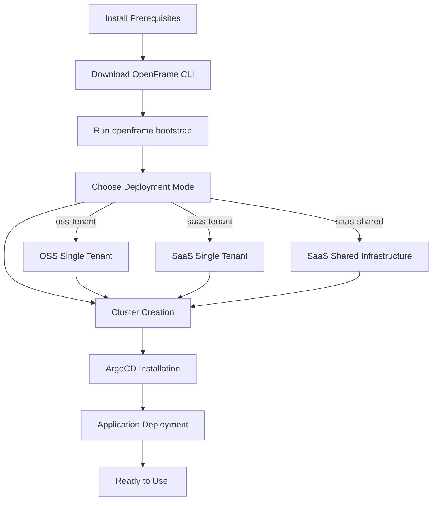

# Getting Started with OpenFrame CLI

Welcome to OpenFrame CLI! This guide will help you set up and use the OpenFrame CLI to create and manage Kubernetes clusters for development and testing.

## What is OpenFrame CLI?

OpenFrame CLI is a modern command-line tool that simplifies Kubernetes cluster management and deployment. It replaces complex shell scripts with an intuitive, wizard-style interface for:

- Creating local Kubernetes clusters
- Installing ArgoCD and applications
- Managing development workflows
- Setting up complete OpenFrame environments

## Prerequisites

Before getting started, ensure you have the following tools installed:

| Tool | Version | Purpose | Installation |
|------|---------|---------|--------------|
| **Docker** | Latest | Container runtime for K3d clusters | [Get Docker](https://docs.docker.com/get-docker/) |
| **K3d** | v5.0+ | Local Kubernetes cluster creation | `curl -s https://raw.githubusercontent.com/k3d-io/k3d/main/install.sh \| bash` |
| **kubectl** | v1.24+ | Kubernetes cluster interaction | [Install kubectl](https://kubernetes.io/docs/tasks/tools/install-kubectl/) |
| **Helm** | v3.8+ | Package management for Kubernetes | [Install Helm](https://helm.sh/docs/intro/install/) |
| **Git** | Latest | Source code management | [Install Git](https://git-scm.com/downloads) |

> **Note**: The OpenFrame CLI will automatically check for these prerequisites and guide you through installation if any are missing.

## Installation

### Download OpenFrame CLI

1. **Download the latest release** for your operating system:
   ```bash
   # For Linux/macOS (replace with actual download URL)
   curl -LO https://github.com/flamingo-stack/openframe-cli/releases/latest/download/openframe-cli-linux
   chmod +x openframe-cli-linux
   sudo mv openframe-cli-linux /usr/local/bin/openframe
   ```

2. **Verify installation**:
   ```bash
   openframe --version
   ```

3. **Check prerequisites**:
   ```bash
   openframe --help
   ```

## Quick Setup Process

Here's a visual overview of the setup process:



## Your First Cluster

The fastest way to get started is using the bootstrap command:

### 1. Quick Bootstrap (Interactive)

```bash
openframe bootstrap
```

This command will:
- Guide you through cluster creation
- Ask for your deployment preferences
- Set up ArgoCD automatically
- Deploy OpenFrame applications

### 2. Quick Bootstrap (Non-Interactive)

For automation or if you know your preferences:

```bash
openframe bootstrap my-dev-cluster --deployment-mode=oss-tenant --non-interactive
```

### 3. Step-by-Step Setup

If you prefer to understand each step:

```bash
# Step 1: Create a cluster
openframe cluster create my-cluster

# Step 2: Install charts and ArgoCD
openframe chart install my-cluster
```

## Configuration Options

### Deployment Modes

| Mode | Description | Use Case |
|------|-------------|----------|
| **oss-tenant** | Single-tenant open source | Development, testing |
| **saas-tenant** | Single-tenant SaaS | Dedicated customer environments |
| **saas-shared** | Multi-tenant SaaS | Shared infrastructure |

### Cluster Options

During interactive setup, you can configure:

- **Cluster Name**: Custom name for your cluster (default: `openframe-dev`)
- **Node Count**: Number of worker nodes (default: 3)
- **Kubernetes Version**: Specific K8s version (default: latest)
- **Cluster Type**: Currently supports K3d

## Basic Commands

### Cluster Management

```bash
# List all clusters
openframe cluster list

# Check cluster status
openframe cluster status my-cluster

# Delete a cluster
openframe cluster delete my-cluster

# Clean up unused resources
openframe cluster cleanup
```

### Quick Access with Aliases

The CLI supports aliases for common commands:

```bash
# These are equivalent
openframe cluster create
openframe c create

# Development tools
openframe dev intercept my-service
openframe d intercept my-service
```

## Common Issues and Solutions

<details>
<summary>🔧 Troubleshooting</summary>

| Issue | Solution |
|-------|----------|
| **Docker not running** | Start Docker Desktop or Docker service: `sudo systemctl start docker` |
| **K3d not found** | Install K3d: `curl -s https://raw.githubusercontent.com/k3d-io/k3d/main/install.sh \| bash` |
| **Insufficient memory** | Ensure at least 4GB RAM available for K3d clusters |
| **Port conflicts** | K3d uses ports 80, 443, 6443. Stop conflicting services |
| **Permission denied** | Run with appropriate permissions or use `sudo` for installation |
| **Cluster creation hangs** | Check Docker resource limits and available disk space |

</details>

## Next Steps

Once you have a running cluster:

1. **Explore the cluster**:
   ```bash
   kubectl get pods -A
   kubectl get nodes
   ```

2. **Access ArgoCD UI**:
   ```bash
   # Get ArgoCD admin password
   kubectl -n argocd get secret argocd-initial-admin-secret -o jsonpath="{.data.password}" | base64 -d
   
   # Port forward to access UI
   kubectl port-forward svc/argocd-server -n argocd 8080:443
   # Open https://localhost:8080
   ```

3. **Check OpenFrame applications**:
   ```bash
   openframe cluster status my-cluster
   ```

4. **Start development workflows** (see [Common Use Cases](common-use-cases.md))

## Getting Help

- **Command help**: `openframe [command] --help`
- **Verbose output**: Add `-v` flag to any command
- **Version info**: `openframe --version`

> **Success!** 🎉 You now have a fully functional OpenFrame development environment. Check out our [Common Use Cases](common-use-cases.md) guide to learn what you can do next.