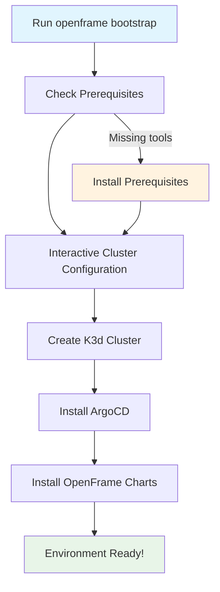

# Getting Started with OpenFrame CLI

Welcome to OpenFrame CLI! This guide will help you set up and start using OpenFrame CLI to manage your Kubernetes clusters and development workflows.

## What is OpenFrame CLI?

OpenFrame CLI is a modern command-line tool that simplifies Kubernetes cluster management and development workflows. It provides interactive wizards for:

- Creating and managing K3d clusters
- Installing ArgoCD and Helm charts
- Setting up development tools like Telepresence
- Bootstrapping complete environments with one command

## Prerequisites

Before you begin, make sure you have the following tools installed on your system:

| Tool | Version | Purpose | Installation Guide |
|------|---------|---------|-------------------|
| **Docker** | Latest | Container runtime for K3d clusters | [Get Docker](https://docs.docker.com/get-docker/) |
| **kubectl** | v1.24+ | Kubernetes command-line tool | [Install kubectl](https://kubernetes.io/docs/tasks/tools/) |
| **k3d** | v5.0+ | Lightweight Kubernetes in Docker | [Install k3d](https://k3d.io/v5.6.0/#installation) |
| **Helm** | v3.8+ | Kubernetes package manager | [Install Helm](https://helm.sh/docs/intro/install/) |

> **Note**: OpenFrame CLI will check for these prerequisites and guide you through installation if any are missing.

## Installation

### Download the Binary

1. Go to the [OpenFrame CLI releases page](https://github.com/flamingo-stack/openframe-cli/releases)
2. Download the appropriate binary for your operating system:
   - **Linux**: `openframe-linux-amd64`
   - **macOS**: `openframe-darwin-amd64` 
   - **Windows**: `openframe-windows-amd64.exe`

3. Make the binary executable and move it to your PATH:

```bash
# Linux/macOS
chmod +x openframe-linux-amd64
sudo mv openframe-linux-amd64 /usr/local/bin/openframe

# Verify installation
openframe --version
```

```powershell
# Windows (PowerShell)
# Move to a directory in your PATH, e.g., C:\Windows\System32
move openframe-windows-amd64.exe C:\Windows\System32\openframe.exe

# Verify installation
openframe --version
```

### Build from Source (Advanced)

If you prefer to build from source:

```bash
git clone https://github.com/flamingo-stack/openframe-cli.git
cd openframe-cli
go build -o openframe
sudo mv openframe /usr/local/bin/
```

## First Steps: Bootstrap Your Environment

The easiest way to get started is with the `bootstrap` command, which creates a complete OpenFrame environment:



### Quick Start

1. **Run the bootstrap command**:
   ```bash
   openframe bootstrap
   ```

2. **Follow the interactive prompts**:
   - Enter a cluster name (or press Enter for default)
   - Choose deployment mode:
     - `oss-tenant`: Open source deployment
     - `saas-tenant`: SaaS tenant deployment  
     - `saas-shared`: SaaS shared deployment

3. **Wait for completion**:
   The tool will create your cluster and install all necessary components. This typically takes 2-5 minutes.

### Example Session

```bash
$ openframe bootstrap

 ██████╗ ██████╗ ███████╗███╗   ██╗███████╗██████╗  █████╗ ███╗   ███╗███████╗
██╔═══██╗██╔══██╗██╔════╝████╗  ██║██╔════╝██╔══██╗██╔══██╗████╗ ████║██╔════╝
██║   ██║██████╔╝█████╗  ██╔██╗ ██║█████╗  ██████╔╝███████║██╔████╔██║█████╗  
██║   ██║██╔═══╝ ██╔══╝  ██║╚██╗██║██╔══╝  ██╔══██╗██╔══██║██║╚██╔╝██║██╔══╝  
╚██████╔╝██║     ███████╗██║ ╚████║██║     ██║  ██║██║  ██║██║ ╚═╝ ██║███████╗
 ╚═════╝ ╚═╝     ╚══════╝╚═╝  ╚═══╝╚═╝     ╚═╝  ╚═╝╚═╝  ╚═╝╚═╝     ╚═╝╚══════╝

? Enter cluster name: my-dev-cluster
? Select deployment mode: oss-tenant
✓ Creating K3d cluster "my-dev-cluster"
✓ Installing ArgoCD
✓ Syncing applications
✓ Bootstrap complete!

Your OpenFrame environment is ready at: https://localhost:8080
```

## Basic Commands

Once your environment is set up, here are the most commonly used commands:

### Cluster Management

```bash
# List all clusters
openframe cluster list

# Check cluster status
openframe cluster status my-dev-cluster

# Delete a cluster
openframe cluster delete my-dev-cluster
```

### Chart Management

```bash
# Install charts on existing cluster
openframe chart install

# Install with specific deployment mode
openframe chart install --deployment-mode=saas-tenant
```

### Getting Help

```bash
# Show main help
openframe --help

# Help for specific commands
openframe cluster --help
openframe bootstrap --help
```

## Configuration

OpenFrame CLI stores configuration in your home directory under `.openframe/`. You can customize:

- Default cluster settings
- Deployment modes
- ArgoCD configurations
- Chart values

## Common Issues and Solutions

| Issue | Solution |
|-------|----------|
| **Docker not running** | Start Docker Desktop or Docker daemon: `sudo systemctl start docker` |
| **Port conflicts** | K3d uses ports 80, 443, and 6443. Stop conflicting services or use different ports |
| **kubectl not found** | Install kubectl: `curl -LO "https://dl.k8s.io/release/$(curl -L -s https://dl.k8s.io/release/stable.txt)/bin/linux/amd64/kubectl"` |
| **Cluster creation fails** | Check Docker has sufficient resources (4GB+ RAM recommended) |
| **ArgoCD not accessible** | Wait 2-3 minutes for all pods to start, then check `kubectl get pods -A` |

## Next Steps

Now that you have OpenFrame CLI set up:

1. **Explore the UI**: Visit your ArgoCD dashboard to see your applications
2. **Try development tools**: Learn about Telepresence intercepts for local development
3. **Read the use cases guide**: Check out `user/common-use-cases.md` for practical examples
4. **Join the community**: Get help and share feedback with other users

## Getting Help

- **Documentation**: Visit the [OpenFrame CLI docs](https://github.com/flamingo-stack/openframe-cli/docs)
- **Issues**: Report bugs on [GitHub Issues](https://github.com/flamingo-stack/openframe-cli/issues)
- **Community**: Join our Slack community for support

---

🎉 **Congratulations!** You've successfully set up OpenFrame CLI and created your first environment. Happy clustering!