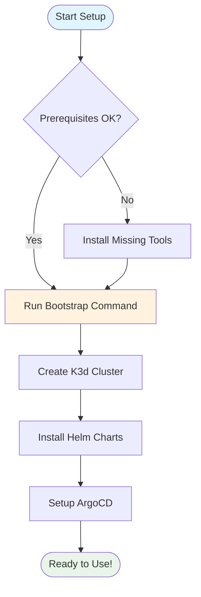

# Getting Started with OpenFrame CLI

Welcome to OpenFrame CLI! This guide will help you set up a complete OpenFrame Kubernetes development environment on your local machine. OpenFrame CLI is a modern command-line tool that makes it easy to create and manage Kubernetes clusters for development and testing.

## Prerequisites

Before you begin, make sure you have the following installed on your system:

| Tool | Version | Purpose | Installation |
|------|---------|---------|--------------|
| **Docker** | 20.10+ | Container runtime for K3d clusters | [Install Docker](https://docs.docker.com/get-docker/) |
| **Kubernetes CLI (kubectl)** | 1.24+ | Interact with Kubernetes clusters | [Install kubectl](https://kubernetes.io/docs/tasks/tools/) |
| **Helm** | 3.8+ | Package manager for Kubernetes | [Install Helm](https://helm.sh/docs/intro/install/) |
| **Git** | 2.30+ | Version control for configuration | [Install Git](https://git-scm.com/downloads) |

> **Note**: OpenFrame CLI will automatically check for these prerequisites and guide you through installation if anything is missing.

## Installation

### Option 1: Download Binary (Recommended)

```bash
# Download the latest release for your platform
curl -L https://github.com/flamingo-stack/openframe-cli/releases/latest/download/openframe-cli-linux-amd64 -o openframe
chmod +x openframe
sudo mv openframe /usr/local/bin/

# Verify installation
openframe --version
```

### Option 2: Build from Source

```bash
# Clone the repository
git clone https://github.com/flamingo-stack/openframe-cli.git
cd openframe-cli

# Build the binary
go build -o openframe .

# Move to your PATH
sudo mv openframe /usr/local/bin/
```

## Quick Setup Process

The fastest way to get started is using the bootstrap command, which sets up everything in one go:



## Step-by-Step Setup

### Step 1: Verify Prerequisites

```bash
# OpenFrame CLI will automatically check prerequisites
# But you can verify manually:

docker --version
kubectl version --client
helm version
git --version
```

### Step 2: Bootstrap Your Environment

The bootstrap command creates a complete OpenFrame environment:

```bash
# Interactive mode (recommended for first time)
openframe bootstrap

# Or with a custom cluster name
openframe bootstrap my-dev-cluster
```

This single command will:
- Create a local Kubernetes cluster using K3d
- Install ArgoCD for application management
- Set up OpenFrame charts and applications
- Configure your kubectl context

### Step 3: Verify Your Setup

```bash
# Check cluster status
openframe cluster status

# List all clusters
openframe cluster list

# Check if pods are running
kubectl get pods --all-namespaces
```

You should see output similar to:
```
NAMESPACE     NAME                                     READY   STATUS    RESTARTS   AGE
kube-system   local-path-provisioner-xxx              1/1     Running   0          2m
kube-system   coredns-xxx                             1/1     Running   0          2m
argocd        argocd-server-xxx                       1/1     Running   0          1m
```

## Configuration Options

### Deployment Modes

When bootstrapping, you can choose from different deployment modes:

| Mode | Description | Use Case |
|------|-------------|----------|
| **oss-tenant** | Open source single-tenant | Individual development |
| **saas-tenant** | SaaS multi-tenant | Team development |
| **saas-shared** | Shared SaaS environment | Testing/staging |

Example with specific mode:
```bash
openframe bootstrap --deployment-mode=oss-tenant
```

### Non-Interactive Setup

For automation or CI/CD environments:

```bash
# Skip all prompts, use defaults
openframe bootstrap --non-interactive --deployment-mode=oss-tenant

# With verbose logging
openframe bootstrap --non-interactive --verbose --deployment-mode=oss-tenant
```

## First Steps

### 1. Access ArgoCD Dashboard

```bash
# Get ArgoCD admin password
kubectl -n argocd get secret argocd-initial-admin-secret -o jsonpath="{.data.password}" | base64 -d

# Port forward to access UI (runs in background)
kubectl port-forward svc/argocd-server -n argocd 8080:443 &

# Open in browser
open https://localhost:8080
# Login: admin / [password from above]
```

### 2. Check Available Commands

```bash
# Main command help
openframe --help

# Cluster management
openframe cluster --help

# Chart management  
openframe chart --help

# Development tools
openframe dev --help
```

### 3. Create Additional Clusters

```bash
# Create a new cluster for testing
openframe cluster create test-cluster

# With custom configuration
openframe cluster create production-test --nodes 5
```

## Common Issues and Solutions

| Issue | Solution |
|-------|----------|
| **Docker not running** | Start Docker Desktop or `sudo systemctl start docker` |
| **Port conflicts** | Stop services using ports 80, 443, 6443, or use different ports |
| **kubectl context issues** | Run `openframe cluster status` to verify active cluster |
| **Permission denied** | Ensure your user is in the `docker` group: `sudo usermod -aG docker $USER` |
| **Cluster creation fails** | Run `openframe cluster cleanup` to remove any stuck resources |

### Troubleshooting Commands

```bash
# Check cluster health
openframe cluster status

# View detailed logs
openframe bootstrap --verbose

# Clean up stuck resources
openframe cluster cleanup

# Delete and recreate cluster
openframe cluster delete my-cluster
openframe cluster create my-cluster
```

## Next Steps

Once your environment is running, you can:

1. **Deploy Applications**: Use ArgoCD to deploy your applications
2. **Development Workflow**: Learn about [traffic interception and live reload](common-use-cases.md)
3. **Team Setup**: Share your configuration with team members
4. **Production Preparation**: Test your applications in a production-like environment

## Getting Help

```bash
# Command help
openframe --help
openframe bootstrap --help

# Check cluster status
openframe cluster status

# View logs
kubectl logs -n argocd deployment/argocd-server
```

For additional help:
- Check the [Common Use Cases](common-use-cases.md) guide
- Review the troubleshooting section above
- Join our community forum for support

---

> **Tip**: Keep your terminal open after bootstrap completes - you'll see helpful information about accessing your new environment and suggested next steps.