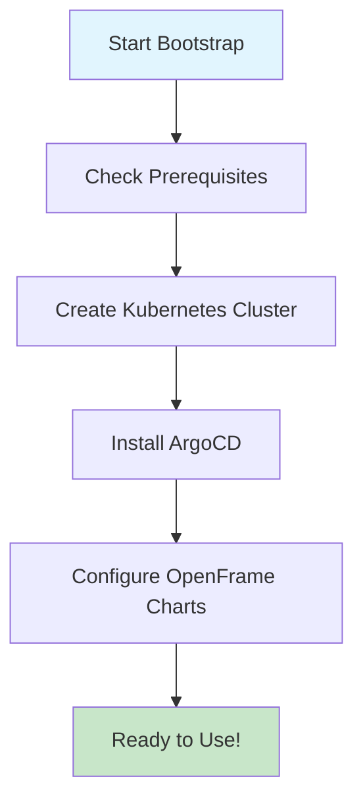

# OpenFrame CLI - Getting Started Guide

Welcome to OpenFrame CLI! This guide will help you get started with OpenFrame, a modern Kubernetes development platform that simplifies cluster management and application deployment.

## What is OpenFrame CLI?

OpenFrame CLI is a command-line tool that helps you:
- Create and manage local Kubernetes clusters
- Install and configure development tools like ArgoCD
- Set up complete development environments with a single command
- Manage application deployments and traffic routing

## Prerequisites

Before you start, ensure you have the following installed on your system:

| Tool | Version | Purpose | Installation |
|------|---------|---------|--------------|
| **Docker** | 20.0+ | Container runtime | [Install Docker](https://docs.docker.com/get-docker/) |
| **kubectl** | 1.20+ | Kubernetes CLI | [Install kubectl](https://kubernetes.io/docs/tasks/tools/) |
| **Helm** | 3.0+ | Package manager for Kubernetes | [Install Helm](https://helm.sh/docs/intro/install/) |
| **k3d** | 5.0+ | Local Kubernetes clusters | [Install k3d](https://k3d.io/stable/#installation) |

> **Note**: OpenFrame CLI will automatically check for these dependencies and guide you through installation if any are missing.

## Installation

### Download OpenFrame CLI

```bash
# Download the latest release (replace with actual download command)
curl -sSL https://get.openframe.dev | bash

# Or download directly from GitHub releases
wget https://github.com/flamingo-stack/openframe-cli/releases/latest/download/openframe-cli-linux-amd64
chmod +x openframe-cli-linux-amd64
sudo mv openframe-cli-linux-amd64 /usr/local/bin/openframe
```

### Verify Installation

```bash
openframe --version
```

You should see the OpenFrame CLI version information.

## Quick Start Setup

The fastest way to get started is with the bootstrap command, which sets up everything you need in one step:



### Option 1: Quick Bootstrap (Recommended)

```bash
# Create a complete OpenFrame environment with defaults
openframe bootstrap

# Or with a custom cluster name
openframe bootstrap my-dev-cluster
```

This command will:
1. Create a local Kubernetes cluster using k3d
2. Install ArgoCD for GitOps deployments
3. Set up OpenFrame charts and configurations
4. Provide you with access URLs and credentials

### Option 2: Step-by-Step Setup

If you prefer more control, you can set up OpenFrame step by step:

```bash
# Step 1: Create a Kubernetes cluster
openframe cluster create my-cluster

# Step 2: Install ArgoCD and charts
openframe chart install my-cluster
```

## Your First OpenFrame Environment

After running the bootstrap command, you'll see output similar to:

```
✅ Cluster 'openframe-dev' created successfully
✅ ArgoCD installed and configured
✅ OpenFrame charts deployed

🌐 Access URLs:
   ArgoCD UI: https://localhost:8080
   OpenFrame Dashboard: https://localhost:3000

🔑 Credentials:
   ArgoCD Username: admin
   ArgoCD Password: [generated-password]

🚀 Your OpenFrame environment is ready!
```

## Common Configuration Options

### Interactive vs Non-Interactive Mode

```bash
# Interactive mode (default) - prompts for configuration
openframe bootstrap

# Non-interactive mode - uses defaults or predefined values
openframe bootstrap --non-interactive --deployment-mode=oss-tenant
```

### Deployment Modes

| Mode | Description | Use Case |
|------|-------------|----------|
| `oss-tenant` | Open source tenant deployment | Individual development |
| `saas-tenant` | SaaS tenant deployment | Team development |
| `saas-shared` | Shared SaaS deployment | Multi-team environment |

```bash
# Specify deployment mode to skip selection prompt
openframe bootstrap --deployment-mode=oss-tenant
```

### Verbose Output

```bash
# Enable detailed logging to see what's happening
openframe bootstrap --verbose
```

## Managing Your Environment

### Check Cluster Status

```bash
# List all clusters
openframe cluster list

# Check specific cluster status
openframe cluster status my-cluster
```

### Access Your Applications

```bash
# Get cluster information and access URLs
openframe cluster status my-cluster
```

## Common Issues and Solutions

| Issue | Symptoms | Solution |
|-------|----------|----------|
| **Docker not running** | "Cannot connect to Docker daemon" | Start Docker Desktop or Docker service |
| **Port conflicts** | "Port already in use" | Stop conflicting services or use different ports |
| **Network issues** | "Connection refused" | Check firewall settings and Docker network |
| **Permission errors** | "Permission denied" | Ensure Docker runs without sudo |
| **Resource limits** | "Out of memory/disk space" | Increase Docker resource limits |

### Troubleshooting Commands

```bash
# Check prerequisites
openframe cluster create --dry-run

# Clean up problematic clusters
openframe cluster cleanup my-cluster

# Start fresh (removes everything)
openframe cluster delete my-cluster
```

## Next Steps

<details>
<summary>🚀 Explore Development Features</summary>

Once your environment is running, try these development features:

```bash
# Set up traffic interception for local development
openframe dev intercept my-service

# Use Skaffold for continuous development
openframe dev scaffold my-service
```

</details>

<details>
<summary>📚 Learn More</summary>

- Check out [Common Use Cases](common-use-cases.md) for practical examples
- Read the [Developer Getting Started Guide](../dev/getting-started-dev.md) if you're contributing to OpenFrame
- Visit the [Architecture Overview](../dev/architecture-overview-dev.md) for technical details

</details>

## Need Help?

- **Documentation**: Check the inline help with `openframe --help` or `openframe [command] --help`
- **Issues**: Report bugs on [GitHub Issues](https://github.com/flamingo-stack/openframe-cli/issues)
- **Community**: Join our community discussions

> **Success!** 🎉 You now have OpenFrame CLI installed and your first environment running. Ready to start developing!