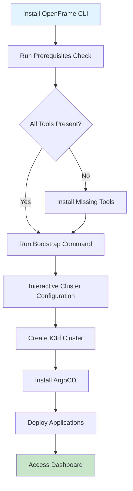

# Getting Started with OpenFrame CLI

Welcome to OpenFrame CLI, an interactive Kubernetes platform bootstrapper that simplifies deploying and managing Kubernetes clusters with ArgoCD GitOps workflows.

## Prerequisites

Before using OpenFrame CLI, ensure you have the following tools installed:

| Tool | Version | Purpose | Installation |
|------|---------|---------|-------------|
| **Docker** | Latest | Container runtime for K3d clusters | [Install Docker](https://docs.docker.com/get-docker/) |
| **kubectl** | Latest | Kubernetes CLI for cluster management | [Install kubectl](https://kubernetes.io/docs/tasks/tools/) |
| **Helm** | v3.8+ | Package manager for Kubernetes | [Install Helm](https://helm.sh/docs/intro/install/) |
| **k3d** | v5.0+ | Lightweight Kubernetes distribution | [Install k3d](https://k3d.io/v5.4.6/#installation) |

### Optional Development Tools

| Tool | Purpose | When Needed |
|------|---------|-------------|
| **Telepresence** | Traffic interception for development | When using `openframe dev intercept` |
| **Skaffold** | Live reload development workflows | When using `openframe dev skaffold` |

> **Note**: OpenFrame CLI will automatically check for missing prerequisites and guide you through installation when needed.

## Installation

### Method 1: Download Pre-built Binary

1. Download the appropriate binary for your system:
   ```bash
   # For Linux (AMD64)
   curl -L -o openframe https://github.com/flamingo-stack/openframe-cli/releases/latest/download/openframe-linux-amd64
   
   # For macOS (Apple Silicon)
   curl -L -o openframe https://github.com/flamingo-stack/openframe-cli/releases/latest/download/openframe
   
   # For Windows (AMD64)
   curl -L -o openframe.exe https://github.com/flamingo-stack/openframe-cli/releases/latest/download/openframe-windows-amd64.exe
   ```

2. Make the binary executable (Linux/macOS only):
   ```bash
   chmod +x openframe
   ```

3. Move to a directory in your PATH:
   ```bash
   sudo mv openframe /usr/local/bin/
   ```

4. Verify installation:
   ```bash
   openframe --version
   ```

### Method 2: Build from Source

1. Clone the repository:
   ```bash
   git clone https://github.com/flamingo-stack/openframe-cli.git
   cd openframe-cli
   ```

2. Build the binary:
   ```bash
   make build
   ```

3. Move to PATH:
   ```bash
   sudo mv openframe /usr/local/bin/
   ```

## Setup Process Overview



## Quick Start

The fastest way to get started is using the bootstrap command, which creates a cluster and installs OpenFrame components in one step:

```bash
openframe bootstrap
```

This will:
1. Check for required prerequisites
2. Guide you through interactive cluster configuration
3. Create a K3d cluster
4. Install ArgoCD with GitOps workflows
5. Deploy the OpenFrame application suite

### Example Interactive Session

```
$ openframe bootstrap

 ██████╗ ██████╗ ███████╗███╗   ██╗███████╗██████╗  █████╗ ███╗   ███╗███████╗
██╔═══██╗██╔══██╗██╔════╝████╗  ██║██╔════╝██╔══██╗██╔══██╗████╗ ████║██╔════╝
██║   ██║██████╔╝█████╗  ██╔██╗ ██║█████╗  ██████╔╝███████║██╔████╔██║█████╗  
██║   ██║██╔═══╝ ██╔══╝  ██║╚██╗██║██╔══╝  ██╔══██╗██╔══██║██║╚██╔╝██║██╔══╝  
╚██████╔╝██║     ███████╗██║ ╚████║██║     ██║  ██║██║  ██║██║ ╚═╝ ██║███████╗
 ╚═════╝ ╚═╝     ╚══════╝╚═╝  ╚═══╝╚═╝     ╚═╝  ╚═╝╚═╝  ╚═╝╚═╝     ╚═╝╚══════╝

✓ Checking prerequisites...
? Enter cluster name: my-dev-cluster
? Select deployment mode: 
  ▸ OSS Tenant (Development)
    Enterprise (Production)
? Enable monitoring stack? Yes
? Configure ingress? Yes

🚀 Creating cluster 'my-dev-cluster'...
✓ Cluster created successfully
🎯 Installing ArgoCD...
✓ ArgoCD installed and configured
🏆 Bootstrap completed successfully!

Access your cluster:
  kubectl get pods -A
  
ArgoCD Dashboard:
  https://argocd.my-dev-cluster.localhost
```

## Step-by-Step Manual Setup

If you prefer more control, you can set up OpenFrame manually:

### Step 1: Create a Cluster

```bash
# List existing clusters
openframe cluster list

# Create a new cluster
openframe cluster create my-cluster

# Check cluster status
openframe cluster status my-cluster
```

### Step 2: Install Charts

```bash
# Install ArgoCD and applications
openframe chart install --deployment-mode=oss-tenant
```

### Step 3: Verify Installation

```bash
# Check all pods are running
kubectl get pods -A

# Port forward to ArgoCD (if needed)
kubectl port-forward -n argocd svc/argocd-server 8080:443
```

## Configuration Options

### Cluster Configuration

OpenFrame CLI supports various cluster configurations:

- **Cluster Name**: Custom name for your K3d cluster
- **Port Mappings**: Expose services on specific ports
- **Node Count**: Single or multi-node clusters
- **Resource Limits**: Memory and CPU constraints

### Deployment Modes

| Mode | Description | Use Case |
|------|-------------|----------|
| **OSS Tenant** | Development setup with basic applications | Local development, testing |
| **Enterprise** | Full production setup with monitoring | Production deployments |

## Common Use Cases

<details>
<summary><strong>Development Environment Setup</strong></summary>

For setting up a development environment:

```bash
# Quick development cluster
openframe bootstrap dev-env --deployment-mode=oss-tenant

# Enable development tools
openframe dev intercept my-service --port 8080
```
</details>

<details>
<summary><strong>Demo/Testing Environment</strong></summary>

For demonstrations or testing:

```bash
# Create isolated cluster
openframe cluster create demo-cluster --nodes=1

# Install minimal setup
openframe chart install --deployment-mode=oss-tenant
```
</details>

<details>
<summary><strong>Learning Kubernetes</strong></summary>

For learning and experimentation:

```bash
# Create learning environment
openframe bootstrap k8s-learning

# Explore with kubectl
kubectl get all -A
kubectl describe pod <pod-name>
```
</details>

## Troubleshooting Common Issues

| Issue | Symptoms | Solution |
|-------|----------|----------|
| **Docker not running** | Error: "Cannot connect to Docker daemon" | Start Docker Desktop or `sudo systemctl start docker` |
| **Port conflicts** | Error: "Port already in use" | Use different ports or stop conflicting services |
| **Insufficient resources** | Pods stuck in Pending state | Increase Docker memory limit (4GB+ recommended) |
| **Network issues** | Cannot access services | Check firewall settings and port forwarding |

### Debug Mode

For detailed troubleshooting information:

```bash
openframe bootstrap --verbose
```

### Getting Help

```bash
# Show general help
openframe --help

# Show command-specific help
openframe cluster create --help
openframe bootstrap --help
```

## Next Steps

Once you have OpenFrame running:

1. **Explore the Dashboard**: Access ArgoCD at the provided URL
2. **Deploy Applications**: Use GitOps workflows to deploy your applications
3. **Development Workflow**: Set up traffic interception with `openframe dev intercept`
4. **Learn More**: Check out our [Common Use Cases](common-use-cases.md) guide

## Getting Support

- **Documentation**: Browse our comprehensive guides
- **Issues**: Report problems on GitHub
- **Community**: Join our discussion forums

> **💡 Tip**: Use `openframe --help` anytime to see available commands and options. The CLI is designed to be self-documenting with helpful prompts and guidance.