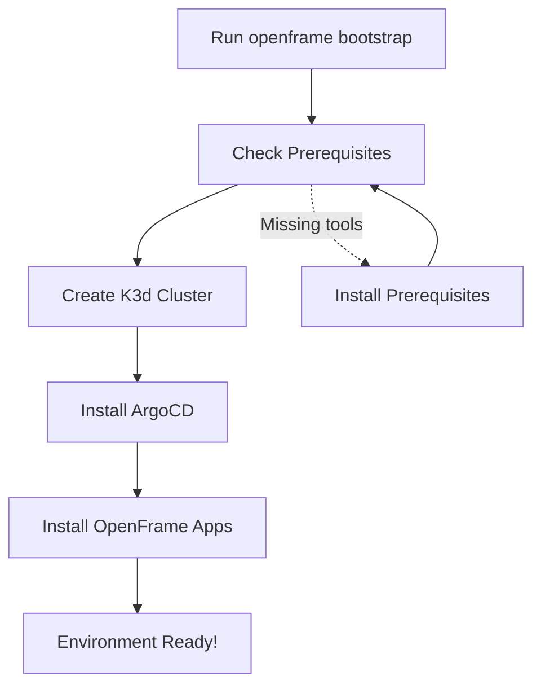

# Getting Started with OpenFrame CLI

Welcome to OpenFrame CLI! This guide will help you install and set up your first OpenFrame Kubernetes environment. OpenFrame CLI provides an interactive, user-friendly way to bootstrap complete Kubernetes platforms with ArgoCD and development tools.

## Prerequisites

Before installing OpenFrame CLI, ensure you have the following tools installed on your system:

| Tool | Purpose | Installation Check |
|------|---------|-------------------|
| **Docker** | Container runtime for K3d | `docker --version` |
| **kubectl** | Kubernetes command-line tool | `kubectl version --client` |
| **Helm** | Kubernetes package manager | `helm version` |
| **Git** | Version control (for GitOps) | `git --version` |

> **Note**: OpenFrame CLI will automatically check for these prerequisites and provide installation guidance if any are missing.

## Installation

### Download OpenFrame CLI

1. **Download the latest release** from the GitHub releases page
2. **Make it executable** (Linux/macOS):
   ```bash
   chmod +x openframe
   ```
3. **Move to your PATH** (optional but recommended):
   ```bash
   sudo mv openframe /usr/local/bin/
   ```

### Verify Installation

```bash
openframe --version
```

You should see version information similar to:
```
openframe version 1.0.0 (abc123) built on 2024-01-01
```

## Quick Start - Bootstrap Your First Environment

The fastest way to get started is with the `bootstrap` command, which creates a complete OpenFrame environment in one step:



### Step 1: Bootstrap Interactive Mode

```bash
openframe bootstrap
```

This launches an interactive wizard that will:
1. **Show the OpenFrame logo** and welcome message
2. **Check prerequisites** and guide you through any missing tools
3. **Prompt for cluster name** (or use default "openframe")
4. **Ask for deployment mode** (OSS Tenant, SaaS Tenant, or SaaS Shared)
5. **Create the Kubernetes cluster** using K3d
6. **Install ArgoCD** and OpenFrame applications
7. **Display success message** with next steps

### Step 2: Access Your Environment

After successful bootstrap, you can access your new environment:

```bash
# Check cluster status
openframe cluster status openframe

# View all clusters
openframe cluster list

# Access ArgoCD (opens in browser)
kubectl port-forward svc/argocd-server -n argocd 8080:443
```

> **Access ArgoCD**: Navigate to `https://localhost:8080` and use the credentials shown during bootstrap.

## Common Configuration Options

### Custom Cluster Name

```bash
openframe bootstrap my-dev-cluster
```

### Non-Interactive Mode (CI/CD Friendly)

```bash
openframe bootstrap --deployment-mode=oss-tenant --non-interactive
```

### Verbose Output (Show Detailed Logs)

```bash
openframe bootstrap --verbose
```

## Basic Usage Examples

### Managing Clusters

```bash
# Create a new cluster
openframe cluster create my-cluster

# List all clusters  
openframe cluster list

# Check cluster status
openframe cluster status my-cluster

# Delete a cluster
openframe cluster delete my-cluster
```

### Installing Charts on Existing Cluster

```bash
# Install OpenFrame charts on existing cluster
openframe chart install my-cluster
```

## Common Issues and Solutions

| Issue | Symptom | Solution |
|-------|---------|----------|
| **Docker not running** | `Cannot connect to Docker daemon` | Start Docker Desktop or `sudo systemctl start docker` |
| **Port conflicts** | `Port 8080 already in use` | Stop other services or use different ports |
| **kubectl not found** | `kubectl: command not found` | Install kubectl following [official guide](https://kubernetes.io/docs/tasks/tools/) |
| **Helm not found** | `helm: command not found` | Install Helm from [helm.sh](https://helm.sh/docs/intro/install/) |
| **Cluster creation timeout** | Cluster creation hangs | Check Docker resources and restart Docker |

### Troubleshooting Commands

```bash
# Check cluster status
openframe cluster status

# View detailed logs
openframe bootstrap --verbose

# Clean up failed deployments
openframe cluster cleanup my-cluster

# Reset everything
openframe cluster delete my-cluster
docker system prune -f
```

## Next Steps

Congratulations! You now have a running OpenFrame environment. Here's what you can do next:

1. **Explore ArgoCD**: Access the web UI to see your applications
2. **Deploy your first app**: Use ArgoCD to deploy applications from Git repositories
3. **Development workflow**: Try the `openframe dev` commands for local development
4. **Read the user guide**: Check out [Common Use Cases](common-use-cases.md) for more examples

## Getting Help

- **CLI Help**: Run `openframe --help` or `openframe [command] --help`
- **Interactive Mode**: Most commands support interactive prompts when run without flags  
- **Verbose Mode**: Add `--verbose` or `-v` to any command for detailed output
- **Logo**: Run `openframe` without arguments to see the welcome screen

> **Tip**: OpenFrame CLI is designed to be interactive and user-friendly. When in doubt, run commands without arguments to see the available options and prompts.