# Getting Started with OpenFrame CLI

Welcome to OpenFrame CLI! This guide will help you set up a local Kubernetes development environment using OpenFrame's streamlined command-line interface. Whether you're a developer or system administrator, this guide provides everything you need to get started.

## What is OpenFrame CLI?

OpenFrame CLI is a modern command-line tool that simplifies the management of Kubernetes clusters and deployment workflows. It provides an intuitive interface for creating local development clusters, installing applications, and managing development workflows.


## Prerequisites

Before installing OpenFrame CLI, ensure you have the following tools installed on your system:

| Tool | Purpose | Installation Check | Required Version |
|------|---------|-------------------|------------------|
| **Docker** | Container runtime for local clusters | `docker --version` | 20.10+ |
| **kubectl** | Kubernetes command-line tool | `kubectl version --client` | 1.25+ |
| **Helm** | Kubernetes package manager | `helm version` | 3.10+ |
| **Git** | Version control (for development) | `git --version` | 2.30+ |

> **📋 Note**: OpenFrame CLI can automatically install missing prerequisites like k3d during the bootstrap process. However, Docker must be installed and running beforehand.

### Installing Prerequisites

#### Docker
- **macOS**: Download Docker Desktop from [docker.com](https://www.docker.com/products/docker-desktop/)
- **Linux**: Follow the [official Docker installation guide](https://docs.docker.com/engine/install/)
- **Windows**: Install Docker Desktop with WSL2 backend

#### kubectl
```bash
# macOS (using Homebrew)
brew install kubectl

# Linux
curl -LO "https://dl.k8s.io/release/$(curl -L -s https://dl.k8s.io/release/stable.txt)/bin/linux/amd64/kubectl"
sudo install -o root -g root -m 0755 kubectl /usr/local/bin/kubectl

# Windows (using Chocolatey)
choco install kubernetes-cli
```

#### Helm
```bash
# macOS (using Homebrew)
brew install helm

# Linux
curl https://baltocdn.com/helm/signing.asc | gpg --dearmor | sudo tee /usr/share/keyrings/helm.gpg > /dev/null
echo "deb [arch=$(dpkg --print-architecture) signed-by=/usr/share/keyrings/helm.gpg] https://baltocdn.com/helm/stable/debian/ all main" | sudo tee /etc/apt/sources.list.d/helm-stable-debian.list
sudo apt-get update
sudo apt-get install helm

# Windows (using Chocolatey)
choco install kubernetes-helm
```

## Installation

### Download and Install OpenFrame CLI

1. **Download the latest release** from the GitHub releases page:
   ```bash
   # Replace VERSION with the latest version number
   curl -LO https://github.com/flamingo-stack/openframe-cli/releases/latest/download/openframe-cli-linux-amd64
   ```

2. **Make it executable and move to your PATH**:
   ```bash
   chmod +x openframe-cli-linux-amd64
   sudo mv openframe-cli-linux-amd64 /usr/local/bin/openframe
   ```

3. **Verify the installation**:
   ```bash
   openframe version
   ```

> **💡 Tip**: For other platforms, replace `linux-amd64` with your platform (e.g., `darwin-amd64` for macOS, `windows-amd64.exe` for Windows).

## First Steps - Bootstrap Your Environment

The fastest way to get started is using the `bootstrap` command, which creates a complete local development environment in one step.

### Interactive Bootstrap (Recommended for beginners)

1. **Start the interactive bootstrap**:
   ```bash
   openframe bootstrap
   ```

2. **Follow the interactive prompts**:
   - Choose your deployment mode (OSS Tenant recommended for learning)
   - Confirm cluster configuration
   - Wait for setup completion

### Quick Bootstrap (Non-interactive)

For faster setup, use the non-interactive mode:

```bash
openframe bootstrap my-dev-cluster --deployment-mode=oss-tenant --verbose
```

### What Happens During Bootstrap?

```mermaid
sequenceDiagram
    participant User
    participant CLI as OpenFrame CLI
    participant Docker
    participant K3d
    participant Helm
    participant ArgoCD

    User->>CLI: openframe bootstrap
    CLI->>CLI: Check prerequisites
    CLI->>K3d: Create local cluster
    K3d->>Docker: Start cluster containers
    CLI->>Helm: Install ArgoCD
    CLI->>ArgoCD: Deploy application manifests
    ArgoCD->>K3d: Deploy applications
    CLI->>User: Environment ready! 🎉
```



The bootstrap process:
1. ✅ Validates that Docker is running
2. ✅ Installs k3d if missing
3. ✅ Creates a local Kubernetes cluster
4. ✅ Installs ArgoCD for application management
5. ✅ Deploys the OpenFrame application stack

## Configuration Options

### Deployment Modes

OpenFrame CLI supports three deployment modes:

| Mode | Description | Use Case |
|------|-------------|----------|
| **oss-tenant** | Open source tenant deployment | Learning, development, single-tenant environments |
| **saas-tenant** | SaaS tenant deployment | Multi-tenant development environments |
| **saas-shared** | SaaS shared deployment | Production-like shared environments |

### Cluster Configuration

Customize your cluster during creation:

```bash
# Create a cluster with specific configuration
openframe cluster create my-cluster --nodes 5 --verbose

# Or use the interactive wizard
openframe cluster create
```

## Verify Your Installation

After bootstrap completes, verify everything is working:

1. **Check cluster status**:
   ```bash
   openframe cluster status
   ```

2. **List running clusters**:
   ```bash
   openframe cluster list
   ```

3. **Verify kubectl access**:
   ```bash
   kubectl get nodes
   kubectl get pods --all-namespaces
   ```

## Accessing Your Applications

Once bootstrap is complete, you can access your applications:

1. **Port forwarding to ArgoCD UI**:
   ```bash
   kubectl port-forward svc/argocd-server -n argocd 8080:443
   ```

2. **Open in browser**: Navigate to `https://localhost:8080`

3. **Get ArgoCD admin password**:
   ```bash
   kubectl -n argocd get secret argocd-initial-admin-secret -o jsonpath="{.data.password}" | base64 -d
   ```

## Common Issues and Solutions

| Issue | Symptoms | Solution |
|-------|----------|----------|
| **Docker not running** | `Cannot connect to the Docker daemon` | Start Docker Desktop or `systemctl start docker` |
| **Port conflicts** | `Port already in use` | Use `openframe cluster cleanup` or kill conflicting processes |
| **Permission denied** | `Permission denied` errors | Ensure Docker group membership: `sudo usermod -aG docker $USER` |
| **K3d installation fails** | K3d download errors | Check internet connection and run with `--verbose` flag |
| **Helm timeout** | Chart installation timeouts | Increase timeout with `--timeout 10m` flag |

<details>
<summary>🔧 Advanced Troubleshooting</summary>

### Verbose Output
For detailed logging, use the `--verbose` flag:
```bash
openframe bootstrap --verbose
```

### Clean Up and Retry
If something goes wrong, clean up and start fresh:
```bash
openframe cluster cleanup
openframe cluster delete my-cluster
# Then try bootstrap again
```

### Check Docker Resources
Ensure Docker has sufficient resources:
- **Memory**: At least 4GB (8GB recommended)
- **CPU**: At least 2 cores (4 cores recommended)
- **Disk**: At least 10GB free space

</details>

## Next Steps

Now that you have OpenFrame CLI working, explore these next steps:

1. **Learn common use cases**: Read our [Common Use Cases Guide](common-use-cases.md)
2. **Development workflows**: Explore `openframe dev --help` for development tools
3. **Cluster management**: Try `openframe cluster --help` for advanced cluster operations
4. **Chart management**: Use `openframe chart --help` to manage applications

## Quick Reference

### Essential Commands
```bash
# Bootstrap a complete environment
openframe bootstrap

# Create a new cluster
openframe cluster create my-cluster

# List all clusters
openframe cluster list

# Check cluster status
openframe cluster status my-cluster

# Delete a cluster
openframe cluster delete my-cluster

# Install charts on existing cluster
openframe chart install --deployment-mode=oss-tenant

# Show help for any command
openframe [command] --help
```

### Global Flags
- `--verbose, -v`: Show detailed output
- `--dry-run`: Preview actions without executing
- `--non-interactive`: Skip interactive prompts
- `--help`: Show command help

---

🎉 **Congratulations!** You now have a working OpenFrame development environment. Start exploring the platform and building amazing applications!

> **💬 Need Help?** Check out our [Common Use Cases](common-use-cases.md) guide or reach out to the community for support.