# OpenFrame CLI - Getting Started Guide

Welcome to OpenFrame CLI! This guide will help you get started with setting up your first Kubernetes cluster and OpenFrame platform using our interactive command-line tool.

## What is OpenFrame CLI?

OpenFrame CLI is a modern, interactive command-line tool that replaces complex shell scripts with user-friendly wizards for managing Kubernetes clusters and OpenFrame deployments. It provides an intuitive way to:

- Create and manage local Kubernetes clusters
- Install OpenFrame platform components
- Set up development environments
- Manage application deployments with ArgoCD

## Prerequisites

Before you begin, ensure you have the following tools installed on your system:

| Tool | Purpose | Installation |
|------|---------|--------------|
| **Docker** | Container runtime for K3d clusters | [Install Docker](https://docs.docker.com/get-docker/) |
| **kubectl** | Kubernetes command-line tool | [Install kubectl](https://kubernetes.io/docs/tasks/tools/) |
| **helm** | Kubernetes package manager | [Install Helm](https://helm.sh/docs/intro/install/) |
| **git** | Version control (for chart repositories) | [Install Git](https://git-scm.com/downloads) |
| **mkcert** *(optional)* | Local SSL certificate generation | [Install mkcert](https://github.com/FiloSottile/mkcert) |

> **Note**: OpenFrame CLI will automatically check for missing prerequisites and guide you through installation when you run commands.

## Installation

### Download OpenFrame CLI

1. **Download the latest release** for your operating system from the [GitHub releases page](https://github.com/flamingo-stack/openframe-cli/releases).

2. **Make the binary executable** (Linux/Mac):
   ```bash
   chmod +x openframe
   ```

3. **Move to your PATH** (optional but recommended):
   ```bash
   # Linux/Mac
   sudo mv openframe /usr/local/bin/
   
   # Verify installation
   openframe --version
   ```

### Verify Installation

Run the following command to ensure OpenFrame CLI is installed correctly:

```bash
openframe --help
```

You should see the OpenFrame CLI help menu with available commands.

## Setup Process Overview

Here's the overall process for setting up your OpenFrame environment:

```mermaid
flowchart TD
    A[Install Prerequisites] --> B[Run openframe bootstrap]
    B --> C{Choose Setup Mode}
    C -->|Interactive| D[Follow Guided Wizard]
    C -->|Quick Start| E[Use Default Settings]
    D --> F[Create K3d Cluster]
    E --> F
    F --> G[Install ArgoCD]
    G --> H[Deploy OpenFrame Apps]
    H --> I[✅ Setup Complete]
    
    style A fill:#f9f9f9
    style I fill:#d4edda
```



## Quick Start (Recommended)

The fastest way to get started is using the bootstrap command, which creates a cluster and installs OpenFrame components in one step:

### 1. Run Bootstrap Command

```bash
openframe bootstrap
```

This will:
1. Show you the OpenFrame logo and welcome message
2. Check for required prerequisites 
3. Present you with setup options
4. Create a K3d cluster with default settings
5. Install ArgoCD and OpenFrame applications

### 2. Choose Your Setup Mode

When prompted, you'll see options like:

```
How would you like to proceed?
❯ Quick start with defaults (recommended)
  Interactive configuration wizard
  Exit
```

**For beginners**: Choose "Quick start with defaults"

### 3. Select Deployment Mode

You'll be asked to choose your deployment mode:

- **oss-tenant**: Open source tenant deployment (recommended for development)
- **saas-tenant**: SaaS tenant deployment
- **saas-shared**: SaaS shared deployment

### 4. Wait for Completion

The process typically takes 2-5 minutes. You'll see progress indicators for:
- Cluster creation
- ArgoCD installation  
- Application deployment

## Manual Step-by-Step Setup

If you prefer more control, you can set up components individually:

### 1. Create a Cluster

```bash
# Interactive cluster creation
openframe cluster create

# Or with a specific name
openframe cluster create my-dev-cluster

# Quick creation with defaults
openframe cluster create my-cluster --skip-wizard
```

### 2. Install OpenFrame Charts

```bash
# Install on the created cluster
openframe chart install

# Or specify deployment mode directly
openframe chart install --deployment-mode oss-tenant
```

## Verification

After setup completes, verify your installation:

### Check Cluster Status

```bash
openframe cluster status
```

### List Running Clusters

```bash
openframe cluster list
```

### Verify Applications

```bash
kubectl get applications -n argocd
```

You should see ArgoCD applications deployed and synced.

## Accessing Your Environment

### ArgoCD Dashboard

1. **Get ArgoCD URL** (will be displayed after installation):
   ```bash
   kubectl get ingress -n argocd
   ```

2. **Get Admin Password**:
   ```bash
   kubectl get secret argocd-initial-admin-secret -n argocd -o jsonpath="{.data.password}" | base64 -d
   ```

3. **Login**: Use username `admin` and the password from step 2

### OpenFrame Applications

Your OpenFrame applications will be automatically deployed through ArgoCD's App-of-Apps pattern. Check the ArgoCD dashboard to see all deployed components.

## Common Issues and Solutions

| Issue | Symptom | Solution |
|-------|---------|----------|
| **Docker not running** | `Cannot connect to Docker daemon` | Start Docker Desktop or Docker service |
| **Port conflicts** | `Port already in use` | Stop conflicting services or use different ports |
| **Insufficient resources** | Cluster creation fails | Ensure Docker has at least 4GB RAM allocated |
| **Prerequisites missing** | `Command not found` errors | Install missing tools using links in Prerequisites table |
| **Cluster already exists** | `Cluster name already in use` | Use `openframe cluster delete <name>` first |

## Next Steps

Now that you have OpenFrame running:

1. **Explore the ArgoCD Dashboard** - See your deployed applications
2. **Check out [Common Use Cases](common-use-cases.md)** - Learn typical workflows  
3. **Set up Development Tools** - Try `openframe dev` commands for local development
4. **Deploy Your Applications** - Add your own apps to the ArgoCD setup

## Getting Help

- **View command help**: `openframe <command> --help`
- **Enable verbose output**: Add `--verbose` to any command
- **Check cluster logs**: `openframe cluster status <cluster-name>`
- **Community Support**: [GitHub Issues](https://github.com/flamingo-stack/openframe-cli/issues)

---

🎉 **Congratulations!** You now have a fully functional OpenFrame environment running on your local machine.