# Getting Started with OpenFrame CLI

Welcome to OpenFrame CLI! This guide will help you set up and run your first OpenFrame Kubernetes environment in minutes. OpenFrame CLI is an interactive tool that simplifies the process of creating local Kubernetes clusters and deploying OpenFrame applications.

## What is OpenFrame CLI?

OpenFrame CLI is a modern command-line tool that replaces complex shell scripts with an intuitive, wizard-style interface. It automates the setup of local Kubernetes clusters using K3d and installs OpenFrame applications through ArgoCD and Helm.

## Prerequisites

Before getting started, ensure your system meets the following requirements:

| Tool | Purpose | Installation Status |
|------|---------|-------------------|
| **Docker** | Container runtime for K3d clusters | ⚠️ Required |
| **Git** | Version control for OpenFrame repositories | ⚠️ Required |
| **Helm** | Kubernetes package manager | ✅ Auto-installed |
| **K3d** | Lightweight Kubernetes in Docker | ✅ Auto-installed |

### System Requirements

- **Memory**: Minimum 8GB RAM (16GB recommended for production workloads)
- **Storage**: At least 10GB free disk space
- **Operating System**: Linux, macOS, or Windows (with WSL2)

## Installation

### Step 1: Install Docker

Docker is required for running K3d clusters:

**For macOS:**
```bash
brew install --cask docker
# Or download Docker Desktop from https://www.docker.com/products/docker-desktop
```

**For Ubuntu/Debian:**
```bash
sudo apt update
sudo apt install docker.io
sudo systemctl start docker
sudo usermod -aG docker $USER
# Log out and back in for group changes to take effect
```

**For CentOS/RHEL:**
```bash
sudo yum install docker
sudo systemctl start docker
sudo systemctl enable docker
sudo usermod -aG docker $USER
```

### Step 2: Install Git

**For macOS:**
```bash
brew install git
```

**For Ubuntu/Debian:**
```bash
sudo apt update
sudo apt install git
```

**For CentOS/RHEL:**
```bash
sudo yum install git
```

### Step 3: Download OpenFrame CLI

Choose your installation method:

**Option A: Direct Download (Recommended)**
```bash
# Download the latest release
curl -L https://github.com/flamingo-stack/openframe-cli/releases/latest/download/openframe-cli-linux-amd64 -o openframe

# Make it executable
chmod +x openframe

# Move to PATH
sudo mv openframe /usr/local/bin/
```

**Option B: Build from Source**
```bash
# Clone the repository
git clone https://github.com/flamingo-stack/openframe-cli.git
cd openframe-cli

# Build the binary (requires Go 1.23+)
go build -o openframe main.go

# Move to PATH
sudo mv openframe /usr/local/bin/
```

### Step 4: Verify Installation

```bash
openframe --version
```

You should see output similar to:
```
dev (none) built on unknown
```

## Setup Process Overview

The setup process follows this flow:

```mermaid
flowchart TD
    A[Run openframe bootstrap] --> B[Check Prerequisites]
    B --> C{All Tools Ready?}
    C -->|No| D[Auto-install Missing Tools]
    D --> E[Create K3d Cluster]
    C -->|Yes| E
    E --> F[Wait for Cluster Ready]
    F --> G[Install ArgoCD]
    G --> H[Deploy OpenFrame Apps]
    H --> I[Setup Complete! 🎉]
    
    style A fill:#e1f5fe
    style I fill:#c8e6c9
    style D fill:#fff3e0
```



## Your First OpenFrame Environment

### Quick Start (Interactive Mode)

The easiest way to get started is with the interactive bootstrap command:

```bash
openframe bootstrap
```

This command will:
1. 🔍 Check system prerequisites
2. 📦 Install any missing tools automatically  
3. 🏗️ Create a new K3d cluster named `openframe-dev`
4. ⚙️ Install ArgoCD for application management
5. 🚀 Deploy OpenFrame applications

### Advanced Setup Options

**Specify a custom cluster name:**
```bash
openframe bootstrap my-awesome-cluster
```

**Choose deployment mode upfront:**
```bash
openframe bootstrap --deployment-mode=oss-tenant
```

**Non-interactive mode (for automation):**
```bash
openframe bootstrap --deployment-mode=oss-tenant --non-interactive
```

**Verbose output (for troubleshooting):**
```bash
openframe bootstrap --verbose
```

### Deployment Modes

| Mode | Description | Use Case |
|------|-------------|----------|
| **oss-tenant** | Open Source single-tenant | Development, testing |
| **saas-tenant** | SaaS single-tenant | Production tenant |
| **saas-shared** | SaaS multi-tenant | Shared environments |

## What Happens During Bootstrap?

### Phase 1: Prerequisites Check
The CLI will automatically check for required tools:

```
✅ Docker: Found (version 24.0.6)
✅ Git: Found (version 2.39.1)
⚠️  Helm: Not found - installing...
✅ Helm: Installed (version 3.12.0)
⚠️  K3d: Not found - installing...  
✅ K3d: Installed (version 5.6.0)
✅ Memory: 16GB available
✅ Certificates: Ready
```

### Phase 2: Cluster Creation
```
🏗️  Creating K3d cluster 'openframe-dev'...
📦 Pulling container images...
🔄 Starting cluster nodes...
✅ Cluster ready in 45s
```

### Phase 3: Application Deployment
```
🚀 Installing ArgoCD...
📋 Configuring OpenFrame applications...
⏳ Waiting for applications to sync...
✅ All applications healthy!
```

## Accessing Your Environment

Once bootstrap completes, you can access your OpenFrame environment:

### ArgoCD UI
```bash
# Get ArgoCD password
kubectl -n argocd get secret argocd-initial-admin-secret -o jsonpath="{.data.password}" | base64 -d

# Port forward to access UI
kubectl port-forward svc/argocd-server -n argocd 8080:443
```

Then open: https://localhost:8080
- Username: `admin`
- Password: (from command above)

### Kubernetes Dashboard
```bash
# View cluster status
openframe cluster status

# List all clusters
openframe cluster list
```

## Common Issues and Solutions

| Issue | Symptoms | Solution |
|-------|----------|----------|
| **Docker not running** | `Cannot connect to Docker daemon` | Start Docker Desktop or `systemctl start docker` |
| **Port conflicts** | `Port 8080 already in use` | Stop conflicting services or use different ports |
| **Insufficient memory** | Cluster creation fails | Close other applications, ensure 8GB+ free RAM |
| **Network issues** | Image pull failures | Check internet connection, verify Docker registry access |
| **Permission denied** | `Permission denied` errors | Add user to docker group: `sudo usermod -aG docker $USER` |

### Troubleshooting Commands

**Check cluster status:**
```bash
openframe cluster status
kubectl get nodes
kubectl get pods --all-namespaces
```

**View logs:**
```bash
openframe bootstrap --verbose
kubectl logs -n argocd deployment/argocd-server
```

**Reset and start over:**
```bash
openframe cluster delete openframe-dev
openframe bootstrap
```

## Next Steps

🎉 **Congratulations!** You now have a running OpenFrame environment. Here's what you can do next:

1. **Explore Applications**: Visit the ArgoCD UI to see deployed applications
2. **Deploy Your Own Apps**: Use the OpenFrame platform to deploy your applications
3. **Learn More**: Check out the [Common Use Cases](common-use-cases.md) guide
4. **Join the Community**: Connect with other OpenFrame users

> **💡 Tip**: Use `openframe --help` to explore all available commands and options.

## Getting Help

If you run into issues:

- 📖 Check the [troubleshooting section](#common-issues-and-solutions) above
- 🐛 Report bugs at: https://github.com/flamingo-stack/openframe-cli/issues
- 💬 Join our community: [Community Link]
- 📚 Read the full documentation: [Docs Link]

---

**Ready to explore more?** Continue with our [Common Use Cases](common-use-cases.md) guide to learn how to use your new OpenFrame environment effectively.