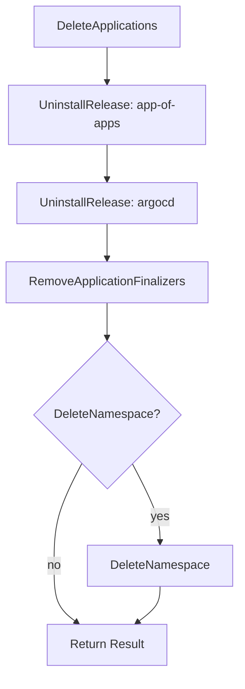

<!-- source-hash: 263c388bb7040b3e1e69c66731a63e7b -->
Orchestrates the removal of the OpenFrame platform (ArgoCD + app-of-apps Helm releases) from a Kubernetes cluster without destroying the cluster itself.

## Key Components

| Symbol | Kind | Description |
|---|---|---|
| `ApplicationDeleter` | Interface | Deletes ArgoCD Application CRs and strips stuck finalizers |
| `ReleaseUninstaller` | Interface | Removes a named Helm release |
| `NamespaceDeleter` | Interface | Deletes a Kubernetes namespace |
| `Options` | Struct | Toggles optional behavior (`DeleteNamespace`) |
| `Result` | Struct | Counts/lists what was actually removed |
| `Service` | Struct | Orchestrator wired with the three dependency interfaces |
| `NewService` | Constructor | Binds a `Service` to a kube-context (empty = cluster current context) |
| `Uninstall` | Method | Runs the full removal sequence, stopping on the first hard error |

## Uninstall Sequence



Applications are deleted **before** Helm releases so ArgoCD can cascade workload cleanup while it is still running. Finalizers are stripped **after** ArgoCD is gone to unblock any CRs stuck in `Terminating`.

## Usage Example

```go
svc := uninstall.NewService(appClient, helmClient, nsClient, "my-cluster")

result, err := svc.Uninstall(ctx, uninstall.Options{
    DeleteNamespace: true,
})
if err != nil {
    log.Fatalf("uninstall failed: %v", err)
}

fmt.Printf("Removed %d apps, %d releases, namespace deleted: %v\n",
    result.AppsDeleted,
    len(result.ReleasesRemoved),
    result.NamespaceDeleted,
)
```