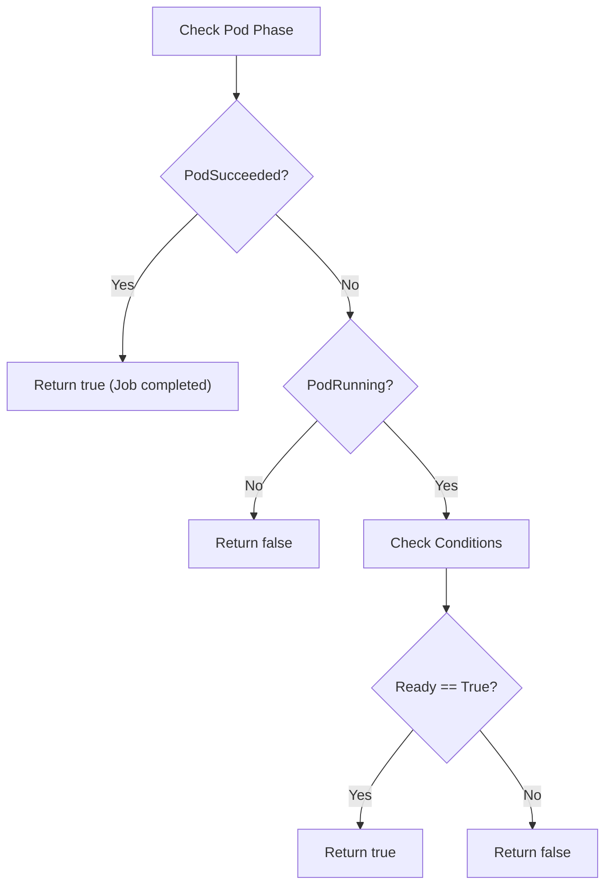

<!-- source-hash: ba39464aeb2273d91c9eb58149fa0135 -->
Utility function for evaluating Kubernetes pod readiness within the ArgoCD package, handling both running and completed (Job) pods.

## Key Components

- **`isPodReady(pod *corev1.Pod) bool`** — Returns `true` if a pod is considered ready. Treats `PodSucceeded` phase (e.g., `argocd-redis-secret-init` Job pods) as ready, requires `PodRunning` phase with a `Ready=True` condition otherwise.

## Usage Example

```go
pod := &corev1.Pod{}
// ... populate pod from Kubernetes API

if isPodReady(pod) {
    fmt.Println("Pod is ready or completed successfully")
}
```

## Readiness Logic



## Notes

- Located in [`pod.go`](https://github.com/flamingo-stack/openframe-cli/blob/main/pkg/argocd/pod.go) under the `argocd` package
- Completed Job pods (`PodSucceeded`) are explicitly treated as ready since they represent successful one-off tasks, not long-running services
- Only checks the `PodReady` condition type; other conditions (e.g., `PodScheduled`, `Initialized`) are ignored