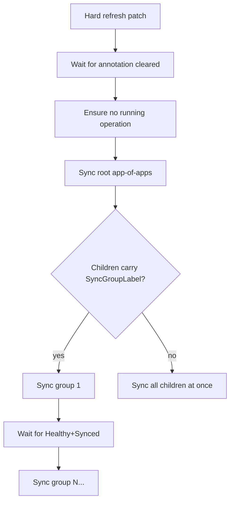

<!-- source-hash: f5e9dc8850b4a9ba4675054eeed4dda7 -->
Handles forced ArgoCD refresh and sync of the root `argocd-apps` Application and its children, enabling rolling deployments across dependency-ordered sync groups without requiring the ArgoCD CLI or API port.

## Key Components

| Symbol | Type | Description |
|--------|------|-------------|
| `AppOfAppsName` | constant | Root ArgoCD Application name (`"argocd-apps"`) that owns all child apps |
| `SyncGroupLabel` | constant | Label key (`openframe.io/sync-group`) used to order child app deployments (1=foundation…5=platform) |
| `refreshHardPatch` | constant | JSON merge-patch that forces repo-server to re-read git, bypassing manifest cache |
| `syncOperationPatch()` | func | Builds the `.operation` sync patch; accepts a `prune` bool to control resource deletion |
| `RefreshAndSync()` | method | Orchestrates the full refresh→wait→sync→child-sync pipeline on `Manager` |
| `syncChildApplications()` | method | Selects owned child apps via ArgoCD tracking markers and syncs them group-by-group |
| `groupChildren()` | func | Buckets child `Application` objects by `SyncGroupLabel`, returning sorted `syncGroup` slices |
| `trackingOwner()` | func | Extracts owning Application name from either the label or annotation tracking marker |
| `syncGroup` | struct | Holds a deploy-order `number` and sorted slice of child Application `names` |

## Usage Example

```go
mgr, err := argocd.NewManager(kubeconfig)
if err != nil {
    log.Fatal(err)
}

// Force re-read of git HEAD and roll out all child apps in dependency order.
// prune=false: never delete workloads when syncing a moved floating ref.
if err := mgr.RefreshAndSync(ctx, false); err != nil {
    log.Fatalf("sync failed: %v", err)
}
```

## Sync Pipeline



Groups are synced lowest-first, each gated on the previous group reaching `Healthy+Synced` (bounded by `defaultGroupWait = 5m`, best-effort). `WaitForApplications` remains the authoritative readiness gate after the full sync completes.

> **Source:** [`pkg/argocd/sync.go`](https://github.com/flamingo-stack/openframe-cli/blob/main/pkg/argocd/sync.go)