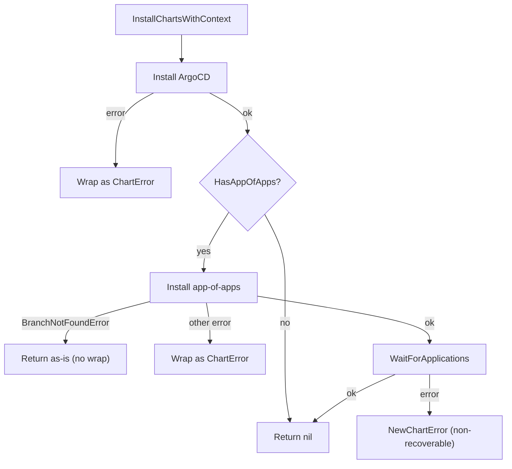

<!-- source-hash: 2668ebf12e58895351cc131e79fedb39 -->
Orchestrates the full chart installation lifecycle, coordinating ArgoCD setup and optional app-of-apps deployment in sequence.

## Key Components

| Symbol | Type | Description |
|---|---|---|
| `Installer` | struct | Holds references to `ArgoCDService` and `AppOfAppsService` for delegated operations |
| `InstallChartsWithContext` | method | Executes the three-phase install: ArgoCD → app-of-apps → wait for readiness |

## Installation Flow



## Key Behaviors

- **Error wrapping**: Most failures are wrapped as `ChartError` with cluster context via `.WithCluster()`
- **Branch-not-found passthrough**: `BranchNotFoundError` is returned unwrapped to preserve its type for upstream handling
- **Non-recoverable wait failure**: Uses `NewChartError` (not `WrapAsChartError`) after app-of-apps is already installed, preventing unnecessary retries since ArgoCD's wait logic has its own internal retry

## Usage Example

```go
installer := &Installer{
    argoCDService:    myArgoCDService,
    appOfAppsService: myAppOfAppsService,
}

cfg := config.ChartInstallConfig{
    ClusterName: "prod-cluster",
    // ...
}

if err := installer.InstallChartsWithContext(ctx, cfg); err != nil {
    log.Fatalf("install failed: %v", err)
}
```

## Source

[`installer.go` on GitHub](https://github.com/flamingo-stack/openframe-cli/blob/main/internal/chart/utils/services/installer.go)