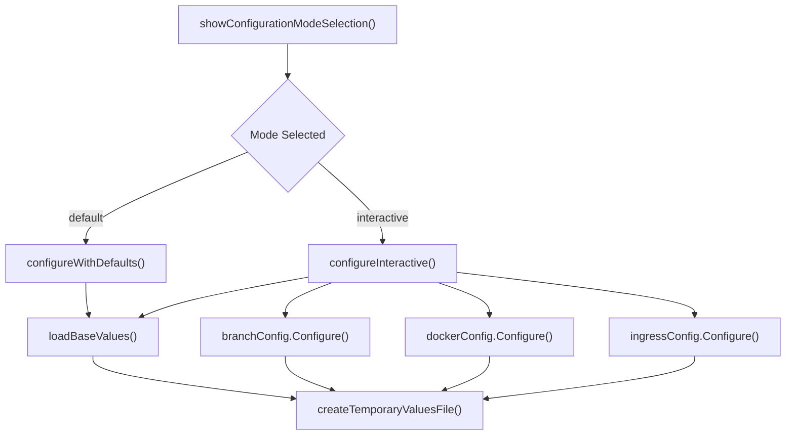

<!-- source-hash: a5af6fc6d64eefb73987206b77c79fc3 -->
Provides the configuration mode selection logic for the `ConfigurationWizard`, offering both a default (non-interactive) and a fully interactive Helm values configuration flow.

## Key Components

| Function | Description |
|---|---|
| `showConfigurationModeSelection()` | Renders a terminal prompt letting the user choose between `"default"` or `"interactive"` mode; returns the chosen mode string |
| `configureWithDefaults()` | Loads base Helm values and writes them to a temporary file without any user interaction |
| `configureInteractive()` | Loads base Helm values, then sequentially runs branch, Docker registry, and ingress configurators before writing the final values file |

## Usage Example

```go
wizard := &ConfigurationWizard{ /* ... */ }

mode, err := wizard.showConfigurationModeSelection()
if err != nil {
    log.Fatal(err)
}

var config *types.ChartConfiguration

switch mode {
case "default":
    config, err = wizard.configureWithDefaults()
case "interactive":
    config, err = wizard.configureInteractive()
}

if err != nil {
    log.Fatalf("configuration failed: %v", err)
}
```

## Configuration Flow

