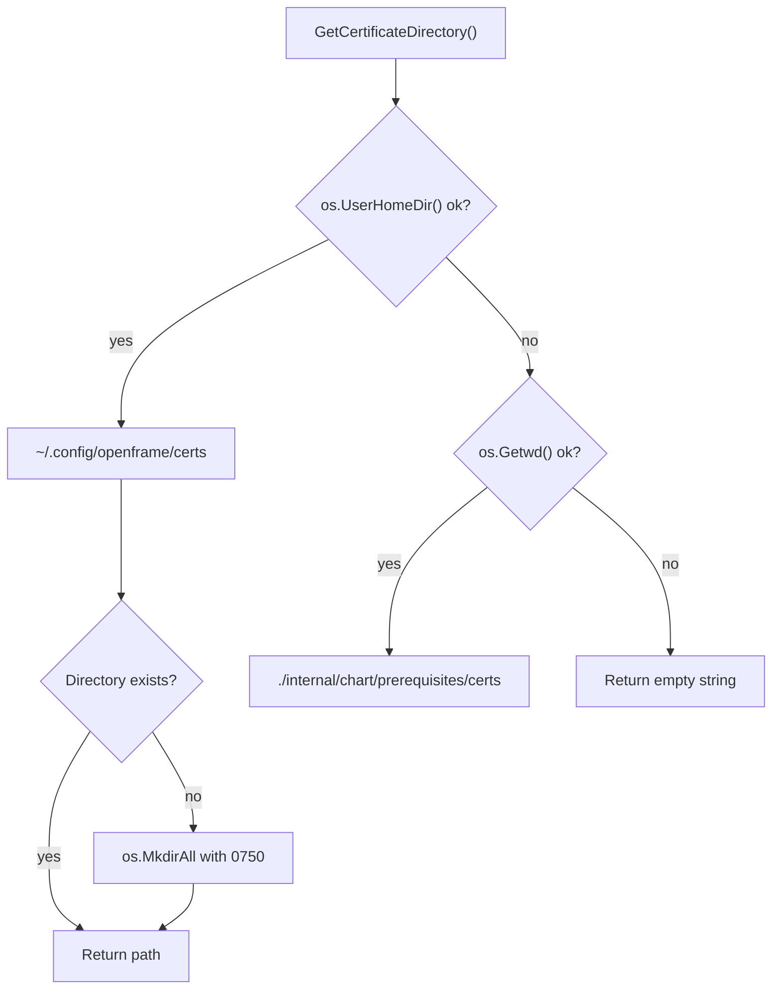

<!-- source-hash: 1876885d7f3d220515840fb217f3e3fe -->
Provides path resolution utilities for OpenFrame CLI configuration files, including certificate directories and Helm values file locations.

## Key Components

| Export | Type | Description |
|--------|------|-------------|
| `DefaultHelmValuesFile` | `const` | Base filename (`openframe-helm-values.yaml`) for Helm values in the working directory |
| `PathResolver` | `struct` | Handles resolution of chart-related file and directory paths |
| `NewPathResolver()` | `func` | Constructor returning a new `*PathResolver` |
| `GetCertificateDirectory()` | `method` | Returns `~/.config/openframe/certs`, creating it if absent; falls back to `./internal/chart/prerequisites/certs` |
| `GetHelmValuesFile()` | `method` | Returns `./openframe-helm-values.yaml` relative to the working directory |
| `GetCertificateFiles()` | `method` | Returns full paths to `localhost.pem` and `localhost-key.pem` inside the cert directory |

## Usage Example

```go
package main

import "github.com/flamingo-stack/openframe-cli/internal/config"

func main() {
    resolver := config.NewPathResolver()

    // Resolve certificate storage directory
    certDir := resolver.GetCertificateDirectory()
    // → /home/user/.config/openframe/certs  (created if missing)

    // Get individual certificate file paths
    certFile, keyFile := resolver.GetCertificateFiles()
    // → certFile: /home/user/.config/openframe/certs/localhost.pem
    // → keyFile:  /home/user/.config/openframe/certs/localhost-key.pem

    // Get Helm values file path
    valuesFile := resolver.GetHelmValuesFile()
    // → ./openframe-helm-values.yaml
}
```

## Path Resolution Fallback Chain

