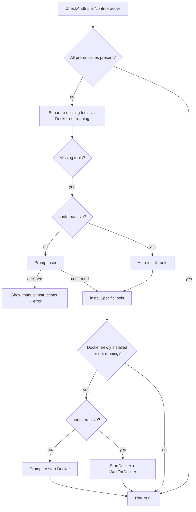

<!-- source-hash: ecc9f35b83219cc3a264c806f3be5306 -->
Orchestrates the detection and installation of cluster prerequisites (Docker, k3d, Helm), handling both interactive and non-interactive flows with spinner feedback and per-platform guidance.

## Key Components

| Export | Description |
|---|---|
| `Installer` | Main struct that coordinates prerequisite checking and installation |
| `NewInstaller()` | Constructor that initialises `Installer` with an embedded `PrerequisiteChecker` |
| `CheckAndInstallNonInteractive(nonInteractive bool)` | Primary entry point; runs a 3-phase check → install → Docker-start pipeline |
| `installSpecificTools(tools []string)` | Installs a named list of tools in order, verifying each after installation |
| `installTool(tool string)` | Dispatches to the correct tool-specific installer (docker/k3d/helm) |
| `showManualInstructions()` | Renders a pterm table of manual install commands when the user declines automation |
| `showDockerStartInstructions()` | Prints OS-aware (macOS / Linux / Windows) instructions for starting Docker |
| `containsTool(tools []string, name string)` | Case-insensitive helper to test tool-list membership |

## Usage Example

```go
installer := prerequisites.NewInstaller()

// Interactive — prompts the user before installing or starting Docker
if err := installer.CheckAndInstallNonInteractive(false); err != nil {
    log.Fatalf("Prerequisites not satisfied: %v", err)
}

// Non-interactive (CI / scripted) — auto-approves all steps
if err := installer.CheckAndInstallNonInteractive(true); err != nil {
    log.Fatalf("Prerequisites not satisfied: %v", err)
}
```

## Installation Flow

