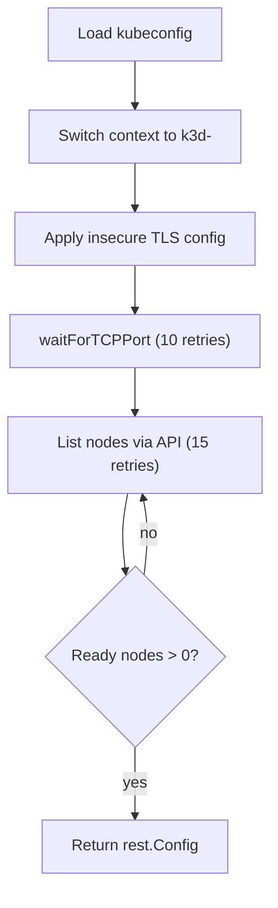

<!-- source-hash: 01bde8e714cf38771081ebc0618ce435 -->
Cluster reachability verification logic for k3d-managed Kubernetes clusters, handling kubeconfig context switching, TLS configuration, TCP port readiness, and node health polling before declaring a cluster ready.

## Key Components

| Symbol | Type | Description |
|--------|------|-------------|
| `verifyClusterReachable` | Method | Orchestrates the full 3-phase readiness check: kubeconfig setup → TCP port availability → Kubernetes API/node readiness |
| `waitForTCPPort` | Method | Polls a TCP address with retries until the port accepts connections or the context is cancelled |
| `isTemporaryError` | Function | Classifies Kubernetes API errors as retryable (e.g., `connection refused`, `i/o timeout`) or fatal |
| `extractHostPort` | Function | Strips URL schemes and splits a host string into `(host, port)` components |
| `getKubeconfigPath` | Method | Resolves the kubeconfig path via `$KUBECONFIG` env var, `~/.kube/config`, or the `clientcmd` fallback |
| `cleanupStaleLockFiles` | Method | Removes stale `~/.kube/config.lock*` files via a shell command |

## Usage Example

```go
manager := &K3dManager{verbose: true, executor: myExecutor}

ctx, cancel := context.WithTimeout(context.Background(), 2*time.Minute)
defer cancel()

restConfig, err := manager.verifyClusterReachable(ctx, "openframe")
if err != nil {
    log.Fatalf("cluster not ready: %v", err)
}

// restConfig is ready for use with any Kubernetes client
client, err := kubernetes.NewForConfig(restConfig)
```

## Verification Phases



## Notes

- TLS verification is intentionally bypassed (`Insecure=true`) for local k3d clusters to handle certificate/hostname mismatches on WSL2; client certificate auth is preserved.
- No Windows-specific code paths exist here — the CLI uses [`wsllauncher`](https://github.com/flamingo-stack/openframe-cli/blob/main/internal/k3d) to forward execution into WSL, so all paths treat the environment as Linux.
- Node readiness uses string comparison against condition types to avoid importing `k8s.io/api/core/v1`.