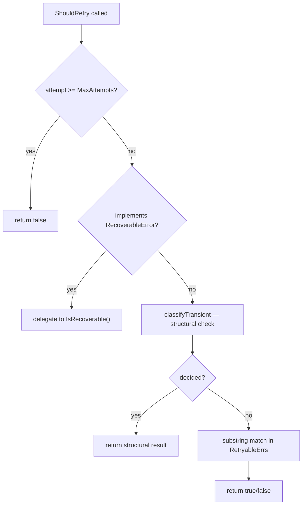

<!-- source-hash: fbeef2abe640b003aa4c2eb0248cf92c -->
Provides retry logic with exponential backoff for recoverable errors in Kubernetes and CLI tool operations.

## Key Components

| Symbol | Type | Description |
|--------|------|-------------|
| `RetryPolicy` | Interface | Contract for retry behavior: `ShouldRetry`, `GetDelay`, `GetMaxAttempts` |
| `RecoverableError` | Interface | Errors that self-report retryability and optional retry-after duration |
| `ExponentialBackoffPolicy` | Struct | `RetryPolicy` implementation with configurable backoff, jitter, and substring-matched error patterns |
| `NewExponentialBackoffPolicy` | Constructor | Creates a policy with sensible defaults (5m max delay, 2× multiplier, additive jitter) |
| `classifyTransient` | Internal func | Structural error classification via `net.Error`, `syscall` errnos, `context` sentinels, and Kubernetes API error types — runs before string matching |
| `RetryExecutor` | Struct | Drives retry loops against a `RetryPolicy`, respects `context.Context`, and fires an optional `onRetry` callback |
| `InstallationRetryPolicy` | Factory func | Pre-tuned policy (3 attempts, 10s base) for Helm/kubectl install operations |

## Usage Example

```go
// Basic usage with the default exponential backoff policy
policy := errors.NewExponentialBackoffPolicy(5, 2*time.Second)
executor := errors.NewRetryExecutor(policy)

err := executor.Execute(ctx, func() error {
    return callKubernetesAPI()
})

// Installation-specific policy with Helm-aware error patterns
installExecutor := errors.NewRetryExecutor(errors.InstallationRetryPolicy())
installExecutor.onRetry = func(err error, attempt int, delay time.Duration) {
    log.Printf("attempt %d failed: %v, retrying in %s", attempt, err, delay)
}

err = installExecutor.Execute(ctx, func() error {
    return helm.Install(release)
})
```

## Retry Decision Order



> **Note:** Structural classification (`net.Error`, `syscall` errnos, Kubernetes API errors) always runs before substring matching. Substring matching serves only as a fallback for shelled-out tools (Helm, kubectl) whose failures surface as `exit status 1` plus stderr text.